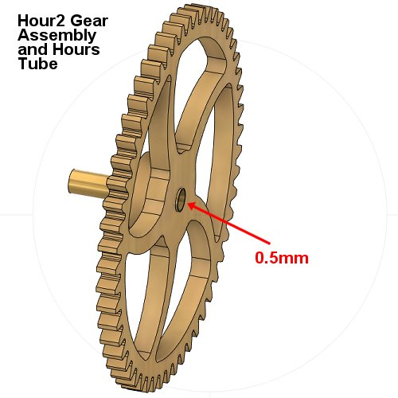

# theClock3 - Create the other Sub-Assemblies (Build Continued)

**[Home](readme.md)** --
**[Design](design.md)** --
**[Plan](plan.md)** --
**[Wood](wood.md)** --
**[Coils](coils.md)** --
**[Electronics](electronics.md)** --
**[Firmware](firmware.md)** --
**Assemble** --
**[Build](build.md)** --
**[Tuning](tuning.md)** --
**[UI](ui.md)** --
**[Software](software.md)** --
**[Troubles](troubles.md)** --
**[Notes](notes.md)**

This page will describe the remaining *miscellaneous* steps to build
the other **sub-assemblies** that are needed before we can proceed to the
[Final Build](build.md) of the clock.

- Cut and sand the [**brass tubes** and **threaded rods**](#a-cut-tubes-and-rods-to-length) to length
- Epoxy glue the [**tubes** into the **Gears**](#b-glue-tubes-into-gear-assemblies)
- Assemble the [**Pendulum**](#c-assemble-the-pendulum)
- 3D print and Assemble the [**Box**](#d-3d-print-and-assemble-the-box)
  - epoxy glue the Coils into the box
  - epoxy glue LED Lenses into the box
  - hot glue the LED Strip into the box
  - screw the PCB into the box
- Create the [**Top Tube** and **Magnetic Cap**](#e-prepare-top-tube-and-magnetic-sensor-cap)
- Epoxy glue the *magnets* into the [**Magnetic Spring**](#f-glue-magnets-to-magnetic-spring)

## A. Cut Tubes and Rods to Length

We will now **cut the brass tubes** and **M3 threaded rod** to lengths.

I have variously used a *hacksaw*, *dremel tool*, and *micro-saw* to
cut these things.  The problem with the dremel tool is that, for many
of the tubes, it is difficult to cut the ends square, so for best
accuracy on the brass tubes I usually use the **micro saw**.

I cut each tube about *1/2 mm* extra in length and then **sand them**
to square up the ends and achieve the target length, measuring them
with a *micrometer* as I go.

**It is important that the ends of the tubes are smooth** and
do not have any burrs that will *damage the wood* as they are
inserted into the gears, cam, etc.  The same goes for the
ends of the threaded rods ... they should be finished so that
the threads *go easily* into M3 nuts.
I also **sand** the *inside* of the **Hours and Minutes Tubes** by
wrapping a piece of 220 grit sandpaper around a length of threaded
rod and inserting it into the tubes and turning the tube around
the sandpaper.  It is **important** that the concentric *Hours*,
*Minutes*, and *Seconds* tubes all fit together nicely and
**do not grind or bind**!

The final items should be within **1/10th of a mm** of the
listed lengths for best fitting and operation of the clock.

Here is a table showing the lengths of the tubes/rods to be cut:

<table style='width:50%;'>
<tr>
	<th>Type</th>
	<th>Length</th>
	<th>Name</th>
</tr>
<tr><th>6 mm brass tube</th><td>27.60 mm</td><td><b>Hours</b> tube</td></tr>
<tr><th>5 mm brass tubes</th><td>78.40 mm</td><td><b>Top</b> tube</b></td></tr>
<tr><td></td><td>48.90 mm</td><td><b>Minutes</b> tube</b></td></tr>
<tr><th>4 mm brass tubes</th><td>85.70 mm</td><td><b>Seconds</b> tube</b></td></tr>
<tr><td></td><td>29.40 mm</td><td><b>Idler1</b> tube</b></td></tr>
<tr><td></td><td>21.20 mm</td><td><b>Idler2</b> tube</b></td></tr>
<tr><th>M3 threaded rod</th><td>73.50 mm</td><td><b>Pendulum</b> rod</b></td></tr>
<tr><td></td><td>64.90 mm</td><td><b>Idler</b> rod</b></td></tr>
</table>

## B. Glue Tubes into Gear Assemblies

Each of the five **gear assemblies** are glued to the appropriate
tube with *5 minute epoxy*.  The *spacing* of the tubes into the
gears is **critical** for proper operation of the clock. Each
tube should *protrude* from the gear by the **dimension**, shown
below, to *within **1/10th mm*** !!!

- the **Seconds Tube** should **protrude 15.4mm** out of the *back* of the **Seconds Wheel** assembly
- the **Idler1 Tube** should be **flush** with the *front* of the **Min1** gear assembly
- the **Minutes Tube** should **protrude 0.8mm** out of the *back* of the **Min2** gear assembly
- the **Idler2 Tube** should **protrude 1.0mm** out of the *back* of the **Hour1** gear assembly
- the **Hours Tube** should **protrude 0.5mm** out of the *back* of the **Hour2** gear assembly

For each gear assembly:

- **Dry Fit** the gear assembly to the tube in the correct position
- **Back it off** so that 5-10mm extra protrudes and **apply** a **very small amount** of epoxy around the tube where the gear will go
- **Slide** the gear assembly into position over the epoxy on the tube
- Carefully, and completely **Wipe Off** any stray epoxy with a paper towel lightly wetted with alcohol.

It is **particularly important** that you don't get any glue **inside** the tubes!!
If you do, *immediately* clean the inside of the tube end with a paper towel, wetted with alcohol, on a toothpick.

## C. Assemble the Pendulum

The **pendulum** is made up of the 3/16" thick *main wooden piece*, four
1/8" thick *pendulum covers*, the large *lead fishing weight*, the
M3 threaded *pendulum* rod, and *m3 hex nut* and two *m3 square nuts*.

### 1. Prepare the **lead fishing weight**

- **Drill** to enlarge the hole in the fishing weight to 2.5mm and **Tap**
  it with *M3 threads*.
- **Run** an *M3 threaded rod* on a *hand drill* through the threads to make
  sure they work well. I use a *portable drill* to run the rod through the threads.
- **Polish** the weight to a shiny surface by *spinning it on an M3 rod
  in a hand drill* and sanding it with 120 and then 220 grit sand paper

### 2. Build the **pendulum**

- thread one **M3 square nut** onto the end of the M3 *Pendulum
  threaded rod* until about 1/2 mm of the thread comes out through the nut.
- apply a drop of **super glue** to the nut/rod to **lock** the nut in place
- thread the **fishing weight** onto the middle of the rod.
- (not shown in the animation) thread a **M3 hex stopper nut** up against the weight.
- thread the other **M3 square nut** onto the free end so that about 1/2
  mm protrudes through the nut
- loosely attach the *lower and upper* **front pendulum covers**
  to the pendulum with *M2x6 machine screws*.
- **insert** the threaded rod/weight assembly into the pendulum from the back
- attach the *lower and upper* **rear pendulum covers** with *M2x6 machine
  screws* and tighten everything down, squaring up the pendulum rod in the middle
  of the slots.

You should now be able to *adjust the weight* up or down the rod by turning
it and the *super-glued nut* should **NOT** turn.  If you have a problem with
this you can also add a **drop of 5 minute epoxy** to the top nut sitting
in the slot.

### 3. Glue the **main magnets** to the pendulum

**You *should* have determined the *correct orientation* of the magnets
when testing the Firmware on the [previous page](firmware.md).*
If you don't remember the correct orientation, or if you get it wrong
**it's ok**.  You will merely need to reverse the orientation of the
coil plugs later when we start [Tuning](tuning.md) the clock.

- put a piece of masking tape on the front of the pendulum over the main magnet
  hole at the end (under the weight).
- mix some **5 minute epoxy** and put a little around the inside edges of the hole.
- press the **two 5x5x2 mm** magnets into the hole.
- center the magnets, as best as possible, in the hole in the wood.

## D. 3D print and Assemble the Box

3D printing the box takes a **long time**.  It took about *9 hours* for me to
print it on my Prusa MK3s 3D printer.  After printing, **clean it up** to
remove any stray threads or imperfections.  As the holes tend to print
a bit *oblong* I also typically run a **4 mm drill** through all the
*LED* and *button* holes.

*Note:  there are different **optional** versions of the **box**.
Please see the [Notes](notes.md) page for more details on these options.*

We also need to 3D print the **small, clear** plastic LED lenses, cut
them apart, and a set of the **coil spacer washers** and clean them up.

### 1. Glue the coils into the box

I usually do the *rear coil* first, and then the front one.  It is
important to **dry fit** the coils into the box and **enlarge the
holes** if necessary to ensure that you can insert them without
damaging them.

- For the rear coil, **slide** the *connectors and wires* through the holes
  in the walls of the *channel* so that they protrude into the main space and
  dry fit the coil.
- Put *pieces of **wood, index cards, playing cards**, or similar*
  into the slot to *ensure that the **coils** will be **flush*** with the
  inside walls of the slot but so that the *coil will not enter* into the
  pendulum's path while it swings.  Two pieces of 1/8"
  and one piece of 3/16" wood should fit snugly into the slot, or just
  cram index or playing cards in there until they are a **tight** fit.
- Mix some **5 minute epoxy** and apply a bit around the inside edge of the coil,
  then slip one of the *coil spacer washers* onto the coil, press it into
  place and put a bit more epoxy all the way around the face of the washer.
- With the box laying on it's face, **insert the rear coil** and press
  it into place.
- Put a small piece of plywood and a weight on top of the coil to
  press it down as the glue sets up.

It is **important** that the back coil **does not protrude** more than 3mm
from the back wall so that when we slide the frame onto it, it does
not catch or damage the wires or solder joints on the coil.

**Repeat** this process for the **front** coil.  You will not be
able to secure it with a weight at the end, so you may want to have
a *small clamp* handy and ready to go to clamp the coil into place
while the glue sets.

### 2. Glue the LED lenses into the box

- Mix some **5 minute epoxy** and, on the *inside of the box* put **very small drops**
at the corners of each of the 5 *indents* where the lenses go.
- Firmly **press** the lenses into the holes. You may need to use a blunt
tool to get them in all the way. They should *snap* into place
and protrude about 1mm out of the front of the box.
- Wipe any excess epoxy off from the indie of the box and let the glue dry.

### 3. Hot Glue the LED Strip into place

- With a **well heated** hot glue gun, place a drop of hot glue
  between each of the leds and at each end
- **quickly** press the led strip into place (cable to the
  *right* as you are facing the box), aligning and the
  pressing the LEDs into the indents in the box.
- **hold it** in place with your fingers until the hot glue
  cools enough so that the LED strip won't move.
- *add more hot glue* as necessary to fix the led strip
  and it's cable in place

### 4. Insert the PCB

- Insert the **PCB** into the box
- Secure the **PCB** with four *M3x8* wood screws
- Plug the cables for *LEDs* and *Coils* into the PCB

## E. Prepare Top Tube and Magnetic Sensor Cap

We want to glue a **stopper** onto the Top Tube.  The stopper is necessary
for the assembly and also provides us with a *handle* to pull the tube out
if we want to *dis-assemble* the clock.

- **Score** about *5mm* of one end of the **Top Tube** with a file or 80 grit sand paper so the glue will adhere to it.
- **Slide** the *tightest* wooden **12x4.85mm** *stopper* you have onto the top tube from the smooth end all the
way down to just before the to the scored region.
- Using a toothpick, **mix and apply** a thin coat of **5 minute epoxy** on the scored part of the tube.
- **Slide** the stopper the final 5mm over the glue until it is **flush** with the end of the tube.
- **Wipe** any remaining epoxy from the assembly and set it aside to dry.

Also, we want to create the **Magnetic Sensor Cap** for the top tube that
contains the **magnet** for the angle sensor.  This will slide on (but not be glued)
to the top tube when we assemble the clock.

- **Mix** some **5 minute epoxy** with a toothpick
- Put a small piece of **masking tape** over one side of the 1/8" thick **12x6** wooden **magnet holder** washer.
- **Insert the magnet** so that it is flush with the front (stuck to the masking tape)
- Put a **drop of epoxy** into the spacer so that it completely covers the magnet and seeps in around the edges
- **Apply** a *thin* coat of epoxy to the back side of the spacer
- **Carefully center** another **12x4.85mm** wooden *stopper* onto the back side of the
  spacer and press it down
- **Wipe off** any stray epoxy and **re-center** the rings **as close as you can**!!

## F. Glue Magnets to Magnetic Spring

We are going to glue one of the *small* **3x2x2mm** magnets to the shaft of
the pendulum and the remaining two into the *3D printed* **magnetic spring holder**.

It is **important** that the two magnets are inserted such that,
when the spring holder is attached to the frame (on the left rear
of the frame) that they **repel** the magnet in the shaft of the
pendulum!  Here is a diagram showing the *pendulum* and *magnet holder*
**from the back** of the clock:

### 1. Glue the moving **spring magnet** into the Shaft of the Pendulum

- put a drop of **5 minute epoxy** into the *indent* on the pendulum shaft.
- set one **3x3x2mm magnet** into the slot so that it's *magnetic face*
  is facing towards the edge (not the front or back!) of the pendulum.
- try to *center* the magnet in the wood (as it is smaller than the thickness
  of the wood)

### 2. Glue the **stationary magnets** into the Magnet Holder

- *3D print* the **magnet holder**.
- *Press two* **3x3x2mm magnets** into the holder. They should go down
  about 1mm below the surface.
- *Add* a  drop of **5 minute epoxy** on top and let it seep down around the
  magnets

*I can't stress this enough!*  **MAKE SURE THAT THE MAGNETS
IN THE HOLDER ARE ORIENTED TO REPEL THE MAGNET IN THE PENDULUM
SHAFT!!**. Once they are glued in you *cannot* get the
magnets out without destroying the magnet holder.
I have, at least twice, gotten this wrong, and had to re-print
the magnet holder.

We are now ready to proceed with the **final build** of the clock!

**Next:** [**Final Build**](build.md) of the clock ...
