# theClock3 - Final Assembly

**[Home](readme.md)** --
**[Design](design.md)** --
**[Build](build.md)** --
**[Wood](wood.md)** --
**[Coils](coils.md)** --
**[Electronics](electronics.md)** --
**[Software](software.md)** --
**[Other](other.md)** --
**Assembly** --
**[Tuning](tuning.md)** --
**[User Manual](user_manual.md)** --
**[Trouble Shooting](trouble_shooting.md)** --
**[Notes](notes.md)**

We finally get to the *fun part* !!

On this page we will assemble the *finished clock*, see it's
*first tick* and make sure the **mechanics** of the clock
are good before we proceed to [tuning](tuning.md) it to
run via the electromagnetic coils.

Although *not described* on this page, it is not a bad idea to
**dry fit** the assembly (Parts **A & B** below) together before
gluing the Tubes into the Gear Assemblies.  When the clock is
assembled the **gears should mesh** with the large gears riding
nicely **in the middle** the small gears - not just barely overlapping!
There should be some **play** in the mechanism, the gears must be **free**
and **turn well** with little friction.

You *may* want to **sand** the *wooden spacers* to make them *thinner*,
and/or sand the *long ends of the tubes* to make sure the gears overlap,
there is a bit of play, and they turn nicely once the **bridge** is attached.

## A. Glue Tubes into Gear Assemblies

Each of the five **gear assemblies** are glued to the appropriate
tube with *5 minute epoxy*.  The *spacing* of the tubes into the
gears is **critical** for proper operation of the clock. Each
tube should *protrude* from the gear by the **dimension**, shown
below, to *within **1/10th mm*** !!!

- the **Seconds Tube** should **protrude 15.4mm** out of the *back* of the **Seconds Wheel** assembly
- the **Idler1 Tube** should be **flush** with the *front* of the **Min1** gear assembly
- the **Minutes Tube** should **protrude 0.8mm** out of the *back* of the **Min2** gear assembly
- the **Idler2 Tube** should **protrude 1.0mm** out of the *back* of the **Hour1** gear assembly
- the **Hours Tube** should **protrude 0.5mm** out of the *back* of the **Hour2** gear assembly

For each gear assembly:

- **Dry Fit** the gear assembly to the tube in the correct position
- **Back it off** so that 5-10mm extra protrudes and **apply** a **very small amount** of epoxy around the tube where the gear will go
- **Slide** the gear assembly into position over the epoxy on the tube
- Carefully, and completely **Wipe Off** any stray epoxy with a paper towel lightly wetted with alcohol.

It is **particularly important** that you don't get any glue **inside** the tubes!!
If you do, *immediately* clean the inside of the tube end with a paper towel, wetted with alcohol, on a toothpick.

## B. Assemble Parts to the Frame

We will now assemble the *majority* of the clock onto the **frame**,
including the *angle sensor*, *gear train*, *front bridge* and *face*,
and the hours, minutes, and seconds *hands*.

### 1. Glue Bearings into Frame and Bridge

Each bearing must be **cleaned** and **lubricated** before it is
installed in the clock.  I do this by putting them all in a small
plastic container and **soaking them in WD40**, removing each in turn
and **spinning** them (on the end of a *bic pen*) and **wiping them
off** with a paper towel.  I then put a small drop of **light machine
oil** (3-in-1) on each bearing, spin them again, and then *clean*
the outer surface with a paper towel lightly wetted with *alcohol*.

The outer surface that will be glued to the wood should be
relatively clean and oil free.

For each **bearing**:

- note from the *diagrams* **how** the bearings are to be inserted
- put a **very small amount** of **5 minute epoxy**
around the hole the bearing will go into.
- **press** the bearing into place, using a piece of wood as necessary.
- **carefully and completely remove any excess epoxy** glue from each
bearing with a paper towel lightly wetted with *alcohol*.

### 2. Assemble Angle Sensor and Cable to Frame

**First** *3D Print* the **Sensor Housing** and the small **Wire Tie** pieces. **Then**:

- **plug** the small *JST connector* of the **cable** into the SDA/SCL connector on the **angle sensor module**
- **screw** the angle sensor module into the *3D printed* **Angle Sensor Housing** with
   the *cable coming out* the left side using four **M3x8** *wood screws* as shown in the image below
- **bend** the cable sharply where it comes out of the housing as shown
- **feed** the large *JST connector* end of the cable into the top of the **frame house**
  and down through the *cutout* in the bottom of the **frame house**.
- **bend** and **align** the cable so that it *tucks into* the inner top-left corner of
  the frame as shown and then **straighten** the part that hangs down so that it goes directly
  through the smaller square in the *cutout*
- **screw** the sensor housing onto the frame with two **M2x8** *machine screws

The following image, with the *frame front and gears* removed for clarity, shows how the
**cable should be run** so that it *does not show* in the final assembled clock:

Then **finally**, when you've got it close,
**back out** the *larger **upper left** bridge M3x20 wood screw*,
**push** the cable into the *bend* in the wire-tie,
**force** the cable and tie up into the corner of the frame, and
**screw** the screw back in so that it goes into the wire tie
*securing the cable* into the upper left corner.

You can also add a a bit of **hot glue** to keep the straight part out of view.

The cable should go straight down out the bottom of the clock.

### 3. Insert Threaded Rod

- screw an **M3 nut** about 7mm onto one end of the **idler** threaded rod
- add an **M3 washer**
- **screw** the threaded rod *into the wood* until it is flush at the back
- **tighten** the nut so that the threaded rod is secure in the frame

### 4. Mount Magnetic Spring

Mount the magnetic spring using two **M2 x 8** machine screws.
Mount it as far away from the pendulum as possible and snug, but do not tighten the screws.

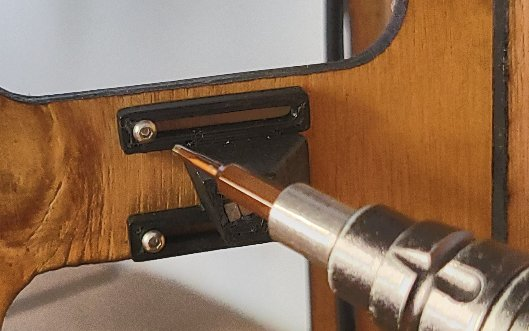

## C. Assemble Gears and Bridge

We are now ready to insert the **gear assemblies** into the frame.

### 1. Lubrication

*Apply* **graphite dry lube** liberally to the teeth of all the gears. The
idea is to *embed* the dry lube in the *lacquer* on the teeth.  This will
significantly **reduce the friction** in the clock and make it run better.
The powdered graphite is very *messy* to work with,  I literally *cover*
the teeth in graphite powder, by *dipping* them in piles of the powder,
or by using a *small spoon* to dump powder onto all the teeth. I then
*rub and brush* the powder into the teeth with a coarse 1/2" paint brush.
Then finally, I *wipe off* the *faces* of each gear with a paper towel
to make them look nice.

Likewise, when assembling the *tubes* I apply a *thin coat* of **light
machine oil** (I use the popular "3-in-1" oil) to the **inner tube** in
each step where a tube will ride on the *threaded rod* or *another tube*.

#### 2. Seconds Wheel Assembly

- slide the *two* **12x4.1mm** *wooden washers* onto the back of the **Seconds Wheel Assembly**
- slide an **M4** *metal washer* onto the assembly
- **insert** the assembly into the main *4mm bearing*

#### 3. Min1 Gear Assembly

- **lubricate** the *threaded rod* with a *drop or two* of **light machine oil**
- slide an **M3** *metal washer* onto the *threaded rod*
- slide the **Min1 Gear Assembly** onto the *threaded rod* so that
  the gear teeth *mesh* with the small gear on the *Seconds Wheel Assembly*

#### 4. Min2 Gear Assembly

- **lubricate** the *Seconds Tube* with a drop of *light machine oil*
- slide an **M4** *metal washer* onto the *Seconds Tube*
- slide the **Min2 Gear Assembly** onto the *Seconds Tube* so that
  the gear teeth mesh with the small gear on *Min1 Gear Assembly*

#### 5. Hour1 Gear Assembly

- slide an **M3** *metal washer* onto the the **threaded rod**
- slide the **Hour1 Gear Assembly** onto the threaded rod so that
  the gear teeth *mesh* with the small gear on the *Min2 Gear Assembly*

#### 6. Hour2 Gear Assembly

- **lubricate** the *Minutes Tube* with a drop of *light machine oil*
- slide an **M5** *metal washer* onto the *Minutes Tube*
- slide the **Hour2 Gear Assembly** onto the *Minutes Tube* so that
  the gear teeth mesh with the small gear on *Hour1 Gear Assembly*

#### 7. Bridge Assembly

- slide the *thin* 1/8" **12x6mm** wooden washer onto the **Hours Tube**
- slide another **M3** *metal washer* onto the threaded rod
- **align** and **press** the **Bridge** onto the frame so that
  the **tabs** fit in the slots in the Bridge, the
  **Hours Tubes** goes through the bearing, and the **threaded rod**
  goes into the hole in the Bridge

There should be some **play** in the *Gear Train* when the
Bridge is in place.  You may need to **sand** the front *thin 1/8" washer*,
and or *the ends of the tubes* to make sure that everything turns smoothly,
and/or **add or change washer combination** at the back of the *Seconds Tube*.
*Ensure* that the **Gear Train** moves freely without any undue *friction*,
*binding*, or *slop*, **before** you screw the Bridge into place.

- Secure the Bridge with *five* **M3x12** wood screws and *one*
  **M3x20** wood screw in the **upper left corner**

## D. Add Top Tube, Pendulum, Cam, and End Cap

This is the *hardest* step in the Assembly process to explain.

We are now going to insert the top tube, through the **back** of the Frame,
through a **Keyed Spacer**, through the **Pendulum**, through the **front** of the Frame,
a M5 **metal washer**, a 3/16" **wooden washer**, and another **Keyed Spacer**, then
through the **Cam**, and top it off with the **Magnetic Cap** for the Angle Sensor.

You will probably find that it takes a quite a bit of
**force** and **twisting and turning** to get the Top Tube through all of these parts!

- add a loose fitting **3/16" 12x5 mm wooden washer** to the **Top Tube**
- position and hold the **Pendulum** within the frame
- insert the Tube into the *back* of the **Frame** and *push and turn* it through the Pendulum
- hold a **Keyed Spacer** up against the Pendulum, inside the frame
- *push and turn* the Top Tube through the Keyed Spacer
- *push and turn* the Tube out the *front* of the Frame until it protrudes about 1/2"

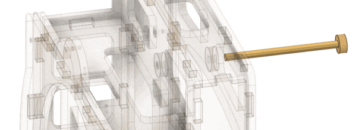

It doesn't matter at this point if the *Pendulum* and *Spacer* are *aligned*.
You just need to get the tube through them and poking a bit out of the front frame.
After that:

- put a **M5 metal washer** on the tube
- put a loose fitting **12x5 mm wooden washer** on the tube
- *push and turn* the tube through the 2nd **Keyed Spacer**
- position the **Cam**
- *push and turn* the Tube through the Cam until the Tube comes out about 1/2" past the Cam

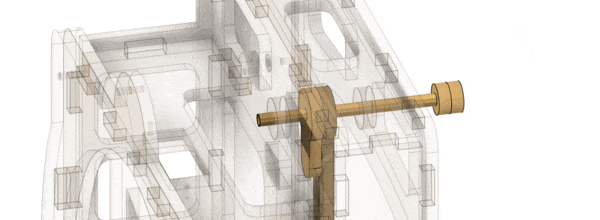

*Note that the **Cam** is **not symmetrical***.  The *higher side* of the
Cam goes on the **left** and the *lower side* on the *right* !!!

- *add* the **Magnetic Sensor Cap** to the end of the tube.
- **hold** the Cam and its Washers **firmly** against the Frame
- **push** the tube the rest of the way until the back **Wooden Washer** comes
  up against the **bearing** in the back of the Frame.

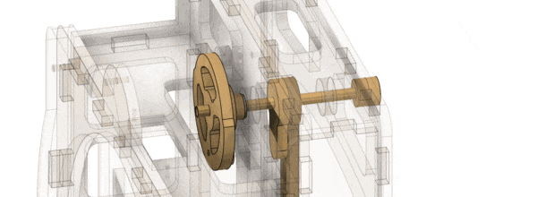

At this point the *Magnetic Cap* should be about **1mm from the Sensor Module**,
the *Back Washer* should be **snug** up to the *Rear Bearing* and the *Cam, Keyed Spacer,*
and *Wooden and Metal Washers* should be **snug** up to the *Front Bearing*, and
the *Cam* should be more or less aligned above the *Seconds Wheel*.

The **Pendulum** will be likely be jammed up against the inside of the Frame.
We need to move the Pendulum **back** so that it is in the **middle** of the **Channel**.

- While holding the **Pendulum** and it's **Spacer** with your fingers,
- **turn the Tube** back and forth while **working the Pendulum** back into the middle of the space.
- *Slide* the assembled **Clock** onto the 3D printed **Box** so that the **Pendulum** is in the **Channel**
- **Adjust the spacing** of the Pendulum so that it swings freely in the
- **middle of the channel** and does not touch the sides.

In the end the
**Pendulum must swing freely in the middle of the channel**
and should *oscillate* **at least 5-6 times** when swung from an extreme.
There should be about **1/2 mm of play** for the Top Tube to move back and forth
aginst the Front and Rear bearings.

Finally we just have to get the **M3x45mm bolt** through the Pendulum, Spacers, and into the Cam.

- **Align the holes** in the *Pendulum, Keyed Spacers, and Cam* so that
  they are lined up when the pendulum is hanging **straight down**.
- **Insert** the **M3x45 bolt** into the Pendulum
- Making sure that the Pendulum Spacer is **flush** up against the Pendulum
- **screw** the bolt in through the Pendulum and Spacer
- Continue **screwing** it in until the bolt *just reaches* the *Cam Spacer*

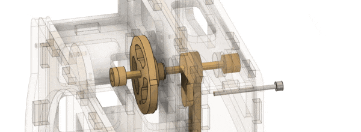

When the bolt is up against the Cam Spacer, **double check that everything
is aligned**, that the **pendulum is still in the middle of the channel**
and that the Cam Spacer is flush up again the Cam and

- **screw the bolt** in the rest of the way.

Ideally it the bolt should protude a small amount out of the front of the Cam.

*Once again*, this will take some *practice* and maybe **several tries**.
If you need to, *remove the bolt*, get everything spaced and aligned,
and try again until you **get it right**!

You can do *minor adjustments* once the assembly is complete by moving
the **Pendulum** slightly on the **Top Tube**.
**Note** that when the **bolt** is screwed in, it acts as a *fulcrum* so
if you need to move the *bottom* of the **Pendulum** backwards in the **Channel**,
once the bolt is screwed in,  you will move the *top* of **Pendulum** forwards, and
the bottom will move slightly backwards.

**You will probably need to mess with this a few times during *Tuning* and *Testing*
to get it just right** so that the Pendulum swings freely, and the Cam is in the
correct place.

****Note Also** that there is a **range of allowed orientations** for the sensor cap.*
In the end, it must be on the tube such that when the pendulum is hanging straight down,
the sensor is reading in the middle of the range, **between 90 and 270 degrees**.
Later, after we have finished the assembly, during [Tuning](tuning.md) we will **Mark**
the spacer so that we know how it supposed to be positioned on the Tube.

## E. Mount Clock on Box

In the previous step we already put **Assembled Clock** onto the **Box**.
I usually don't add the screws until I have started [Tuning](tuning.md)
the clock and I am confident all of the electronics are working correctly.

However, we obviously need to do these things at some point, so they are
being presented here for completeness:

- **Plug** the *Sensor Cable* into the *PCB*
- **Screw** two **M3x12** wood screws from the rear of the Clock into the box.
- **Screw** two **M3x18** wood screws from the front of the Clock into the box.

## F. Assemble Arms and Pawls

The below photo shows the parts that are used in assmbling the *Arms and Pawls*.

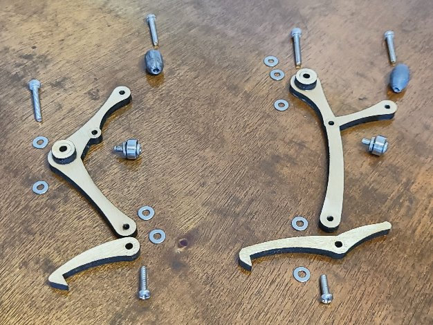

Start by expanding the holes in the *two small fishing weights* using a **3mm Drill**.

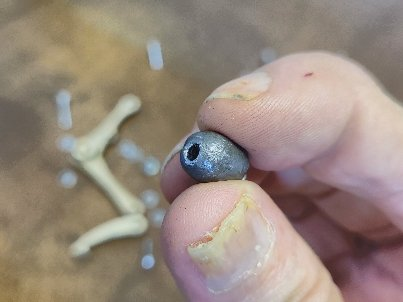

Then assemble each arm as follows:

- put an **M3x10** *machine* **screw** through one of the **3x9x4 bearings**
- put *two* **M3 washers** behind that
- *screw* the bearing assembly into the Arm
- put an **M3x18** *machine* **screw** through a **small fishing weight**
- *screw* the weight into the Arm
- put an **M3 washer** on a **M3x12** *machine* **screw**
- put the screw *through* the appropriate **Pawl**
- put another **M3 washer** on the screw
- *screw* the pawl onto the Arm until it is **snug**
- **back off** the screw by *1/4 turn* so that the **Pawl swings freely**

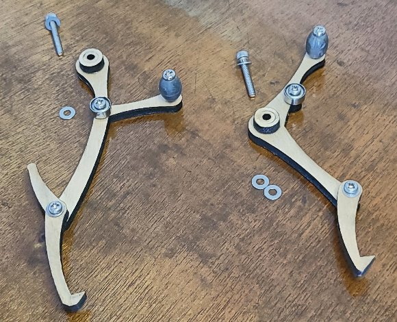

## G. Attach Arms and Pawls

The **Pawls must ride on the Seconds Wheel**.  So there
is some *jiggling* and *adjustment* needed as you screw
the Arms into place.

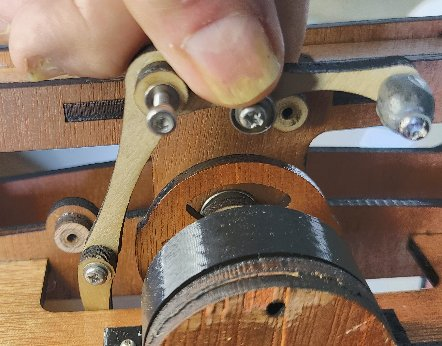
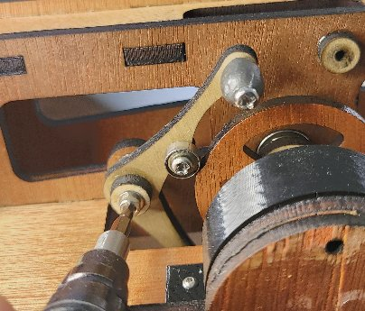

For both arms, do the following:

- put a **M3 washer** on an **M3x20** *machine* **screw**.
- insert the screw into one of the **Arms**
- put another **M3 washer** on the screw, behind the Arm
- **lower** the arm into the space *next to the Cam* until it is positioned in
  front of it's **mounting spacer**.
- **screw** the Arm in until it is **snug**
- **back off** the screw by *1/4 turn* so that the **Arm swings freely**

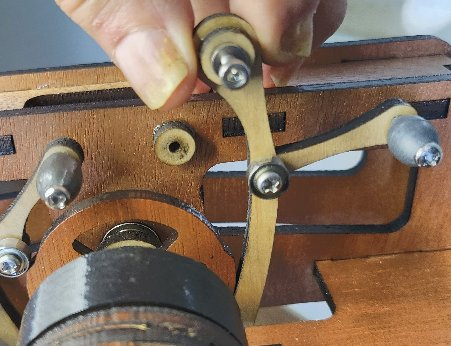
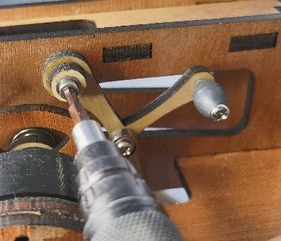

As you are assembling this part, you will need adjust the *Pawl* so that
it rides **on top of the Seconds Wheel**.

**You may need to add additional M3 washers** to the back of the arms
to get the spacing correct.

## H. Attach Face and Hands

- align and attach the **Face** with two **M3x12** wood screws
- *push and turn* a 3/16" **10x6mm** *wooden stop washer* onto the *Hours Tube*
  so that it is snug up again the *bearing*
- **compression fit** the **Hour**, **Minutes**, and **Seconds**
hands on to the tubes so there is about **1-2mm** of space
between them and they are **square** and won't hit each other
as they turn.

## H. FIRST TICK!!

At this point you should be able to *move* the **Pendulum** and
the **Pawls** should *correctly engage* the *Seconds Wheel* one
after the other, advancing the *Gear Train* on each swing!!

**TAKE A BREAK** !!  Sit back and admire your clock :-)

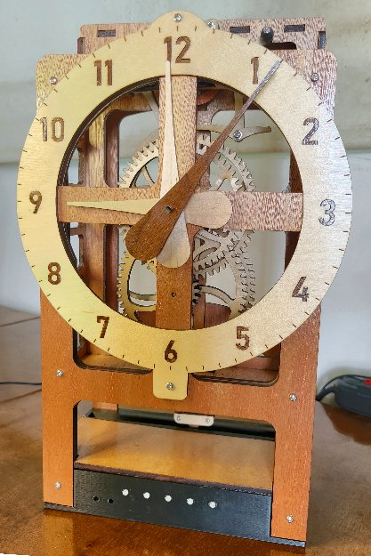

This is the time to make **any and all** adjustments to get the clock **ticking correctly**.
Trust me, it is **worth the time** to get the *Mechanism* working correctly at this point.
By moving the Pendulum *gently* with your finger through the top hole in the Frame you
should be able to swing it back and forth and **reliably** and *smoothly* engage and
advance the *Gear Train*.

You may need to do one or more of the following:

- move the **Pendulum** back or forwards to get it in the middle of the channel
- adjust **Top Tube** and the *Cam* and *Spacers* on it to get align them
- *tighten* or *loosen* the *Arm and Pawl* **screws** to get them to swing freely, yet *aligned* with the Seconds Wheel
- add additional **M3 washers** to the back of the Arms to make sure the *bearings* ride on the Cam
- add additional **M3 washers** between the Pawls and the Arms to make sure the *Pawls* ride on the Seconds Wheel
- **cut** and use *slightly modified **Pawls***

It should **tick and tock** and should move the **Seconds Wheel** about the same
distance as it swings in **each direction**.

If you find that the Seconds Hand moves *mostly* when the Pendulum swings in one
direction and *hardly at all* when the Pendulum swings in the other direction,
then you *may* want to **Analyze the motion closely** and **modify the DXF drawings**
slightly to **cut** and use *slightly modified **Pawls***.

For example, on one clock I built, I found that shortening the **right pawl** by
**0.5mm** made all the difference in the world in *balancing* out the ticks and
tocks.  To whit, there is a **alternate_right_pawls.lbrn2** file in the *Lightburn*
folder in the repository that contains some modified Pawls.

Some **experimentation may be necessary**, but as I said, it is **well worth the time**
to get the clock **ticking and tocking correctly** before moving on and trying to
[Tune](tuning.md) it.  You don't want to be modifying the *hardware* once you have
started configuring the *software*!

**Next:** Setting up and [**Tuning**](tuning.md) the clock ...
