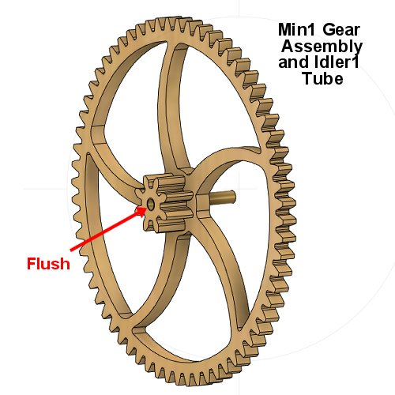
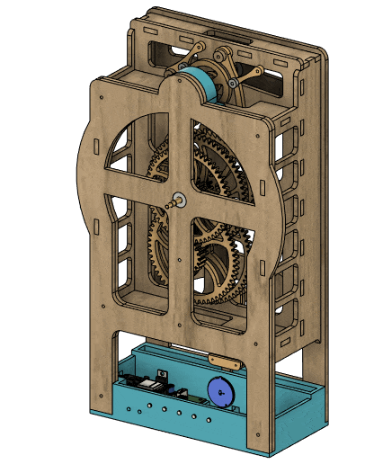

# theClock3 - Final Assembly

**[Home](readme.md)** --
**[Design](design.md)** --
**[Build](build.md)** --
**[Wood](wood.md)** --
**[Coils](coils.md)** --
**[Electronics](electronics.md)** --
**[Software](software.md)** --
**[Other](other.md)** --
**Assembly** --
**[Tuning](tuning.md)** --
**[User Manual](user_manual.md)** --
**[Trouble Shooting](trouble_shooting.md)** --
**[Notes](notes.md)**

We finally get to the *fun part* !!

On this page we will assemble the *finished clock*, see it's
*first tick* and make sure the **mechanics** of the clock
are good before we proceed to [tuning](tuning.md) it to
run via the electromagnetic coils.

Although *not described* on this page, it is not a bad idea to
**dry fit** the assembly (Parts **A & B** below) together before
gluing the Tubes into the Gear Assemblies.  When the clock is
assembled the **gears should mesh** with the large gears riding
nicely **in the middle** the small gears - not just barely overlapping!
There should be some **play** in the mechanism, the gears must be **free**
and **turn well** with little friction.

You *may* want to **sand** the *wooden spacers* to make them *thinner*,
and/or sand the *long ends of the tubes* to make sure the gears overlap,
there is a bit of play, and they turn nicely once the **bridge** is attached.

## A. Glue Tubes into Gear Assemblies

Each of the five **gear assemblies** are glued to the appropriate
tube with *5 minute epoxy*.  The *spacing* of the tubes into the
gears is **critical** for proper operation of the clock. Each
tube should *protrude* from the gear by the **dimension**, shown
below, to *within **1/10th mm*** !!!

- the **Seconds Tube** should **protrude 15.4mm** out of the *back* of the **Seconds Wheel** assembly
- the **Idler1 Tube** should be **flush** with the *front* of the **Min1** gear assembly
- the **Minutes Tube** should **protrude 0.8mm** out of the *back* of the **Min2** gear assembly
- the **Idler2 Tube** should **protrude 1.0mm** out of the *back* of the **Hour1** gear assembly
- the **Hours Tube** should **protrude 0.5mm** out of the *back* of the **Hour2** gear assembly

For each gear assembly:

- **Dry Fit** the gear assembly to the tube in the correct position
- **Back it off** so that 5-10mm extra protrudes and **apply** a **very small amount** of epoxy around the tube where the gear will go
- **Slide** the gear assembly into position over the epoxy on the tube
- Carefully, and completely **Wipe Off** any stray epoxy with a paper towel lightly wetted with alcohol.

It is **particularly important** that you don't get any glue **inside** the tubes!!
If you do, *immediately* clean the inside of the tube end with a paper towel, wetted with alcohol, on a toothpick.

## B. Assemble Parts to the Frame

We will now assemble the *majority* of the clock onto the **frame**,
including the *angle sensor*, *gear train*, *front bridge* and *face*,
and the hours, minutes, and seconds *hands*.

### 1. Glue Bearings into Frame and Bridge

Each bearing must be **cleaned** and **lubricated** before it is
installed in the clock.  I do this by putting them all in a small
plastic container and **soaking them in WD40**, removing each in turn
and **spinning** them (on the end of a *bic pen*) and **wiping them
off** with a paper towel.  I then put a small drop of **light machine
oil** (3-in-1) on each bearing, spin them again, and then *clean*
the outer surface with a paper towel lightly wetted with *alcohol*.

The outer surface that will be glued to the wood should be
relatively clean and oil free.

For each **bearing**:

- note from the *diagrams* **how** the bearings are to be inserted
- put a **very small amount** of **5 minute epoxy**
around the hole the bearing will go into.
- **press** the bearing into place, using a piece of wood as necessary.
- **carefully and completely remove any excess epoxy** glue from each
bearing with a paper towel lightly wetted with *alcohol*.

### 2. Insert Threaded Rod

- screw an **M3 nut** about 7mm onto one end of the **idler** threaded rod
- add an **M3 washer**
- **screw** the threaded rod *into the wood* until it is flush at the back
- **tighten** the nut so that the threaded rod is secure in the frame

### 3. Add assembled Gears and Bridge

We are now ready to insert the **gear assemblies** into the frame.

#### Lubrication

*Apply* **graphite dry lube** liberally to the teeth of all the gears. The
idea is to *embed* the dry lube in the *laquer* on the teeth.  This will
significantly **reduce the friction** in the clock and make it run better.
The powdered graphite is very *messy* to work with,  I literally *cover*
the teeth in graphite powder, by *dipping* them in piles of the powder,
or ny using a *small spoon* to dump powder onto all the teeth. I then
*rub and brush* the powder into the teeth with a coarse 1/2" paint brush.
Then finally, I *wipe off* the *faces* of each gear with a paper towel
to make them look nice.

Likewise, when assembling the *tubes* I apply a *thin coat* of **light
machine oil** (I use the popular "3-in-1" oil) to the **inner tube** in
each step where a tube will ride on the *threaded rod* or *another tube*.

#### Seconds Wheel Assembly

- slide the *two* **12x4.1mm** *wooden washers* onto the back of the **Seconds Wheel Assembly**
- slide an **M4** *metal washer* onto the assembly
- **insert** the assembly into the main *4mm bearing*

#### Min1 Gear Assembly

- **lubricate** the *threaded rod* with a *drop or two* of **light machine oil**
- slide an **M3** *metal washer* onto the *threaded rod*
- slide the **Min1 Gear Assembly** onto the *threaded rod* so that
  the gear teeth *mesh* with the small gear on the *Seconds Wheel Assembly*

#### Min2 Gear Assembly

- **lubricate** the *Seconds Tube* with a drop of *light machine oil*
- slide an **M4** *metal washer* onto the *Seconds Tube*
- slide the **Min2 Gear Assembly** onto the *Seconds Tube* so that
  the gear teeth mesh with the small gear on *Min1 Gear Assembly*

#### Hour1 Gear Assembly

- slide an **M3** *metal washer* onto the the **threaded rod**
- slide the **Hour1 Gear Assembly** onto the threaded rod so that
  the gear teeth *mesh* with the small gear on the *Min2 Gear Assembly*

#### Hour2 Gear Assembly

- **lubricate** the *Minutes Tube* with a drop of *light machine oil*
- slide an **M5** *metal washer* onto the *Minutes Tube*
- slide the **Hour2 Gear Assembly** onto the *Minutes Tube* so that
  the gear teeth mesh with the small gear on *Hour1 Gear Assembly*

#### Bridge Assembly

- slide the *thin* 1/8" **12x6mm** wooden washer onto the **Hours Tube**
- slide another **M3** *metal washer* onto the threaded rod
- **align** and **press** the **Bridge** onto the frame so that
  the **tabs** fit in the slots in the Bridge, the
  **Hours Tubes** goes through the bearing, and the **threaded rod**
  goes into the hole in the Bridge
- Secure the Bridge with *five* **M3x12** wood screws and *one*
  **M3x20** wood screw in the **upper left corner**

### 4. Assemble Angle Sensor and Cable to Frame

**First** *3D Print* the **Sensor Housing** and the small **Wire Tie** pieces. **Then**:

- **plug** the small *JST connector* of the **cable** into the SDA/SCL connector on the **angle sensor module**
- **screw** the angle sensor module into the *3D printed* **Angle Sensor Housing** with
   the *cable coming out* the left side using four **M3x8** *wood screws* as shown in the image below
- **bend** the cable sharply where it comes out of the housing as shown
- **feed** the large *JST connector* end of the cable into the top of the **frame house**
  and down through the *cutout* in the bottom of the **frame house**.
- **bend** and **align** the cable so that it *tucks into* the inner top-left corner of
  the frame as shown and then **straighten** the part that hangs down so that it goes directly
  through the smaller square in the *cutout*
- **screw** the sensor housing onto the frame with two **M2x8** *machine screws

Note that this is all a **bit difficult** to do within the assembled gears and frame,
but **it can be done**.
The following image, with the *frame front and gears* removed for clarity, shows how the
**cable should be run** so that it *does not show* in the final assembled clock:

Then **finally**, when you've got it close,
**back out** the *larger **upper left** bridge M3x20 wood screw*,
**push** the cable into the *bend* in the wire-tie,
**force** the cable and tie up into the corner of the frame, and
**screw** the screw back in so that it goes into the wire tie
*securing the cable* into the upper left corner.

You can also add a a bit of **hot glue** to keep the straight part out of view.

The cable should go straight down into the notch in the **wooden top** of the box,
and into the **slot** in the 3D printed box, so that, when the top is fitted onto the box,
it holds the cable nicely in place out of view.

### 5. Attach Face and Hands

- align and attach the **Face** with two **M3x12** wood screws
- slide a 3/16" **10x6mm** *wooden* *stop washer* onto the *Hours Tube*
  so that it is snug up agains the *bearing*
- **compression fit** the **Hour**, **Minutes**, and **Seconds**
hands on to the tubes so there is about **1-2mm** of space
between them and they are **square** and won't hit each other
as they turn.

## C. Assemble Arms and Pawls

## D. Add Top Tube, Pendulum, Cam, and End Cap

## E. Attach Arms and Pawls

**FIRST TICK**

*Note: alternative pawl dxf files*

## F. Slide Clock onto Box and Screws

## G. Summary of Assembly

**Next:** Setting up and [**Tuning**](tuning.md) the clock ...
