# theClock3 - Winding the Coils (Build Continued)

**[Home](readme.md)** --
**[Design](design.md)** --
**[Build](build.md)** --
**[Wood](wood.md)** --
**Coils** --
**[Electronics](electronics.md)** --
**[Software](software.md)** --
**[Other](other.md)** --
**[Assembly](assembly.md)** --
**[Tuning](tuning.md)** --
**[User Manual](user_manual.md)** --
**[Trouble Shooting](trouble.md)** --
**[Notes](notes.md)**

Although you can *probably* wind these coils by hand, I have now
made several dozen such coils and, to facilitate the process, I quickly made a
[**coil winding machine**](https://github.com/phorton1/Arduino-CoilWindingMachine)
that is laser cut from the same *cheap plywood* I use for this clock.
Please follow the link to the repository for the **Fusion 360 design**,
**DXF Files** and the Arduino Nano **INO Sketch** for that machine.

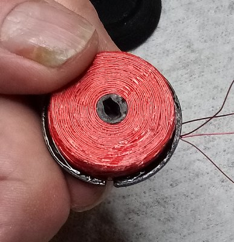
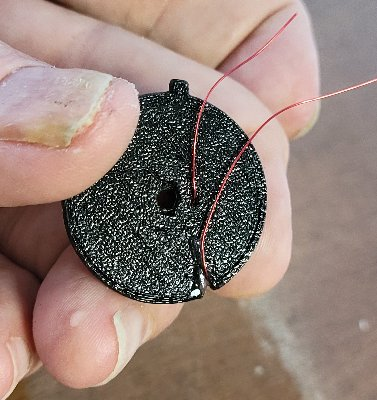

### Why opened face, again?

There were three main reasons I settled on this design for the coils.

First, with these air core coils (no iron in the core), the magnetic field
is relatively weak and *even 1 mm* of extra distance closer to the magnet
*significantly* increases the force applied to the pendulum.  Second,
in my experience, it was *hard to 3D print* a nice bobbin with a thin
face without supports.  And third, I found that a thin face tends to
**curl** away from the coil, and into the pendulum's path, if the coil
gets warm which it might (does), especially over time.

Plus I think the open face coils look cooler :-)

If you *want* to wind them by hand I'd probably do everything as with the
machine to prep and put the bobbin on a 3mm threaded rod, and then hold
that in my left hand and wind the wire with my right hand.  It would
be tough to stop, keep the coil from unwinding, and apply a drop of
epoxy glue to the face side every 50 or so turns.  The 30 minute
epoxy would likely setup before you could get 400+ turns on the coil,
but it could probably be done, perhaps with slower epoxy.

If I *really needed* to wind these by hand, I would probably **redesign
the bobbin**, with a thin (0.4mm) face, that was assembled on the rod
in two parts, and I would still add epoxy initially to
glue the two parts together and try to glue the face to the coil
somehow.

### 1. 3D Print the Tools and the Bobbin

I 3D print the Tools and two Bobbin (as a set) at 0.2mm layer heights
for more resolution and accuracy.  The parts should be cleaned
and prepped after printing.

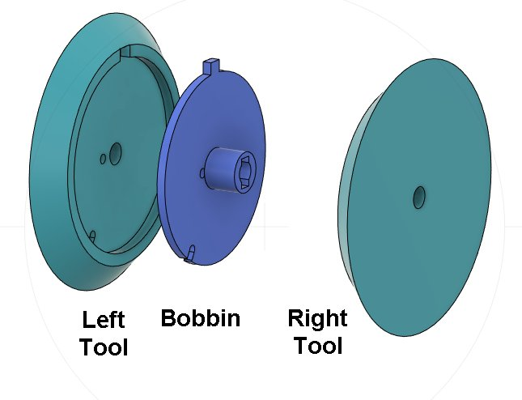

The **Bobbin** is *keyed* to fit within the **Left Tool** part. There is
a **tiny hole** in the bobbin, that *lines up with a hole in the left tool*,
through which the initial wire is fed.  At the end of winding, there is a
**notch** in the bobbin that lines up with another ***hole** in the left tool*
through which the final wire is *cinched* for the final coat of epoxy to fix it
in place.

**It is a good idea to dry fit the bobbin to the tool and expand the holes with a pin
or exacto knife** as needed so that you can easily and reliably feed the
wire through them when the bobbin is on the tool. Especially the final
hole, as you will be feeding the wire through it *while the bobbin is
wound and loose and **covered in epoxy!!***

### 2. Prep the Right Tool with Tape

Prepare the **Right Tool** by putting plastic tape on it
with a hole in the middle and securing that from the back
with small pieces of masking tape.

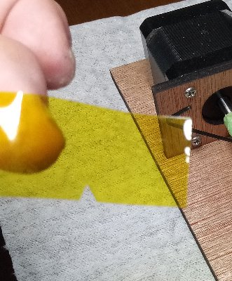
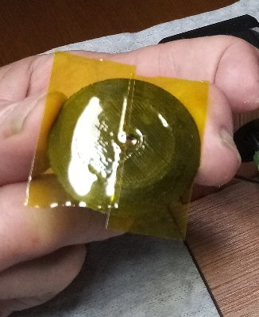

The **Right Tool** is covered with tape to prevent the epoxy from
touching it.  I used two pieces of **kapton tape**, because it was handy,
but I think a single piece of **packing tape** would probably
be easier and work as well.  Just put a big piece of packing
tape on the face of the right tool and wrap and attach the
edges to the back side of the tool as smoothly and
tightly as you can.

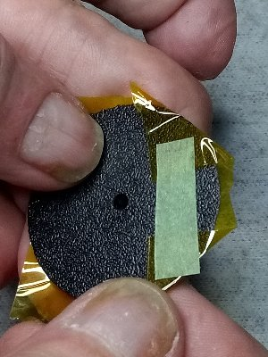
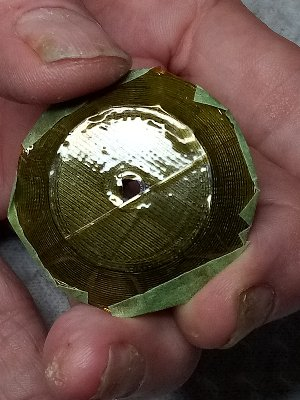

Secure the plastic tape from the back with smaller pieces of
masking tape, and cut a hole through the middle of the packing
tape for the rod to pass through.

### 3. Assemble Tools and Bobbin

PRH TODO:  The photos in this section of the process and
some subsequent ones are the opposite of what I do now.
I need to make new photos and videos.

We need to **cut a 3 inch** or so length of **M3 threaded rod**
and **lock two M3 nuts onto it** about 1" from one end.  The long end
will be about 2".  This threaded rod becomes a permanent part of the
machine henceforth.

Assemble the tools and bobbin on the rod as follows

- snap the **Bobbin** into the **Left Tool**
- insert the *long end* of the **threaded rod** into the Left Tool/Bobbin pair and push/screw it
  until it the lock nuts are snug and tight against the Left Tool.
- **feed about 12" of wire** through the *inner hole* in the Bobbin out through the
  corresponding hole on the Left Tool, leaving it hanging slack
- push/screw the **Right Tool** onto the threaded rod until it is tight against the Bobbin
- screw another pair of **3mm locking nuts** onto the rod and lock them tightly against the
  Right Tool

We want to make sure that the coil/tool assembly will not turn on the rod
while we are winding the coil!!

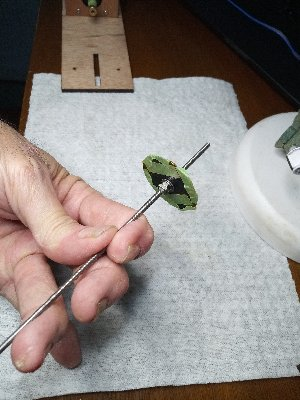
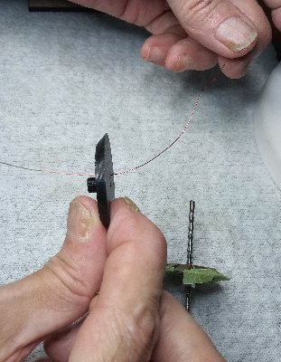
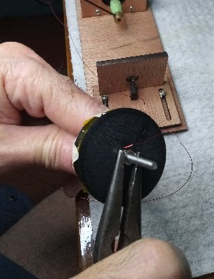

You should now have the entire assembly in your hands, with the wire freely passing through
the inner hole.

### 4. Insert assembly into Winding Machine and do First Turns

Insert the assembly as follows:

- affix the loose end of the wire to the **adapter** on the machine with a small piece of masking tape
- wind **10 turns** of the wire onto adapter by pressing the **space bar** on the laptop
- insert the threaded rod (the whole mess) into the adapter
- move the **sliding part** of the machine leftwards to capture the threaded rod
- align the sliding part and tighten it down with the **screws**
- tighten the **hex nuts** in the adapter to secure the threaded rod
- adjust the wire so that there is a **1 inch** or so **service loop** (loose wire) between the adapter and the bobbin.

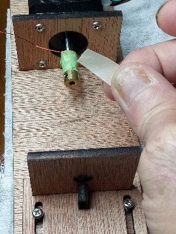
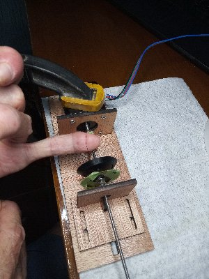
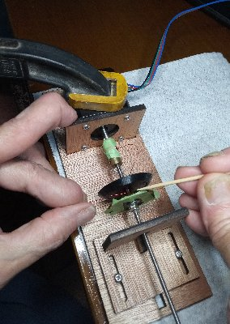

- while holding the service loop with one finger, carefully pull he wire slightly tight and
- do **one or two turns of the spindle by hand**, *overlapping* the wire so that it is locked in place and *will
not pull out* when we begin winding with the machine.  I use a **toothpick** to help bend the
wire and get it to overlap on these first couple of turns, then ...
- **carefully wind the 1st 10 turns** with the machine (by hitting the *space* bar on the laptop) to secure the wire

After the first layer of turns I **tape the working end of the wire to my work surface**
with a piece of masking tape, **stop**, take a break and a deep breath and **pause**!!

### 5. Mix the 30 minute epoxy

On an index card taped to my work surface, so that it wont move around as I try to get a drop on a toothpick with one hand,
I mix a small batch of 30 minute epoxy.

The rest of the coil winding process has to be accomplished in 15 minutes or so.

You only get one chance!

**FROM HERE DOWN YOU HAVE TO WORK QUICKLY AND ACCURATELY!!**

### 6. Wind the coil adding epoxy as you go

Remove the tape holding the working end to your work surface and prepare to feed
the wire into the machine, working left and right to produce smooth layers of wire.

**THERE IS AN ART TO THIS PROCESS**.   I would not expect to perfectly make my first coil.
Probably by the third try you will start making workable coils!

In any case, to get started:

- put the first drop of epoxy **on the Right Tool** smearing it **on the tape**, pushing
  it towards the center of the bobbin without getting any on the Left Tool.
- wind **another 10 turns** (space bar)
- then another 20 turns (space bar twice)

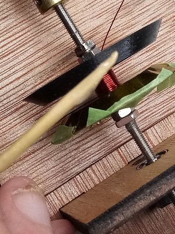

After the first 40 turns I usually switch the tool to start doing **40 revolutions** per *space bar*
by typing **r40<enter>** into the laptop serial terminal as I proceed to wind the remaining 400 turns of wire
in ten steps.

- add **40 more turns** at a time, adding **drops of glue** as you go
- continue until you have wound the wire to just under the notch in the bobbin.

Winding the wire will tend to mix and spread the epoxy but
I also **smear it around** with a toothpick at times and sometimes
move the coil 1/2 turn by hand to put epoxy on the other side.

The coil should be wound until the wire *just reaches the **notch*** but no further!!
This should be **about 440 turns**.  More important than the exact number of turns
is that you wind approximately the **same number of turns on both coils!**.

Also, it is important to **get as little epoxy as possible** on the
**Left Tool** in the process.

### 7. Feed the terminal end through the tool and finish the epoxy

**NOW THE TRICKY PART** When the winding is complete, the hard part is getting the wire end
through the **notch in the Bobbin** and the corresponding **hole in the Left Tool** to come out
the other side.  It's like threading a needle, that has been dipped in epoxy glue, at a right angle.

- **use a piece of tape to fix the loose end of the wire to your work surface** to keep it **taught** on the coil.
- **Cut the wire**, leaving about a foot (**12" or more**) of **free wire** after the taped down portion, so that you can freely manipulate the end without the coil coming unwound
- *Curl the wire slightly* and feed the free end through the **notch in the bobbin** and the **hole in the left tool** and pull it out towards the stepper motor
- When you finally get it through, pull it fairly **tight**

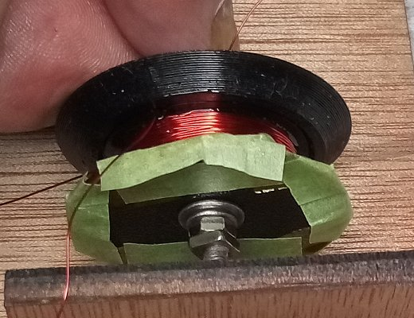

- Affix the wire to the adapter with **another small piece of masking tape**.
- type **R10** into the laptop to change back to 10 revolutions per space bar
- press the **space bar** and wind the *remainder* of the **free end** of the wire around the adapter.
- put another, final small piece of masking tape on the free end to affix it to the adapter

Now that the whole thing can turn freely, I repeatedly press the *space bar* to keep the coil turning
to keep the epoxy from drooping in any given direction.  I *put more epoxy* on the coil and run it
around with a toothpick to make sure the sides are fairly well saturated and the wire is **glued
into the notch**.  I then take a **stick with a pieces of paper towel wrapped around it** and run
it over the surface of the coil to remove any excess epoxy that I can.

**As the epoxy is finally setting up** I use the stick and a **paper towel slightly dampened with rubbing
alcohol** to clean up the edges of the **right tool** and any wayward epoxy *as the coil is
still turning*.  Scrub-a-dub!

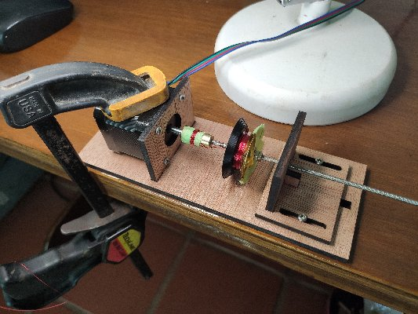

**Then I take another short break**.  We don't want the epoxy to fully cure, but we want
it to setup enough so that when we disassemble the tool it doesn't come apart.

### 8. Remove and Unwind the assembly from the machine

So, after **about 3-5 more minutes** for the epoxy to setup, but while it is still **tacky** ....

- type "R-10<enter>" to prepare to reverse the machine 10 revolutions at a time.
- remove the piece of masking tape from the adapter and grab the terminal end of the wire
- press the **space bar** to **unwind the terminal end** of the wire (and/or turn the spindle by hand to unwind it)
- when the terminal wire is all unwound, **loosen the hex nut** in the adapter
- loosen the screws and **sliding part** of the machine and move it to the right
- take the **rod and coil assembly** out of the machine
- press the **space bar** again while gently pulling the wire off the adapter
  until all of the wire comes off the adapter and you are left with the entire
  assembly in your hand.

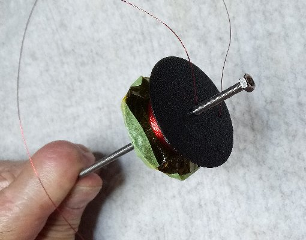

### 9. Disassemble and free the coil

Finally we disassemble the whole thing and pop the coil out of the tools

- remove the **lock nuts** from the long end of the tool
- unscrew the entire glued **tool-bobbin assembly** from the threaded rod
- make sure that the **wires are free to run** when we pull it apart
- **pop the bobbin** and **right tool** out of the **left tool**,
  pulling the wires through the holes in the left tool. It might be
  useful to re-insert a short length of the threaded rod into
  the right tool/bobbin pair to help **pry** them from the left tool.

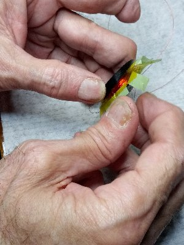
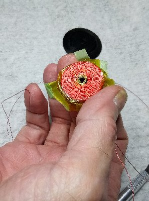

Once you have just the **coil and right tool** in your hand:

- *free up* the all the edges of the tape from the right tool
- **peel** the tape and coil from the right tool.  The tape **should come off the tool** and
remain glued to the coil.

This can take some force and prying.  But the epoxy bond to the coil and tape should be stronger than the
tape's bond to the 3D printed plastic, so what should happen is that the *tape should remain on the
**coil*** and be *removed* from the **Right Tool**.

Then finally you can **peel the tape from the coil face** !!!  Once again, this may take some force,
but with luck, the tape will come off cleanly leaving you with an epoxy impregnated open faced coil.
I found that the kapton tape came nicely free from the epoxy.  I have not tried it with packing table

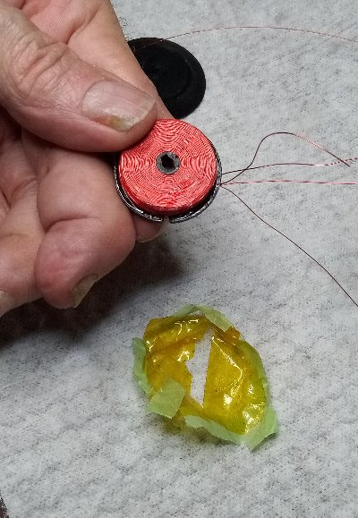

Congratulations!

You should now have a finished coil in your hand. Carefully set it aside.
It is a good idea to **immediately detail clean the tools with rubbing alcohol**
scrubbing them to remove any epoxy that might be on them.  I also take a
moment with a **toothpick** and the alcohol towel to clean any excess epoxy
from the finished coil itself.

### Rinse and Repeat

You need two good coils to make a clock.

You can test the coils with a multi-meter, but I have never had one
short circuit or fail.  The main problems I have had are:

- getting glue on the Left Tool and letting it set up too much so that
  I cannot separate the bobbin from the Left Tool and damage it while trying
- not letting it setup enough and having the coil come unwound
  (pull off of the bobbin) when I try to remove the Right Tool from the tape

As I said, I think it took me 3 tries to get my first relatively decent coil.
This is my *second least favorite* part of the clock build.  But it *is
satisfying* when you finally start getting **nice looking, evenly wound,
epoxy impregnated open faced electrical coils** out of the process.

:-)

**Next:** Creating the [**Electronics**](electronics.md) for the clock ...
