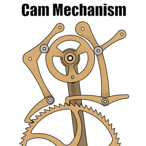
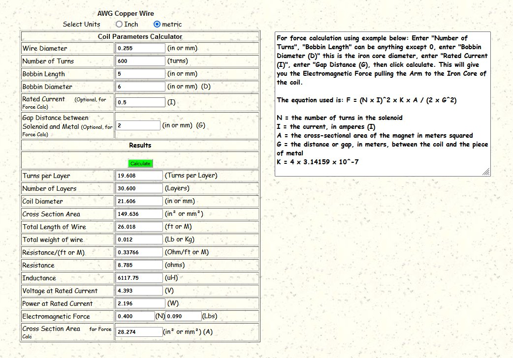

# theClock3 - Design Overview

**[Home](readme.md)** --
**Design** --
**[Plan](plan.md)** --
**[Wood](wood.md)** --
**[Coils](coils.md)** --
**[Electronics](electronics.md)** --
**[Firmware](firmware.md)** --
**[Assemble](assemble.md)** --
**[Build](build.md)** --
**[Tuning](tuning.md)** --
**[UI](ui.md)** --
**[Software](software.md)** --
**[Troubles](troubles.md)** --
**[Notes](notes.md)**

I designed and built **theClock3** after [**clocks #1 and #2**](https://github.com/phorton1/Arduino-theClock).
This design includes the requirements listed there and makes use of **lessons learned** in the process
of building those earlier clocks.  Some of the most important changes from those previous clocks include:

- It uses a **cam driven mechanism** to move the pawls within prescribed limits to eliminate *double grabs* and *work more reliably*
- The *cam driven mechanism* moves the pawls so that the pendulum does *work* in **both directions** as it swings
- It uses **smaller gears** to lessen the *mass*, *friction* and amount of *work* the clock must do.
- It uses an **angle sensor** instead of *hall sensors* for more accuracy in controlling the pendulum.
- It uses a **box-joint assembly** rather than *wooden dowels* to provide a more rigid and accurate frame.
- More care was taken to **balance** the *center of mass* of the **hands** so that they don't add extra *work* for the clock as they spin
- It has an **adjustable pendulum** weight for more accuracy in *tuning* the clock
- The **magnetic spring** has been separated from the *main driving magnet* to prevent *twisting moments* on the *pendulum*
- The **number of LEDs** was increased from one to **five** to allow for the displamy of more diagnostic and state information
- The **number of buttons** was increased from one to **two** to allow for a few more functions to be available without recourse to the **WebUI**
- The **L293D IC** driver circuit has been replaced with a new circuit that uses a higher powered **MOSFET** to drive the coils

## 1. Basics

The pendulum has a **magnet** in it that passes between a pair of **electromagnetic coils**
on each swing.   The coils *repulse* (push) the pendulum a little on each swing,
providing the energy to keep it moving.  By increasing the power provided to the coil
we can make the pendulum swing further, and by decreasing it, we can generally make it swing
less widely.

The **cam mechanism** has a **minimum design angle** of **5 degrees** (about the center,
or 10 degrees overall).  It is designed such that if the pendulum swings at least this far,
the *pawls* will properly engage the *seconds wheel* and advance the gear train.
Furthermore the mechanism is designed such that, beyond this distance, the pendulum
does no further work so that it is impossible for the pawls to grab
more than one tooth at a time or advance the clock more than one second per swing,
regardless of how far the pendulum swings.

There is an **angle sensor** on the pendulum.  By comparing successive
measurements we can determine the pendulum's *direction*, when it *crosses zero*,
and the extreme *maximum angle* it achieves during any given swing.

There is another **pair of magnets**, one in the stem of the pendulum, and one
that is affixed to the clock that is adjustable, that together, via magnetic
repulsion, act as a **magnetic spring**. Because of this spring, the pendulum
swings *faster* when it swings sufficiently far to **bounce** off of this spring,
and it swings *slower* when it swings less and the spring does not come into play.

### How it Keeps Time

We establish a **working minimum angle** at which the clock functions, by which we
mean that it actually *ticks* and *tocks* reliably. For prudence we set this to a
few degrees wider than the *minimum design angle* at approximately **8 degrees**
about center, or 16 degrees overall.
By design, the pendulum can swing 12.5 degrees about center or 25 degrees
overall before it *bangs* up against the frame.  We define a **working maximum angle
of 11 degrees** about center or 22 degrees overall where the clock will not bang
on the frame.

We **adjust the weight** on the pendulum so that the pendulum swings a little
*slower* than one second (about 1010 milliseconds) at the minimum angle.
We then **adjust the spring** so that it swings a little *faster* than one
second (about 990 ms) when it swings at the maximum angle.

The clock (code) works by using a **primary
[PID controller](https://en.wikipedia.org/wiki/PID_controller)** to swing at a
**given ANGLE** by increasing or decreasing the amount of power fed to the
coil during each swing.  We call this angle the **target angle**, and when working
correctly, the clock will reliably swing within a few tenths of a degree
of the given target angle.

We then use a **second PID controller** to adjust the **target angle** to minimize
the clock's *error* (in milliseconds).  On each swing, there is an instantaneous
error, which is how many ms faster, or slower, than 1000ms (one second) a particular
swing took.  These errors can accumulate, causing the clock to run slower,
or faster, overall, than the correct time.  If the clock is running slow, we
gently increase the target angle towards the **maximum working angle** so that the
pendulum starts to be influenced by the magnetic spring, and speeds up.
Or if it is running fast, we gently decrease the target angle so that it beats
slower, but still always swings at least at the **minimum working angle**.

This two stage PID controller was an evolution.
On [earlier clocks](https://github.com/phorton1/Arduino-theClock)
I merely tried to use a single PID controller to directly minimize the
instantaneous and cumulative ms errors by changing the power delivered
to the pendulum, but I found that it was better, both mechanically, and aesthetically,
to try to get the clock to first swing at a relatively constant angle, and THEN
to adjust that angle subtly to correct the time.
The second PID controller significantly smoothed out the behavior
and increased the accuracy of the clock.

### Synchronization

The swing error is based on calls to the ESP32 **millis()** function, which returns
the *milliseconds* since the clock was booted, rather than comparing the time
directly to the **RTC** (Real Time Clock) on the ESP32.  This means that the algorithm
itself can drift from RTC time.  We allow this to happen and provide a separate
synchronization method, **onSyncRTC()**, to occasionally (once per hour, parametrized)
correct for this potential drift. This allows us to keep track of the drift between
the algorithm and the RTC and isolates the basic swing PID controllers
from changes in the RTC.

Finally, if connected to the internet, we occasionally (once every four hours,
parametrized) synchronize the RTC to **NTP** (Network Time Protocol) to correct
for the ESP32 clock drift via another method **onSyncNTP()**.

### [myIOT framework](https://github.com/phorton1/Arduino-libraries-myIOT) and parametrization

The clock makes use of a library that I created, called
[myIOT](https://github.com/phorton1/Arduino-libraries-myIOT), for
creating parametrized devices with ESP32's.   By using this library
the clock presents a **User Interface** over the **Serial Port** and/or
a browser based **WebUI** and/or **Telnet** UI via **WiFi** that
lets you control and monitor the clock.

Much of the **behavior** of the clock can be modified by changing
the *parameters* of the clock.
For instance, the **minimum and maximum working angle** and the
**duration of the pulses** are parametrized and can be modified
at run-time in order to better [Tune](tuning.md) the clock.

Likewise, the **PID controller values** for both PID controllers are also
parametrized. as well as things like **the interval for syncing
the RTC and NTP clocks**.  In fact the software can even be **re-compiled
and uploaded** to the ESP32 via WiFi with **OTA** (Over the Air) updates.

Please see the **[User Interface](ui.md)** and
**[Software](software.md)** pages for more details on
the capabilities of the software and how to use it.

## 2. Mechanical Calculations

The **seconds wheel** has **60 teeth** on it so that advancing the
wheel by one tooth moves the seconds hand **one second**.  This
corresponds to moving the seconds wheel **6 degrees** per second.

The **cam mechanism** is designed to move the seconds wheel forward
**three degrees** when the pendulum swings in one direction, and
another three degrees when the pendulum swings in the other direction.

From the seconds wheel, which turns at **one rpm**, the gear chain
consists of four reduction gear pairs to turn the minute and hours hands.
For ease of design all gears are **separated by 60mm** center-to-center.

### Gear Ratios

<table style='width:50%;'>
<tr><th colspan='5'>Gear Ratios</th><tr>
<tr>
	<th>Names</th>
	<th>Teeth1</th>
	<th>Teeth2</th>
	<th>Modulus</th>
	<th>Ratio</th>
</tr>
<tr><td><b>min1a and min1b</b></td>		<td>8</td>	<td>64</td>	<td>1.6667</td>	<td>8:1</td></tr>
<tr><td><b>min2a and min2b</b></td>		<td>8</td>	<td>60</td>	<td>1.7647</td>	<td>7.5:1</td></tr>
<tr><td><b>hour1a and hour1b</b></td>	<td>10</td>	<td>40</td>	<td>2.4</td>	<td>4:1</td></tr>
<tr><td><b>hour2a and Hour2b</b></td>	<td>12</td>	<td>36</td>	<td>2.5</td>	<td>3:1</td></tr>
</table>

By multiplying the gear ratios we can see that the **minutes gears** have an overall
ratio of 7.5 * 8 = **60:1** and the **hours gears** have a ratio of 3 * 4 = **12:1** so
that for each 60 turns of the seconds hand the minutes hand makes one revolution, and
for each 12 turns of the minutes hand the hours hand makes one revolution.

By taking the diameter of the gears and the number of teeth, the **modulus** is calculated,
which is the key parameter used with the **FM Gears** function of Fusion 360 to
generate the gear drawings.  For example *min1a and min1b* have a ratio of *8:1*,
for **nine parts overall**. The smaller gear takes 1/9th of the distance and the larger
gear takes 8/9ths of the distance between them.  So the min1b gear has a *radius* of
8/9 * 60mm, or approximately *53.33 mm*, which gives a *diameter* of **106.66 mm**.
*Dividing the diameter by the number of teeth results in the modulus*.
106.66 / 64 equals approximately **1.66** for the calculated modulus of the
1st gear pair which we then plug into Fusion to generate the drawing
of the min1b gear.

### Pendulum

A pendulum of approximately **1 meter in length** swings at one *half swing* per second.
This clock uses a **1/2 second pendulum** that swings two half swings, or **one full swing**,
back and forth, per second.  The math predicts that a pendulum of approximately **1/4 meter**
(250 mm) would swing at this frequency.  More precisely, the length of a *seconds pendulum*
in today's units is **0.994 meters**, so an ideal 1/2 second pendulum would have a
length of **248.5 mm**.

Our pendulum is designed to utilize **threads drilled and tapped** through a
**lead fishing weight** and, by affixing that to the shaft via a threaded rod so that
turning the weight will move it up or down, the pendulum can be adjusted.
The wooden part also has an extension below the weight which contains the **metal magnet**
so our full pendulum is somewhat longer than the ideal pendulum at **322.5 mm**.
The (center of the) lead weight can be adjusted so that the weight can be anywhere
from about **230** to **270** mm from the pivot point to allow us to adjust the
weight up or down +/- 20mm or so from the ideal length.

We will adjust it to swing *slightly slower* than one second (1000ms),
or at a rate of **about 1010ms** per full swing at the *minimum angle*
and a *bit quicker*, at about **990ms** per swing when it comes under
the influence of the magnetic spring at the *maximum angle*.

## 3. Coil Calculations

The clock uses two 5x5x2mm *neodynium* magnets in the pendulum.

The coils run at **5V** (USB power supply) and I have **30 guage magnet wire** on hand.

The [**best free online calculator**](http://production-solution.com/coil-calculator.htm)
I found for calculating the size and electrical characteristcs of electromagnetic
coils comes from the company **Production Solution** (motto: *"If we can't do it, it can't be done!!"*)
in Bradenton, Forida.

Many days on that website, along with my previous builds and experimentation
led me to making the coil with an outside diameter of about 1" (**24mm** maximum).

This was arrived at based on calculations using **30 guage** magnet wire,
on a bobbin with an inside diameter of **6 mm** that is about **5 mm thick**.

A perfectly wound coil of 600 turns would result in an outside diameter of
21.606mm, would have a resistance of 8.785 ohms, and would draw 0.5 amps at
4.393V according to these calculations:

In practice, due to imperfect winding and the tolerances for fitting
the coil into the box, I ended up actually winding the coils with 440 turns
resulting in a calculated resistance of 5.75 ohms and a current draw
of about 0.9 amps at 4.94 volts.   The resistance I measured was roughtly about
6 ohms.

## 4. Construction Options

I have designed (at least) two **options** into the construction of the clock.

- an optional **2nd usb connector** to allow the power cable to come in the right, rather than the left side of the clock
- an optional **USB UPS** (Uninteruptable Power Supply) for the clock

These relativly minor options involve **3D printing a slightly different box** and/or
adding additional **cables and connectors** as far as the clock's construction is concerned.
Please see the [Notes](notes.md) page for more details on these options.

**Next:** An overview of the [**Build Plan**](plan.md) for the clock ...
