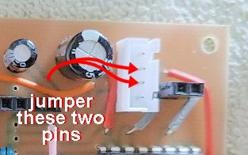
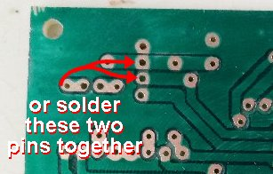

# theClock3 - Electronics Schematics and PCB (Build Continued)

**[Home](readme.md)** --
**[Design](design.md)** --
**[Build](build.md)** --
**[Wood](wood.md)** --
**[Coils](coils.md)** --
**Electronics** --
**[Software](software.md)** --
**[Box](box.md)** --
**[Assembly](assembly.md)** --
**[Tuning](tuning.md)** --
**[User Manual](user_manual.md)** --
**[Trouble Shooting](trouble.md)** --
**[Notes](notes.md)**

All of the files and design materials for the PCB can be found
in the **/docs/kicad/pcb3.1** folder of this repository.

### PCB (Printed Circuit Board) and Fusion 360

It is worth noting that I have modified my **KiCAD** environment a
bit, creating custom *symbols* and *footprints* with *3D components*
as needed, so that when I design the PCB, I can also export a *3D Model* (**STEP file**)
of it from KiCad, as shown below:

I used to have to keep track of, and manually redraw, all of the dimensions
of the PCB in Fusion 360, but now, with the STEP file from KiCad,
I am then able to import that 3D model *directly into my Fusion 360 design*
which made it **much easier** to do things like aligning screw holes in
the box base for the PCB mount, holes in the front of the box for the buttons,
and locating the cutout on the side of the box for the USB connector.

### Schematic

I have learned, when using **KiCad** to no longer draw all the
wires in my schematics but rather to use **labels** wherever
possible to reduce the clutter. It also makes it **much easier**
if I want to change the pins that I use on the ESP32 or the
connectors.

The **schematic** for the PCB is pretty simple.  Around the **ESP32 Dev Module**
SBC (Single Board Computer) we have

At the top, five **connectors**:

- a **four pin connector** for a potential future battery backup power supply
- two **two pin connectors** for the coils
- a **four pin connector** for the *AS5600* angle sensor
- a **three pin connector** for the *WS2812B* LED strip

On the upper left are two electrolyte **capacitors**:

- a **100uf** capacitor on the *5V rail* and
- a **470uf** capacitor on the *3.3V rail*

On the lower left are two *buttons* from ESP32 pins to Ground

In the middle are three **voltage dividers** to *analog input*
pins on the ESP32 for monitoring the VBUS. 5V, and (future)
Battery voltages.

On the right is the **L293D** *h-bridge motor driver* IC with a
**10K resistor** to ground on the *Enable* pin.

*The **10 uf electrolyte capacitor** on the ESP32 **EN** pin is
intended to make it work better with serial port programming.*

### PCB (KiCad) Design

From the schematic I use the **PCB Design** capabilities of KiCad
to *layout* the PCB. Here's a screen grab of that:

From the KiCad PCB design program I export a **STEP file** (3D model of the PCB)
and the **Gerber** and **Excelon** files that I will use in **FlatCam** to
generate the **gcode** to mill, laser, drill, and cut out the PCB.

### Creating the PCB

There are a series of steps carried out on my
[3018 CNC machine](https://github.com/phorton1/Arduino-esp32_cnc3018) to produce the PCB:

- two sided tape a blank single sided **PCB** to the work surface of the CNC machine
- do a [**mesh levelling**](https://github.com/phorton1/Arduino-libraries-FluidNC_Extensions)
  of the surface of the PCB to get more accurate results
- mill a **cross hair** *(using gcode)* that can be used to align the *spindle* and *laser* when I change between them
- do the **isolation routing** milling step *(using gcode)*
- **clean, sand**, and closely **inspect** the isolation routing
- *swap* the **spindle** out of the machine for the **500mw UV Diode Laser**
- **mask** and **paint** the board with a thin coat of *UV Epoxy*
- **expose** the UV epoxy using the *Diode Laser* on the CNC machine *(using gcode)*
- remove the **unexposed epoxy** from the pads with paper towel pieces and a bit of alcohol
- further *harden* the exposed epoxy by shining a **15W UV light** on the PCB for 2-3 minutes
- *swap* the **laser** out and put the **spindle** back in the machine
- **re-align** the spindle to the cross-hairs
- **drill** the 0.8mm holes *(using gcode)*
- **drill** the 1.0mm holes *(using gcode)*
- with a 2mm end-mill, **mill** *(using gcode)* the 3mm *mounting holes*, and finally
- **cut out** the board with the 2mm end-mill *(using gcode)*

After cutting out the board I remove it from the work surface,
remove any tape left on it, lightly sand the edges, and clean it
carefully with **Goo-Gone** and then a toothbrush and **warm soapy water**

I then *blow dry it* and do a **continuity** test of all of the pads
and paths with my multi-meter, making sure that everything is connected
and there are no short circuits.

### Soldering the PCB

After that I solder the wires, resistors, headers, and connectors to the PCB.

When finished, it looks something like this:

*Note: The open holes are where I only soldered resistors for one of the **voltage** dividers onto the
above PCB, and intentionally added **extra pads** for unconnected pins on the
ESP32 to allow for future modifications.*

**Important Note:** As *designed* the circuit keeps the **5V** and **VBUS** (usb power)
rails **separate** to allow for the later incorporation of a *battery backup power supply*.
Because of this, in the absence of such a backup
power supply, **the two center pins of the four pin "battery backup" connector
must be connected!!** for it to work properly .  You can attach a jumper
between the two pins or **create a solder bridge** between the two
center pins of the power supply connector when soldering the board.

### Solder and Create other Cables

In addition to the PCB

- **solder** a wired 3 pin JST connector to a strip of *five WS3812b LEDs*
- **solder** a wired 4 pin JST connector to the **secondary micro usb power port** (not shown)
- **crimp** two 4 pin JST connectors onto a 18" four conductor cable (not shown) for the *AS560 angle sensor* (shown)
- **solder** wires and **crimp** 2 pin dupont connectors to the coils.

When creating the cables be sure to get the **pin alignments** correct!!
Please refer to the *schematic* and *pcb* designs and **carefully
match the pins and orientations of the cables and connectors**
when creating the cables!

### Design Note

The **L293D** integrated circuit is rated at **600ma** from 4 to 36 volts,
so I am **pushing the chip past it's design specs**, sigh. However,
it is worth noting that the typical parametrized driving impulse
is only **120 ms** in duration, so the **overall duty cycle** of the circuit
is about only 10%.  and the **PWM output** from the ESP32 typically
runs at about 50%, so (for the time being) I am using this circuit.
There is a [note](notes.md) about potentially upgrading this in the future.

**Next:** Installing the **[Software](software.md)** and testing the PCB ...
