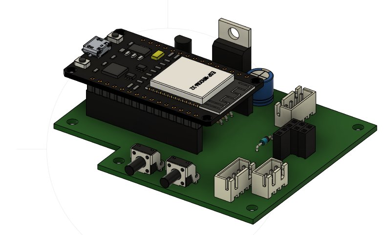
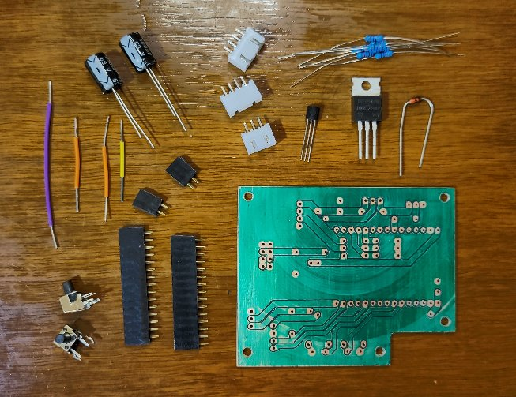

# theClock3 - Electronics Schematics and PCB (Build Continued)

**[Home](readme.md)** --
**[Design](design.md)** --
**[Plan](plan.md)** --
**[Wood](wood.md)** --
**[Coils](coils.md)** --
**Electronics** --
**[Software](software.md)** --
**[Assemble](assemble.md)** --
**[Build](build.md)** --
**[Tuning](tuning.md)** --
**[UI](ui.md)** --
**[Troubles](troubles.md)** --
**[Notes](notes.md)**

On this page we will describe the steps involving in building the electronics for the clock,
including:

- the [Schematic](#schematic) for the circuit
- the KiCad [PCB Design](#kicad-pcb-design)
- [Creating](#creating-the-pcb) the PCB
- [Soldering](#soldering-the-pcb) the PCB
- Soldering and Creating the other [Cables and Connectors](#solder-and-create-other-cables) needed for the clock

All of the files and design materials for the PCB can be found
in the **/docs/kicad/pcb3.1** folder of this repository.

### PCB (Printed Circuit Board) and Fusion 360

It is worth noting that I have modified my **KiCAD** environment a
bit, creating custom *symbols* and *footprints* with *3D components*
as needed, so that when I design the PCB, I can also export a *3D Model* (**STEP file**)
of it from KiCad, as shown below:

I used to have to keep track of, and manually redraw, all of the dimensions
of the PCB in Fusion 360, but now, with the STEP file from KiCad,
I am then able to import that 3D model *directly into my Fusion 360 design*
which made it **much easier** to do things like aligning screw holes in
the box base for the PCB mount, holes in the front of the box for the buttons,
and locating the cutout on the side of the box for the USB connector.

### Schematic

I have learned, when using **KiCad** to no longer draw all the
wires in my schematics but rather to use **labels** wherever
possible to reduce the clutter. It also makes it **much easier**
if I want to change the pins that I use on the ESP32 or the
connectors.

The **schematic** for the PCB is pretty simple.  Around the **ESP32 Dev Module**
SBC (Single Board Computer) we have

At the top, a bunch of **connectors**:

- a **four pin connector** for a potential future battery backup power supply
- two **two pin connectors** for wiring the coils in *parallel*
- two **two pin connectors** for wiring the coils in *series*
- a **four pin connector** for the *AS5600* angle sensor, along with a 10K pullup resistor on SCL
- a **three pin connector** for the *WS2812B* LED strip

On the left are two electrolyte **capacitors**:

- a **330uf** capacitor on the *5V rail* and
- a **100uf** capacitor on the *3.3V rail*

On the lower left are two *buttons* from ESP32 pins to Ground

In the middle are three **voltage dividers** to *analog input*
pins on the ESP32 for monitoring the VBUS. 5V, and (future)
Battery voltages.

On the right is the circuit that drives the coils.
The *gate* of the **IRF9540N** *N-Channel Mosfet* is normally
pulled *high* via a *10K resistor*, preventing any current from
flowing through the mosfet.
The **PWM** signal from the ESP32 passes through a *10K
resistor* to the gate of a **BC458** *NPN transistor*.
When the transistor receives a pulse, it pulls the gate of
the mosfet *low*, allowing the mosfet to transfer the full
5V to the coil(s).
There is also a **1N4741** flyback *zener diode* to dissipate
the currents from the coil when they are de-energeized and
the magnetic fields collapse.

###  KiCad PCB Design

From the schematic I use the **PCB Design** capabilities of KiCad
to *layout* the PCB. Here's a screen grab of that:

From the KiCad PCB design program I export a **STEP file** (3D model of the PCB)
and the **Gerber** and **Excelon** files that I will use in **FlatCam** to
generate the **gcode** to mill, laser, drill, and cut out the PCB.

It is beyond the scope of this document to describe how the **Flatcam**
project, and the resulting **gcode files** are produced.  However,
the *project and all of the output files* are included in this
repository if you want to explore them.

### Creating the PCB

There are a series of steps carried out on my
[3018 CNC machine](https://github.com/phorton1/Arduino-esp32_cnc3018) to produce the PCB:

- two sided tape a blank single sided **PCB** to the work surface of the CNC machine
- do a [**mesh levelling**](https://github.com/phorton1/Arduino-libraries-FluidNC_Extensions)
  of the surface of the PCB to get more accurate results
- mill a **cross hair** *(using gcode)* that can be used to align the *spindle* and *laser* when I change between them
- do the **isolation routing** milling step *(using gcode)*
- **clean, sand**, and closely **inspect** the isolation routing
- *swap* the **spindle** out of the machine for the **500mw UV Diode Laser**
- **mask** and **paint** the board with a thin coat of *UV Epoxy*
- **expose** the UV epoxy using the *Diode Laser* on the CNC machine *(using gcode)*
- remove the **unexposed epoxy** from the pads with paper towel pieces and a bit of alcohol
- further *harden* the exposed epoxy by shining a **15W UV light** on the PCB for 2-3 minutes
- *swap* the **laser** out and put the **spindle** back in the machine
- **re-align** the spindle to the cross-hairs
- **drill** the 0.8mm holes *(using gcode)*
- **drill** the 1.0mm holes *(using gcode)*
- with a 2mm end-mill, **mill** *(using gcode)* the 3mm *mounting holes*, and finally
- **cut out** the board with the 2mm end-mill *(using gcode)*

After cutting out the board I remove it from the work surface,
remove any tape left on it, lightly sand the edges, and clean it
carefully with **Goo-Gone** and then a toothbrush and **warm soapy water**

I then *blow dry it* and do a **continuity** test of all of the pads
and paths with my multi-meter, making sure that everything is connected
and there are no short circuits.

### Soldering the PCB

I usually take a few minutes, under a magnifying glass, with a
tiny piece of fine grit sandpaper to **clean the pads** to remove
any *epoxy film* left over from above before doing any soldering.
I then wipe them off with a paper towel and some *rubbing alcohol*.

After that I gather all the parts together and then I *cut, strip and bend* the
**connecting wires**, heat up the soldering iron, and solder them to the board.
Proceeding in *order of height* I next solder the **resistors** to the
board, then the **connectors**, **headers** and **switches**, then finally,
I solder on the **transistor**, **mosfet**, and **capacitors** last.

While still setup for soldering, I *test the PCB* with a *multi-meter* to ensure there are
no **short circuits** (particularly between the voltage rails and ground), and do any
*spot corrections* if I find a short or a component that is not conducting well while
the soldering iron is still hot.

When finished, it looks something like this:

*Note: The **resistors** for the voltage dividers and the **4 pin JST** *battery backup*
connector are only for the [optional](notes.md) **UPS** (Uninteruptable Power Supply) option
and you don't need to solder them if you are not using that option.*

### Solder and Create other Cables

In addition to the PCB we need to **solder** and **crimp** some cables
for the electronics.

#### LED cable

Solder a **wired 3 pin JST connector** to a strip of *five WS3812b LEDs*.
The wired connectors I purchased have the *correct orientation* with regards to
the socket on the PCB.  **Red** goes to the **5V** on the strip,
**Black** goes to **ground** on the strip, and the
middle **White** goes to the strip's **data in** connector.

**DOUBLE CHECK** the orientation of the pins on the connector and
LED strip versus the **PCB and schematic** BEFORE plugging the LED's
in!!!  You may *burn out the power supply* on the ESP32 if you have
them backwards!

#### AS5600 cable

The **AS5600 cable** has a *regular* **2.54mm** pitch female JST connector
on one side, and a smaller **2.0mm** pitch female JST connector on the
other side.

I used three of the four conductors, and the shield, of an **18"**
length of shielded **four conductor** cable (not shown), cutting
and not using the **black** conductor.  You could also use shielded
*three conductor* cable.

Carefully extract about 1" length of the conductors and shield from
each end of the cable and strip 3mm from the ends of the conductors.
Twist the ends of the conductors and the entirety of the *shield cable* and
put a small piece of *heat shrink tubing* on the shield cable, leaving
about 3mm at the end exposed.  Then **Crimp** the **female pins** onto
each end of the cable, with the larger pins on one side, and smaller
ones on the other side.

Make sure the **orientation of the pins** are correct and slide
and click them into the appropriate white nylon connectors. With
the AS5600 modules I have, the pin orientation is the *same on both plugs*

- pin1 - **red** 3.3V
- pin2 - **black** (heat shrink over twisted shield) **Ground**
- pin3 - **white SCL**
- pin4 - **green SDA**

**DOUBLE CHECK** the orientation of the pins on each end
of the cable versus the PCB/schematic and pinout of your
AS5600 module *before* inserting them in the white nylon parts!!

#### Coils

When soldering the wires to the coils, I used an **orange**  wire to the
center of each coil and a **white**  wire to the outer lead of each coil.
I use about 6" of *stranded 22 gauge wire* for these leads, stripping about
1/4" off each end and twisting the end strands.

Trim the leads of the 30 gauge wire from the coils to about 1/2"
in length, and **burn** about 1/4" of the lacquer off the wires with a lighter.
After burning off the lacquer, **sand** the ends to expose *clean copper* for soldering.
It is **important** that you have carefully cleaned the 30 gauge wire before attempting
to solder to it!

Then solder the bigger wires to the coils and cover the solder joints
with a small piece of *heat shrink tubing*. After soldering,  provide *stress
relief* by placing the coils face down, and gluing the the heat shrink tubing
to the coil with a drop or two of **5 minute epoxy**.

Finally, **crimp** some standard **male dupont** pins onto the ends of the cables
and put a two pin dupont connector housing on each coil.  It is **important**
that the solder connection and epoxy on the *back coil* **do not extend more
than 3mm** above the coil.  We don't want the *frame* to damage the *back coil*
once it is glued into the *box* and we slide the *frame* onto the *box*.

**Next:** Installing the **[Software](software.md)** and testing the PCB ...
