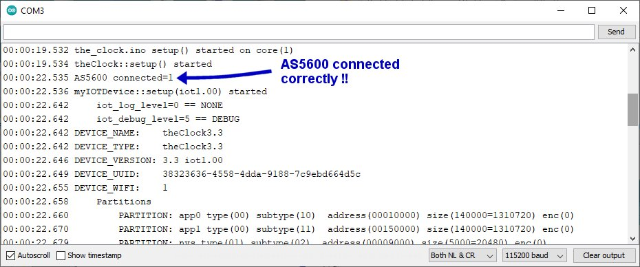
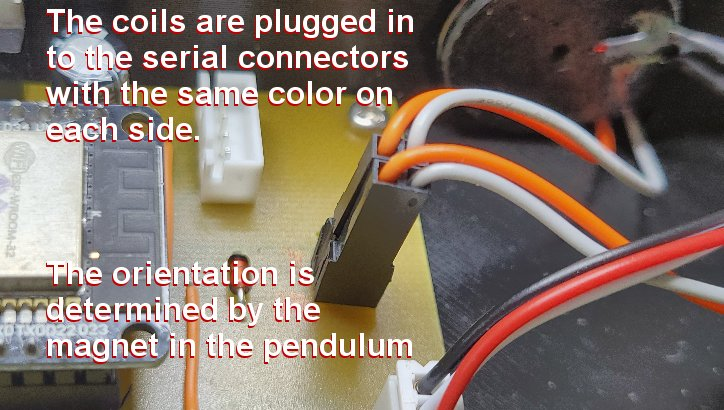

# theClock3 - Installing and Building the Firmware (Build Continued)

**[Home](readme.md)** --
**[Design](design.md)** --
**[Plan](plan.md)** --
**[Wood](wood.md)** --
**[Coils](coils.md)** --
**[Electronics](electronics.md)** --
**Firmware** --
**[Assemble](assemble.md)** --
**[Build](build.md)** --
**[Tuning](tuning.md)** --
**[UI](ui.md)** --
**[Software](software.md)** --
**[Troubles](troubles.md)** --
**[Notes](notes.md)**


This page describes how to install and build the **firmware**, upload it to the **ESP32**
and do an initial **test** of the PCB cables and sub components.

- [Install, Build, and Upload the Firmware](#a-install-build-and-upload)
- Boot up the ESP32 and explore the [Serial Monitor](#b-serial-monitor)
- Do a [Hardware Test](#c-hardware-test) of the PCB and components


## A. Install, Build and Upload

### 1. Install the [**myIOT**](https://github.com/phorton1/Arduino-libraries-myIOT/blob/master/docs/getting_started.md) Library

The firmware is built within the [**Arduino IDE**](https://www.arduino.cc/en/firmware) development environment and depends
on the [**myIOT**](https://github.com/phorton1/Arduino-libraries-myIOT) library.  Please follow the below link for
instructions on how to *prepare your Arduino IDE to build ESP32 projects* and install the *myIOT library*

[**Getting Started with the myIOT Library**](https://github.com/phorton1/Arduino-libraries-myIOT/blob/master/docs/getting_started.md)

As described there, you will also need to install the following dependencies:

- **WebSockets** by Markus Sattler - Version 2.3.6
- **ArduinoJson** by Benoit Blanchon - Version 6.18.5
- **ESP Telnet** by Lennart Hennings - Version 1.2.2
- [**Arduino ESP32 filesystem uploader**](https://github.com/me-no-dev/arduino-esp32fs-plugin)

### 2. Copy or clone **this** repository into your **Arduino Sketch Folder**

The location of your Arduino Sketch Folder can be found in the Arduino IDE via
the **File - Preferences** menu.


I have set mine to *C:\src\Arduino*, but yours will probably be something like **C:\Users\YOUR_NAME\Documents\Arduino**
(**Arduino** under your **documents** folder).

To install it from the **Zip File** go to the [main repository page](https://github.com/phorton1/Arduino-theClock3)
and press the green **CODE** button.  Download the **Arduino-theClock3-master.zip** file, and copy it's inner
folder (*Arduino-theClock3-master*) into your *Arduino Sketch Directory* and **rename the folder to "theClock3"**.

To clone it from github, open a **command prompt** window, change directories  to your *Arduino Sketch Directory*
and clone the repository

```
C> cd C:\Users\YOUR_NAME\Documents\Arduino
C> git clone https://github.com/phorton1/Arduino-theClock3.git theClock3
```

In either case you should now be able to open **theClock3.ino** within the Arduino IDE.

### 3. Install additional libraries

From the Arduino IDE **Library Manager**, install

- the **AS5600** library, version 0.3.5, by **Rob Tillart**
- the **Adafruit NeoPixels** library

### 4. Building and Uploading

Start with a **bare ESP32 Dev Module** that is **NOT** plugged into the PCB we created.

1. Connect the **ESP32 Dev Module** to your computer via a USB Cable
2. Open **theClock3.ino** in the *Arduino IDE*
3. In the Arduino IDE **Tools** Menu, set the *Board* to **ESP32 Dev Module**
4. Make sure that the *Partition Scheme* is set to **Default 4MB with spiffs (1.2MB App/1.5MB SPIFFS)**
5. Make sure that the correct **COM Port** for your ESP32 is selected.
6. Press the **Right Arrow** icon to **compile and upload** the **code** to the ESP32
7. Use the **ESP32 Sketch Data Upload** command from the *Tools* menu to upload the
   contents of the sketches' **data** folder to the **SPIFFS File System** on the ESP32

The ESP32 should reboot and you should see output on the **Serial Monitor**
indicating that the clock firmware has been uploaded and is running.


## B. Serial Monitor

There is a **lot** of Serial Output from the ESP32.  Use the *Arduino IDE
**Serial Monitor*** to see the output and to **type commands** to control the clock.
The Serial monitor must be set to **115200 baud** and to send **Both NL and
CR** (new line and carriage return).

The first time you boot it, you should see something like this in the
serial monitor:


When you boot a [**myIOT device**](https://github.com/phorton1/Arduino-libraries-myIOT),
like **theClock3**, the serial output tells you a lot about the device as it boots,
including providing a complete listing of the **ESP32 partitions** and **contents
of the SPIFFS file system**. Each line starts with **time stamp**.  Since we have
not yet connected to NTP (Network Time Protocol), the ESP32 does not know what time
it is, and so it defaults to starting at midnight on January 1, 1970.
The messages are **nested** (in many cases) by their **call level** within the code

The most important thing to note in the above log output,
as highlighted in <font color='red'><b>red</b></font>,
is that the ESP32
**failed to initialize the AS5600** angle sensor module.
That's ok!! We haven't *plugged it in yet* !!  The listing then continues:


A **myIOT device**, by default, sets itself up as a **WiFi Access Point**,
as highlighted in <font color='blue'><b>blue</b></font>
in the serial output. You can see that the *SSID* of the Access Point
is **theClock3.3** and the *IP Address* is 192.168.1.254. Also we see,
highlighted in <font color='red'><b>red</b></font> that the ESP32
**COULD NOT SET** the **AS5600 zero angle** five times.
That's ok too!  We just want to draw your attention to
these messages for later.


### 1. See a list of the Clock's PARAMETERS (Values)

If we now type the command **"values"**, followed by a carriage return,
into the serial monitor, the clock will display a list of all of it's
**PARAMETERS** and their values.


### 2. Try settting a PARAMETER and REBOOTING

There are a **lot** of different [**parameters**](software.md#b-parameters-and-commands)
available for controlling and understanding the clock.  They will be described more fully as we
move forward through the [Tuning](tuning.md) and [User Interface](ui.md) pages,
but for now it is good to learn that you can *set parameters*
by typing their **name**, followed by an **equals sign**, followed
by the **value** you want to set them to.

**parameter = value &lt;carriage return>**

For instance (from the Serial Monitor), we can **turn the ESP32
WiFi off** and back **on** by typing the following into the Serial Monitor (where
each line is followed by a *carriage return*)

```
wifi=0
wifi=1
```

Note that you can type the word **"reboot"**, followed by a carriage
return, into the serial monitor to reboot the ESP32.


Try it!


## C. Hardware Test

The point of introducing the **firmware** at this point in the documentation is so that
we can do a quick test of the **PCB** and some of the **peripherals and cables**
that were built on the **[Electronics](electronics.md)** page before we
*embed* them in the Frame and Box.

Particularly, we can test that the **LEDs** and **buttons** are working,
that we can connect to the **AS5600 angle sensor module**, and that the
**coils** *energize* and can *repel* a magnet.

To begin with, you should have already **uploaded the firmware and the
contents of the SPIFFS filesystem** to a bare ESP32, and
be able to connect to it and see, and type input into the **Serial Monitor**,
as described above.

You should have already (also) **checked the PCB** with a *multimeter* to
make sure there are **no short circuits**, particularly between any of the
power rails and ground,.


### 1. Unpower everything and plug the ESP32 into the PCB

**Plug the ESP32 into the PCB** and **power it up** by attaching it to your computer via a serial cable.

It should boot normally and not **explode** or overheat!

In the *Serial Monitor*, you should see the same thing as before.

**De-power the ESP32**.


### 2. Plug in the LED Strip and Repower

**Plug in the LED Strip** and **power up the ESP32**.

*note: the LEDs are in installed in the box from right to left, so
the **last** LED in the strip becomes the **leftmost** LED in the box
and the **first** LED in the strip becomes the **rightmost** LED in the box*.

You should see a series of 5 LEDs lighting up in <font color='cyan'><b>cyan</b></font>.
Then, because it cannot initialize the AS5600, all five LEDs should start flashing.
It flashes <font color='red'><b>red</b></font> **five times** for each failed attempt,
and *it will retry five times* to initialize the AS5600, so, in total you
*should* see **25 red flashes of all five LEDs** as it boots.

After 30 seconds or so the last LED in the strip should turn
<font color='purple'><b>purple</b></font>, or
<font color='green'><b>green</b></font> if you have previously connected to the WebUI.

In either case the 2nd to last LED should continue to flash <font color='red'><b>red</b></font>
to remind you that, *without the AS5600 module, the **clock will not work***.  That's
ok!  We can still test the PCB!


### 3. Test the button(s)

**Short Press** (quickly press and release) the **right** button a few times.
Each time you do it, the *1st LED* in the strip should turn **white** while the button
is pressed, and the LEDs should get brighter when you release it.
There are **15 levels** of brightness for the LEDs, then they will
turn off, then on again at their minimum level to repeat the cycle.

While you do this you should see various output in the console window.
if you are running the *Web UI* you should see the **LED BRIGHTNESS**
parameter change values each time you press the button.

To test the left button, **Medium Press** the **left** button by holding for two or more seconds
(but *less than 8 seconds!!*) until the 1st LED changes from **white**
to <font color='cyan'><b>cyan</b></font>.
When you let it up, you will toggle the **WiFi on and off**.

The last LED in the strip will turn <font color='blue'><b>blue</b></font> when
the WiFi is turned **off** and will turn back to <font color='green'><b>green</b></font>
when it connects to your WiFi, or to <font color='purple'><b>purple</b></font>
when it starts an Access Point.

If you are running the *WebUI* and you turn WiFi **off** you will notice that
the buttons and entry controls in the browser will be *greyed out* and *disabled*
while WiFi is turned off.  When you turn WiFi back **on** again, after a
few seconds, the WebUI *should* **reconnect** to the clock and *enable*
the buttons and entry controls.

You probably want to make sure that you *leave the ESP32* with the **WiFi** turned on,
and the **LEDS** at medium brightness after this step!!

When you are done testing the buttons, **De-power the ESP32**.


### 4. Test the AS5600 Connection

**Plug in the AS5600 cable** and *power up the ESP32**.

If we plug the AS5600 in with it's cable, and reboot the ESP32, the AS5600 should now initialize
properly, **no longer flashing RED 25 times**, and giving the **AS5600 connected=1** message
in the console as shown below:



The last LED in the strip should eventually turn
<font color='green'><b>green</b></font> or <font color='purple'><b>purple</b></font>,
as before, but now, instead of **red** the 2nd to last LED will flash <font color='orange'><b>orange</b></font>
indicating that, although the AS5600 initialized, we **still could not set the zero angle**.

That's because there's no **magnet** in front of the AS5600!  That's ok!!  All
we wanted to do here was test that we can connect to the AS5600 correctly via the cable.


### 5. Test the coils

Use a **multimeter** to ensure that the coils have some resistance (about 6 ohms) **BEFORE
CONNECTING THEM TO THE CIRCUIT**!!!

Have a **magnet** handy.

We plug the coils **in series** into the two **serial coil** connectors.
The orientation of the plugs depends on and/or determines the orientation of the magnets
that will be glued into the pendulum.  Plug the coils in such that the
same colors are on each side, with **orange** on the left and **white** on the right.



**De-power the ESP32** (unplug the serial cable), **plug in the coils**, and **power up**
the ESP32.

**WATCH OUT FOR SMOKE AND BE READY TO UNPLUG THE POWER SUPPLY!!**

After it has finished booting, type the command **"test_coils=80"** into the Serial Monitor.
This command energizes the coils at 80/255 power (80 on a scale from 0 to 255) which
should be enough for you to detect the forces. Obviously, if any thing gets **hot**
or **starts smoking**, you should remove the power supply immediately and figure out
what is wrong, and **correct the short circuit** before continuing.

You should be able to hold the magnet near the face of each coil and feel a
repulsion or attraction. Increase the power (*gingerly!*) as necessary.

This is a good opportunity to determine the **orientation** of the *magnets and coils*.
We want to figure out how to arrange the coils and magnets such that
the magnet is repulsed by each coil when the coils are facing each other and the magnet
is in between them.   Once you have determined that, **mark** the **front coil** with
a piece of tape or felt marker, and **mark the front** of the magnet.

**Remember** (write down) the orientation of the coils, plugs, and magnets, so that
you can glue the magnets in the pendulum in the correct orientation in the
next steps of assembly!

De-energize the coils by typing **test_coils=0** into the Serial Monitor.


## Summary

That's about it for an introduction to the firmware.  We just want to make sure
the PCB basically works before we embed it, the LEDS, and the coils
into the **Box**, and the AS5600 cable and Sensor into **Frame**, as
we continue building the clock.


**Next:** - Finish the other [**Sub-Assemblies**](assemble.md) of the clock, including the **gears, pendulum, and box**
