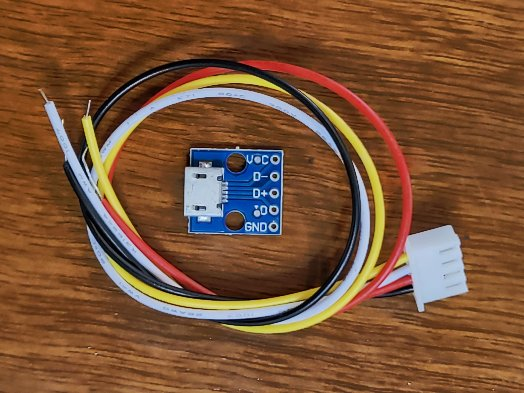
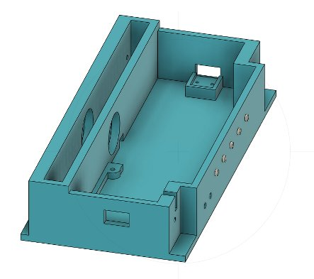
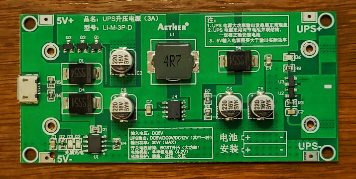
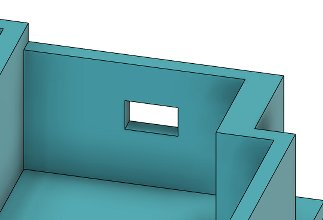
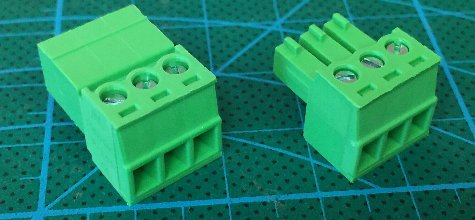
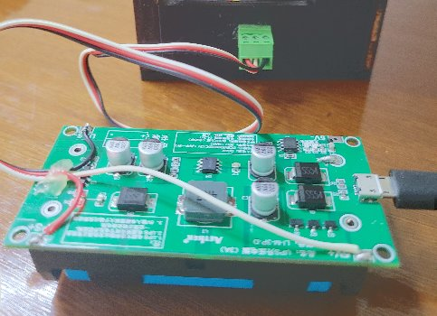
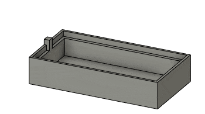
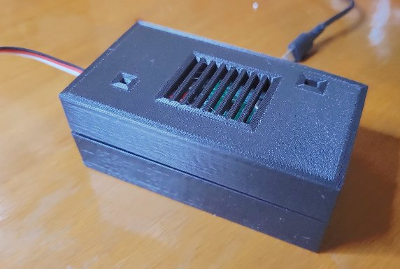

# theClock3 - General Notes

**[Home](readme.md)** --
**[Design](design.md)** --
**[Plan](plan.md)** --
**[Wood](wood.md)** --
**[Coils](coils.md)** --
**[Electronics](electronics.md)** --
**[Firmware](firmware.md)** --
**[Assemble](assemble.md)** --
**[Build](build.md)** --
**[Tuning](tuning.md)** --
**[UI](ui.md)** --
**[Software](software.md)** --
**[Troubles](troubles.md)** --
**Notes**

On this page, you will find various other information about the Clock
including the following **Optional Features**:

- [Secondary USB Connector](#1-optional-secondary-usb-connector)
- [Battery Backup Power Supply](#2-optional-battery-backup-power-supply)

and **Historical Notes** about the clock:

- [Serial Plotter Example](#serial-plotter-example)
- [pyJoints Addin](#pyjoints-addin)
- [Ugraded MOSFET PCB](#ugraded-mosfet-pcb)

... as well as a list of
[Possible Future Changes](#c-possible-future-changes)
and a
[Version History](#d-clock-version-history) of the clock.

## A. Optional Features

### 1. Optional Secondary USB Connector

There is a designed *option* to include a **Second USB connector**
to the *right side* of the Box.

In the [Fusion 360 Design](./fusion/clock3.2.f3z)
there is a *selection* set that
consists of a number of *features* that are, by default,
*suppressed* for this option.  If you **unsuppress** those features, then
the Box will include
a **hole** on the right side and a **mount** for a USB connector.
Also, in this repository, you can find the
[STL](./fusion/stl/the_box_usb.stl) file
for this version of the box, as well as
[Prusa](./prusa/the_box_usb.3mf)
project, and the
[GCODE](./prusa/gcode/the_box_usb.gcode) file for 3D Printing
this version of the Box.

To add the **2nd USB connector**:

- *3D Print* the Box with the **USB mount and hole** in the right side
- *Solder* a *wired* 4 pin **JST** connector to a **Micro USB board** as shown above and described here:
- The **GND** (**black** with the shown cable) from the Micro USB board goes to the **GND** pin of the
	**Backup Battery Connector** on the [PCB](electronics.md)
- The **VCC** (<b>yellow</b> with the shown cable) from the Micro USB board
    goes to the <b>5V</b> pin of the
	**Backup Battery Connector** on the [PCB](electronics.md)
- *Screw* the Micro USB Board into the Box with two **M2x8** machine screws
- *Plug* it into the **Backup Battery Connector**
- *Connect* a **USB Power Supply** to the new USB connector

This *2nd USB connector* may be added for a number of reasons

- it allows you to plug the power in from the *other side* for aesthetic reasons
- it *may* improve the performance of the clock, inasmuch as the power for the *coils*
  will now come **directly** from the usb power supply, rather than **through** the
  ESP32, which may involve a *diode* cutting the power available to the coils.

### 2. Optional Battery Backup Power Supply

There is a designed *option* to include a **Backup UPS**
(Uninteruptable) **Power Supply** to the *right side* of the Box.

The UPS (Uninterruptable Power Supply) that I
[found on Ebay](https://www.ebay.com/itm/394629392845)
to work for this
purpose, using two **18650** batteries, is shown below.

In the [Fusion 360 Design](./fusion/clock3.2.f3z)
there is a *selection* set that
consists of a number of *features* that are, by default,
*suppressed* for this option.  If you **unsuppress** those features, then
the **Clock Box** will include
a **hole** on the right side for a **connector**.
Also, in this repository, you can find the
[STL](./fusion/stl/the_box_ups.stl) file
for this version of the Clock box, as well as
[Prusa](./prusa/the_box_ups.3mf)
project, and the
[GCODE](./prusa/gcode/the_box_ups.gcode) file for 3D Printing
this version of the Clock Box.

For ease of assembly,
I simply used a pair of *Pheonix Style* **3.81mm** screw terminal plugs, that I
[found](https://www.ebay.com/itm/313657760083)
on ebay, to connect the UPS to the Box. The **hole** in the
Box is sized so that you can *epoxy glue* the **female**
plug to the box, and it is *easy* to **screw** the wires
into the plugs.

- *Solder* the supplied **battery holder** to the *UPS board*.
- *Solder* a **black** wire to the **UPS-** (minus) terminal
  (which is also the common ground) on the UPS board.
- *Solder* a <b>red</b> wire from the
   **UPS+** (positive) terminal (the *output* power) on the UPS.
   This will **supply power** to the clock.
- *Solder* a **white** wire to the **5V+** (the *input power*)
  terminal on the UPS.  This is the voltage that will be
  *monitored* by the *low power detection* system.

Create a **4 pin JST cable** that connects the following *three out of
four* pins on the JST connector with the appropriate pins
on the **Backup Battery Connector** on the [PCB](electronics.md)

- **black** (common ground) goes to **GND** on the battery connector
- <b>red</b> (UPS + power) goes to **5V** on the battery connector, and
- **white** (5V from the UPS) goes to the **VBUS** pin on the battery connector.

After *gluing the connector to the box*, and
*screwing the wires* appropriately into the connectors,
the assembled electronics look something like this:

#### 3D Printed Box for UPS

There is a **3D Printable** box for this UPS included in this repository.

There is a separate [Fusion 360 Design](./fusion/USB_UPS.f3z), for it,
as well as the STL files for the
[top](./fusion/stl/ups_top.stl) and
[bottom](./fusion/stl/ups_bottom.stl) of the UPS box, as well as the
[Prusa](./prusa/USB_UPS.3mf) project and
[GCODE](./prusa/gcode/USB_UPS.gcode) file for Printing
both parts.   When assembled it looks something like this:

#### Note regarding UPS batteries

The choice of **batteries** for the UPS makes a **big** difference!

I tested it first with some *cheap yellow* chinese 18650 batteries
and it was only able to power the clock for about **30-45 minutes**
before the batteries dropped below 2.9 and the ESP32 would no longer
boot.

Then I switched to some new *high quality* **LG** batteries, and
it was able to power the clock for over **8 hours**.

## B. Historical Notes

### Serial Plotter Example

### pyJoints Addin

While designing theClock3's Cam Mechanism, I wrote the Fusion 360
[pyJoints Addin](https://github.com/phorton1/fusionAddIns-pyJoints).

It took *nearly a month* (and a lot of head scratching) to design the
**cam mechanism**.  I could find no existing examples or such a
mechanism despite many, many internet searches.

It was *very tricky* in Fusion 360 to get all the distances and angles correct (or close).

In order to get some idea of whether or not it would actually work I spent
a lot of time researching **physics simulators** and exploring the **animation
capabilities** of Fusion 360.   For all of it's sophistication, none of the
available tools in Fusion allowed me to animate the mechanism and get an
idea, before I built the clock, whether or not the mechanism would work.

As a result of not being able to otherwise physically model the mechanism,
I ended up spending another *three weeks* or so designing and implementing
an [**Addin**](https://github.com/phorton1/fusionAddIns-pyJoints)
to Fusion 360 to allow me to animate the design and visualize
the actual mechanism in action.

### Ugraded MOSFET PCB

My earliest builds of this clock made use of a circuit that utilized
an L293D h-bridge integrated circuit to drive the coils, inherited from
my [previous clock](https://github.com/phorton1/Arduino-theClock) project.

I believe that the coils were occasionally drawing more current than the
L293D chip was rated for.  I noticed that after a week or more of running
perfectly, the clocks would start failing.  They seemed unable to push the
pendulum far enough.  By that point the PID algorithms had worked their way to
sending full power pulses (255 on a scale of 0 to 255), and yet the pendulum
was not swinging far enough to speed up, or would even come to a complete
stop.

When this happened, I noticed that the L293D chips were very hot.
The two coils were wired separately to the two circuits within the
L293D, and by my calculations the coils could draw upto 0.9 amps
each in that configuration.  The L293D is only rated to 600 ma.

Nonetheless I continued trying to work with the L293D circuit.
I added heat-sinks to the chips, and, after letting them cool down
and rebooting the clock, it would start working again, where full
power pulses would correctly swing the pendulum far enough to bang
against the frame, but after another week, sometimes, the same thing
would happen.

So I decided to redesign the circuit to use a high power MOSFET,
instead of the L293D, to drive the coils.

## C. Possible Future Changes

### Bigger Holes and 4mm Tubes for Arms && Washers

It is difficult to align the Washers onto the Arms for gluing.
The are supposed to fit *loosely* on an M3 machine screw.
If you use an M3 machine screw for the alighment, you are
likely to **not center** the holes correctly.

One solution would be to make the holes 3.85mm, and to
align them using a 9.6mm piece of 4mm tubing. They could
be clamped.

### 3D printed spacer for Top Tube Assembly

It is difficult to align the Pendulum in the Channel while
assembling the Top Tube.   The Pendulum ends up smashed
against the front frame and has to be moved back which
is difficult.  One solution would be to 3D print a U-shaped
spacer that could be inserted while pushing the Tube through,
and then removed for final acjustment of the spacing.

Another solution would be to laser cut, and glue, the
correct thicknesses of U shaped wooden pieces.

### Shorter Clock and Pendulum

As currently designed in v3.2 the Pendulum Weight tends to need to be
adjusted far **up** on the rod to achieve the correct swing.
Making the Pendulum (and the whole clock) **even shorter** to get
the weight more towards the center of the rod will also
*save wood* and make the big clock *Frame Pieces* easier
to cut.

## D. Clock Version History

- [**v1.0**](https://github.com/phorton1/theClock) - the first clock I **built**, with *5 coils* that could tick, but not keep good time
- [**v1.1**](https://github.com/phorton1/theClock) - modified v1.0 to a *single coil* and made it keep rudimentary time
- [**v2.0**](https://github.com/phorton1/theClock) - Improved from v1.0 and **built** as a *gift*
- **v3.0** - complete re-design and **build**, especially the *frame* and *cam mechanism* and switch from *hall sensors* to the *angle sensor*
- **v1.3** - retrofitted my v1.1 clock with *angle sensor* and new *software*
- **v3.1** - redesigned the *arms and pawls* for more reliability
- **v3.2** - *shortened* the clock by 10mm and **built three** as gifts
- **v3.3** - replaced the *L293D* based PCB with a *MOSFET* based PCB

**Done!!** Back to the [**beginning**](readme.md) ...
