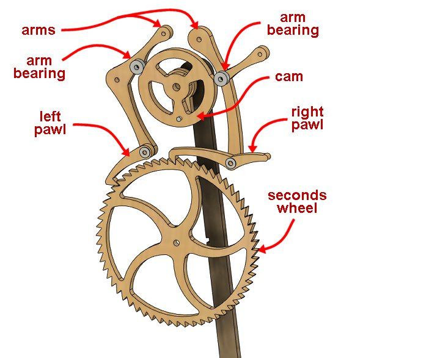
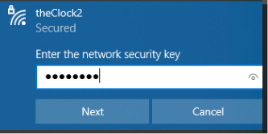
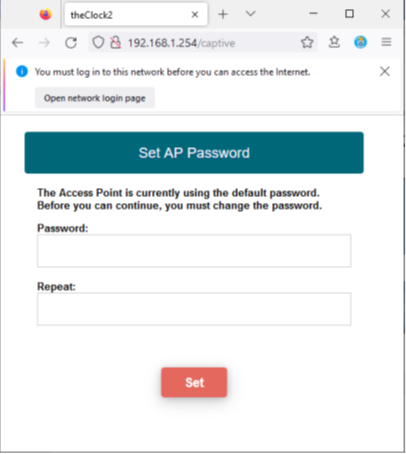
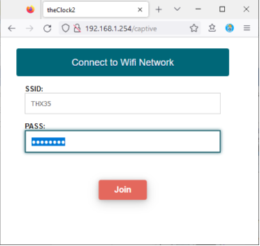
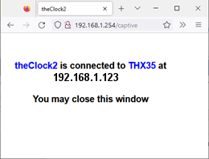
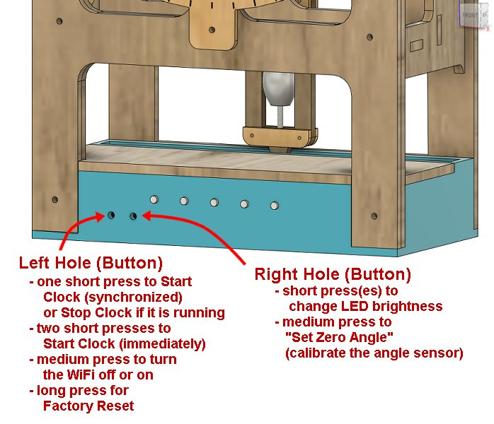
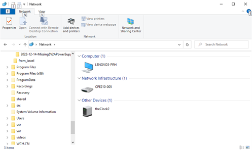
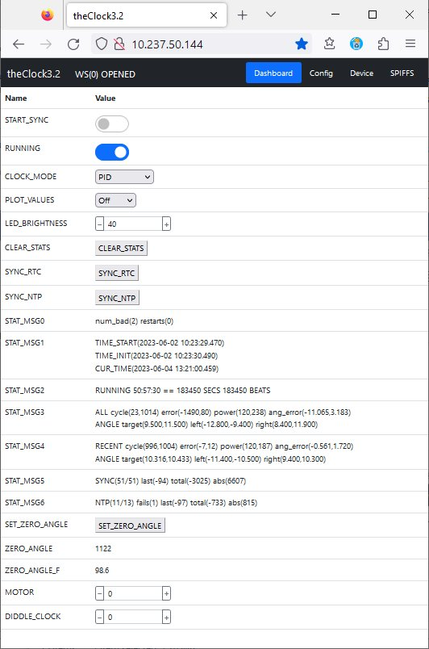

# The Clock - Quick Start Guide

**[Home](readme.md)** --
**[Design](design.md)** --
**[Wood](wood.md)** --
**[Plastic](plastic.md)** --
**[Electronics](electronics.md)** --
**[Coils](coils.md)** --
**[Assembly](assembly.md)** --
**[Tuning](tuning.md)** --
**Quick Start** --
**[User Manual](user_manual.md)** --
**[Trouble Shooting](troubles.md)** --
**[Notes](notes.md)**

Welcome to theClock v3.2 !!

This clock has been especially **hand-crafted** for **YOU**.

Please visit **https://github.com/phorton1/Arduino-theClock3** and view the web-pages in the repository
for many more details about the clock, it's design and construction, maintenance and operation.
Particularly, there you will find the **[User Manual](user_manual.md)** for the clock.

Although you could theoretically merely unpack the clock, plug it in, and press the left button
twice to start it ticking, **it is highly recommended that you follow this Quick Start guide**
and **first connect it to your local WiFi network**, and use the **Synchronized Start** method
described below to start the clock.

The clock is designed to **synchronize itself** to the Network Time Protocol (NTP) if it is given a
Wifi connection, with the idea that it should run within a second or so of the correct time for
the forseeable future (until, hopefully, at least the *Y2038 problem*, when unix time will overflow 32 bits).
If it is not connected to the internet, the best it can do is synchronize itself to the internal
RTC (Real Time Clock) on the embedded computer, which, at best, will only be correct to within
a few seconds a day.

A few notes:

- The clock was shipped to you after a fresh **Factory Reset**.  You can, at any time, return the clock's
  software to it's initial state by issuing a Factory Reset as described in the **[User Manual](user_manual.md)**.
- The **Wifi has been enabled by default**. It can be turned off (as described in the **[User Manual](user_manual.md)**)
  if you are paranoid about your home network security.
  Substantial efforts were put into ensuring that the clock does not create any significant security risk
  to your home network, but just in case, I added the ability for you to disable the clock's Wifi access entirely.
- Although I have tried my best to produce a reliable clock, **some maintenance may be necessary**.  In particular
  it may be necessary once every few years, or more often, to lubricate the bearings and brass tubes.
- **PLEASE DO NOT TURN THE SECONDS HAND COUNTER-CLOCKWISE!!** The hands are merely compression fitted to the
  brass tubes, and the seconds hand was intentionally designed to be a tighter fit.  It is not intended to
  move relative to the tube and gears, whereas the hour and minute hands ARE intended to be moved
  relative to the tubes and gears, in order to for you to be able to set the time.
  **When moving the seconds hand** please always turn it **clockwise**!!  It should turn the *seconds wheel*
  smoothly and go "clickity-clack" as the pawls slide over the seconds wheel.
- **ANY FLASHING LEDS ARE INDICATIVE OF A PROBLEM**.  If you see any LEDS that are flashing
  regularly (once per second or so) it means something is wrong!!   Please see the online
  **[Trouble Shooting](trouble.md)** guide, or contact me if you see flashing LEDs!

## Quick Start Overview

- Unpacking
- Preparation
- Power Up!
- Connect to theClock
-- Change Default Password
-- Specify Wifi SSID and password
-- Verify Connection
- Reboot
- Start Clock Synchronized
- Brief Description of LEDs
- Stop the Clock
- Changing the LED brighntess
- Getting to the WebUI

### 1. Unpacking

- Open the box and remove piece(s) of styrofoam
- Remove the **power supply** and **baggy with allen wrench** from the lower portion of the clock.
- Remove **the Clock** from the box and place it on a flat level surface
- Remove the **pieces of cardboard** at the top of the clock
  that are securing the mechanism
- From the back **remove the piece of green tape** and the
  **pieces of cardboard** that are securing the pendulum
- Blow off any styrofoam particles that may be left over from
  the packaging.

### 2. Preparation

Efforts were made to ensure that the clock would not be damaged during transport.
However, some shifting may have taken place during shipping, and so, before anything else we need
to make sure that the mechanism is properly aligned and engaged, that the pendulum
swings freely, that the gears turn correctly, and that the hands are aligned so
that they don't collide.

- From the top of the clock, the two **pawls** should be resting on top of the **seconds wheel**
- The **pawls** and **arms** should move freely.
- The **arm bearings** should be riding squarely on the **cam**
- The **hands** should be square to the tubes they are connected to with approximately equal spacing between them.
  Adjust them slightly as necessary to ensure that they don't hit each other as they turn.
- You should be able to move the **seconds hand** (which is connected to the *seconds wheel*) clockwise and the **pawls** should go "clickity-clack" as the second hand moves.
- There should be **very little resistance** when moving the second hand!!
- As you move the second hand clockwise multiple revolutions, the minute hand and hour hand **should move**
  slightly, but noticably.
- The **penduluum** should swing freely in the middle of the **channel** and not touch the plastic at any point.
- The **pendulum** should swing 4-5 times back and forth when released from an extreme posision.  It should NOT
  swing only once or twice and then stop.

At that point you should be able to swing the pendulum back and forth, and the clock should tick-tock,
with each pawl, in turn, grabbing and turning the seconds wheel clockwise.  You can put your index finger
into the hole on the top of the clock and move the pendulum back and forth and it should not take
much force to keep the pendulum moving and the clock ticking.

### 3. Power Up

When the clock is mechanically ok and everything is nice and loosy-goosey it is time to connect the
power supply and boot it for the first time.

You can connect the USB power supply from the left, or right of the clock as you desire.

When the USB power supply is connected the computer will boot, and you will (should) see
the five LEDs on the front of the clock light up in **cyan** from left to right, followed
by various other LED colors as the clock boots.

When the clock has sucessfully booted for the first time, the **left most LED should be
purple** and no other LEDs should be lit, and particularly **NO LEDS SHOULD BE FLASHING!!**
Please see the online **[Trouble Shooting](trouble.md)** guide, or contact me if you see flashing LEDs!

The meaning of the LEDs is described more fully below, but for now suffice it to say
that the **Left Purple LED** indicates that the clock is in **AP (Access Point)) Mode**
which means that you can connect to it via Wifi.

### 4. Connect to the Clock (in Access Point Mode)

When the clock is in **AP (Access Point)) Mode** (the left-most LED is **purple**)
it will show up on your home computer or phone as a **Wifi Network** to which you can attach.

You will **connect** to the clock, be required to **change it's wifi password**, and then
will tell it how to **connect to your home Wifi network**.  By connecting to your home
Wifi network (and presumably to the internet via that) the clock will have access to
the **NTP (Network Time Protocol)** from which it can find the correct time.

Just in case you are concerned,
**apart from connecting to NTP, the clock does not use or present itself in any way to the internet!!**
However, once it is connected to your home Wifi network, **YOU** will be able to access it
via a browser based **WebUI** if you so wish.

In any case, please perform the following steps to connect the clock to your Wifi network.

- From a laptop or home computer (preferable) or phone/tablet connect to **theClock3** wifi network
- The default password is **11111111**  (eight ones).

- After a few seconds your system **browser should automatically pop up** with
  a (redirect page and then) a page which requires you to set a **new password**.
- Enter (and re-enter) and **write down!!** a new password for your clock's AP Mode.
  You will need this password (or a Factory Reset) in the future if you change
  your home network SSID or credentials.

- After you set the AP Mode password, you will be presented with a page that allows you to
  tell the clock the **SSID** and **password** of your home wifi network.
- These credentials are stored in an encrypted form on the clock's computer and
  will never be presented to anyone in a human readable form !!

- **Enter the SSID and password of your home Wifi network** and press the **Join
  Button**.
- If, after 15 seconds or so, **you do NOT receive an error message, then everything worked ok!!**

That's it!   The only thing that can be done from **AP Mode** is to tell the clock
a wifi network to connect to.

The clock *tries* to report when it has sucessfully connected to your home wifi network, but
because it cannot be connected in both AP and STA mode at the same time (unless your home
wifi network *happens* to be on the same "channel" as the clock's AP mode), typically
it is not able to report to the browser that it connected successfully.  However, you
may get lucky and see a message of the form "theClock3 succesfully connected to YOUR_SSID
at IP Addresss XXX.XXX.XXX.XXX".

In any case, **if you DONT see an error message at this point** after 10-15 seconds then the clock has succesfully connected
to your home wifi network.
If you **DO RECEIVE AN ERROR MESSAGE** please re-enter the SSID and password and try again. You
can reboot the clock (disconnect and reconnect the power supply) and try this again.  You may
need to reboot your laptop/tablet/phone, although everything *should* work the first time through.

When the clock is connected to your home wifi network, it is said to be in **Station (STA) Mode**.

### 5. Reboot

Once you have connected the clock to your Wifi network, you may reconnect your Laptop/Tablet/Phone
to your home wifi network.  When you do so, after about 15 seconds, the leftmost LED should change
from **purple to green**.    When the leftmost LED is **green** it indicates the the clock is
correctly attached to your home wifi network in **STA Mode**.

If after 15 seconds or so the LED does NOT turn green, you may need to reboot the clock by
disconnecting and reconnecting the USB power supply.

**It is not a bad idea to reboot the clock in any case at this point**.

When you reboot and the clock connects to your Wifi network, the same pattern of LEDs
should occur
(the five LEDS will light up left-to-right in **cyan**, and then various other colors will show)
except for now, when the boot is complete, only the
left-most LED should be on, and it should be **green**.

### 6. Starting the Clock (Synchronized)

For this step you will need a toothpick, or other item (you can use the included allen wrench)
that you can insert into the **left** hole on the front of the clock to press a button.

You will also need a reference clock for the current time.  I typically use the clock
on my computer which conveniently shows the seconds in a HH:MM:SS format.  If you use
a clock that does not have a seconds hand as the reference, then you will need to notice
when the minute changes.

The idea is that we set the clock up so that it is pointing at the correct time for the
**next minute** crossing, then we will press the left button **once briefly** sometime
during the minute before the start time, and, when the
clock notices that it is time to start, it will start ticking, hopefully within 1 or
2 seconds of the correct time.

- Move the **seconds hand** clockwise (clickity-clack) until it is pointing straight up at 12 oclock.
- Move the hour hand to the correct position ... it is designed to slip on the shaft.
  Note that if you are starting the clock at 11:30, for example, the hour hand should be about
  halfway between the 11 and the 12.
- Move the minute hand to the **next minute** that will occur.  So, if your reference clock shows
  11:29, set the minute hand to the 30 minute position (pointing straight down at the 6).
- Sometime during the minute before the clock should start **press the left button** with
  the toothpick **one time briefly**.
- The 2nd LED should turn **white** indicating that the clock is waiting to do a synchronized
  start.
- When the clock's internal computer thinks it is appropriate (a parameterized number of milliseconds
  before the minute crossing), it will deliver the initial impulse to start the pendulum moving.

At that point 4 of the 5 LEDs will light up in various colors.  The clock should start
ticking.  Hopefully it will be within a second or two of the correct reference time.

It can take upto a few minutes for the clock to stabilize and a description of that
process, and the colors of the LEDs during that process is beyond the scope of this
quick start guide.

Suffice it to say that for upto a few minutes the LEDs will show a variety of colors.
Within 5 minutes or so, there should be **four green (or close to green) LEDs**.

Generally speaking **four green (or close to green) LEDs** indicates that the clock
is running correctly and is accurate to within a few milliseconds of the correct time.

### 7. Brief Description of the LEDs

**Four green-ish LEDs** indicate that the clock is running normally.

The LEDs, from left to right, have the following meanings

- the **left most LED** is **the System LED** and shows the status of the system, particularly the state of the **Wifi Connection**.
- the **second LED** is the **Clock State LED** it shows if the clock is running or not, and what stage of the startup process it is in.
- the **third (middle) LED** is the **Clock Accuracy LED**.  If it is **green** then the clock is running, overall, within a few milliseconds of the correct time.
  The color shifts to **blue-ish** tints if the clock is running slightly slow, or **red-ish** tints if it is running slightly fast, overall
- the **fourth (second from right) LED** is the **Cycle Accuracy LED** which shows the accuracy of each swing of the pendulum.  As with
  the *clock accuracy LED* if this LED is green, it means that the pendulum is swinging within a few milliseconds of one swing
  per second.  It turns **blu-ish** as the pendulum swings slightly slower, or **red-ish** as the pendulum swings slightly quicker.
- the **fifth (right-most) LED** is the **Sync LED**.  It lights up every so often when the clock is doing a
  *synchronization cycle*.  As with the *clock accuracy LED* it is **blue** if the clock needs to speed up, or **red**
  it needs to slow down.

It is normal for the 3rd and 4th leds to shift slightly from **green** to **red-ish** or **blue-ish** and
**it is normal for the 5th (right most) LED** to occassionally light up as **red** or **blue** and work it's way to **green**
and then turn itself off.

What you are seeing is the process of the clock correcting itself.

So, for example, the *clock accuracy led* may shift slightly towards blue, indicating that the clock,
overall, is running a little slow.  To compensate, the pendulum will swing a little quicker, and the
*cycle accuracy led* will shift slightly towards a red color as it speeds up. The clock accuracy led
will then return from blue-ish to green as the clock catches up to the correct time, and the clock cycle
led will shift from red-ish to green as the cycle is adjusted.

This process is continuous.

In general the clock is busy counting the milliseconds for each beat and doesn't really pay attention
to the time.  It just tries to keep the pendulum swinging at or near 1000ms and mimimize the cumulative
error in that process.

However, once per hour (parameterized) the clock compares the number of milliseconds it has counted off
to the number that should have occurred based on the RTC (Real Time Clock) in the computer.
If there is a difference (which is normal due to the algorithms used), then the clock
will enter a *synchronization cycle* where it speeds up, or slows down, as necessary to get the number of
beats to agree with the computer's RTC.

Typically, once per hour the clock will speed up (or slow down) by 20-30 milliseconds.  This
adjustment is spread out over upto 1-3 minutes.  If the **sync LED** stays on for more than
2 or 3 minutes this means the clock is having a hard time speeding up or slowing down and probably
indicates that an adjustment or lubrication is needed.

It's complicated!

If at any time the clock is found to be running faster (or slower) than 3 seconds from the correct
time, then the **clock accuracy LED will flash red or blue**.  In correct operation this should not
happen, but if it does it means that the clock likely needs a physical adjustment or lubrication
of some kind, and you should refer to the **[User Manual](user_manual.md)** or
**[Trouble Shooting Guide](troubles.md)** for more information.

Finally, once every 3 hours (parameterised) the clock will compare the RTC (Real Time Clock)
to the NTP (Network Time Protocol) time, and adjust the RTC accordingly.   Typically, this
will result in a change of, say, 100 milliseconds (plus or minus) or so, or a second or two total
per day, overall.  This will in turn, at the next hour, trigger a *synchronization cycle*.

In any case, with luck, you will generally see **four green-ish LEDs** indicating that the
clock is running ok, and if they vary from that, then over a few minutes they should
return to four green-ish LEDs.

### 8. Stopping the Clock

If the clock loses power, it will stop and will need to be restarted.

You can also explicitly **stop the clock** by pressing the left-button one time briefly while it is running.
All LEDs except the left-most one should turn off indicating that the clock is no longer running.

When it has come to a complete stop, you can restart it as described in *6. Starting the Clock (Synchronized)*
above.

FWIW, **two short presses of the left button** will *start the clock immediately* if it is not
running, I generally prefer to use the *synchronized start* method as described here but if
you are in a hurry, just set the current time on the clock and press the left button twice.

### 9. Changing the LED brightness

There are two buttons on the clock.

There is a difference between a **short press** (brief), **medium press** (more than 2 seconds), and
a **long press** (more than 8 seconds) of the buttons.

The **[User Manual](user_manual.md)** will describe more fully what the buttons do, and you have
already seen that **a short press of the left button** will *start the clock (synchronized)* when
the clock is not running, and will *stop the clock* when it is running.

If you find the LEDs to be too bright or irratating, you can **short press the right button**
to *change the LED brightness*.   Sucessive presses will make the LED's brighter until their
brightest, and then will cycle off and then to their minimum brightness to start the cycle
over again. There are 15 levels of brightness for the LEDS.

### 10. Getting to the WebUI

There is a whole world of other functionality and access available with the clock.

All you need to know is the **IP Address** that your wifi-network has assigned to the clock and,
if you go to that IP address from a web-browser, you will be connected to the **Web UI** which
allows you to control the clock, but also show you more detailed statistics about how it is running,
to set various other modes of operation, and to tune and adjust the clock by changing various parameters.

Typically once I have connected a clock to my own wifi-network, I go to my router's browser
based UI and assign it a **fixed IP address** based on it's MAC address, and set a bookmark
in my browser so that I can easily access the WebUI and check on the status and/or adjust
the clock's parameters.

However, particularly if your home computer is a **Microsoft Windows** machine (i.e. Win10 or Win11),
since **the clock is a valid SSDP device** (SSDP stands for "Service Search and Discovery Protocol"),
it is worth knowing that if you **open Windows Explorer** and go to the **Network** location, and **right click in the
window** and select **Refresh**, the clock *should* show up as a network device.  Then, by merely
double clicking on it's icon, a browser *should* pop up and show you the WebUI (and will also show you
the IP address of the clock).

The **WebUI** is described more fully in the [**User Manual**](user_manual.md) and on the
**[Tuning](tuning.md)** documentation page, but it might be fun (?!?) to try this once
and see if it works for you.

**Next:** [**User Manual**](user_manual.md) - a more comprehensive end-user manual for the clock ...
