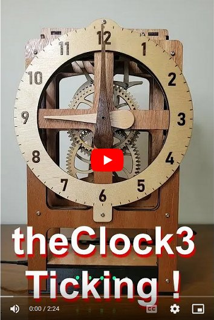

# theClock3 - Accurate Wooden Geared Clock with Electromagnetic Pendulum

**Home** --
**[Design](design.md)** --
**[Build](build.md)** --
**[Wood](wood.md)** --
**[Coils](coils.md)** --
**[Electronics](electronics.md)** --
**[Software](software.md)** --
**[Other](other.md)** --
**[Assembly](assembly.md)** --
**[Tuning](tuning.md)** --
**[User Manual](user_manual.md)** --
**[Trouble Shooting](trouble.md)** --
**[Notes](notes.md)**

This clock uses wooden gears and a simple electromagnetically driven pendulum
with the goal of keeping accurate time.

It uses an an **electromagnet** and **permanent magnet** to provide pulses of energy
to the pendulum to keep it moving, an **angle sensor** to detect the position
of the pendulum, and a **magnetic spring** to to speed up, or slow down, the pendulum.

It uses a specially designed **cam driven pawl** mechanism to
reliably convert the motion of the pendulum in each direction
to the rotation of the **seconds wheel** and **gear train**.

It has a computer (an [**ESP32**](https://en.wikipedia.org/wiki/ESP32)) in it,
with a *Real Time Clock* (**RTC**) that is fairly accurate (to within about 1 second per day).
Furthermore the computer can connect to the internet to use Network Time Protocol
([**NTP**](https://en.wikipedia.org/wiki/Network_Time_Protocol))
to synchronize it's RTC within a few milliseconds of the *correct* international
**standard time**.

Roughly stated, the goal of this project is to produce a **wooden geared clock**
that will be accurate to within one second per day, or, when connected to the
internet, within one second at any given time over it's working lifetime.

## Documentation Outline

This documentation is mostly geared towards makers who might like to build
one of these clocks. Though it is not a trivial task, this repository should
contain all of the information needed for you to build one.

If you have received one of these clocks as a gift, please see the
**[Quick Start Guide](QuickStartGuide.pdf)** and
**[User Manual](user_manual.md.pdf)** for information on how to unpack,
setup, start, and run your clock.

On these pages you will find the following:

- **[Design](design.md)** - An overview of the **requirements** and **design** of the clock
- **[Build](build.md)** - An overview of the process of **building** the clock
- **[Wood](wood.md)** - **Laser Cutting** the wood and building the *frame* and *gear train*
- **[Coils](coils.md)** - **Winding** the *electromagnet coils*
- **[Electronics](electronics.md)** - Creating the custom **PCB** (printed circuit board), **Cables**, and **Connectors**
- **[Software](software.md)** - Compiling and installing the **Software** and doing a submodule **test** of the electronics
- **[Other](other.md)** - Finish the **other sub-assemblies** of the clock, including the **box, pendulum,** and **cutting the tubes**
- **[Assembly](assembly.md)** - **Final Assembly** of the clock
- **[Tuning](tuning.md)** - Describes the process of getting the clock to **run accurately**
- **[User Manual](user_manual.md)** - A more detailed guide to the **WebUI** and software for the clock
- **[Trouble Shooting](trouble.md)** - Some common potential **problems** and possible **solutions**
- **[Notes](notes.md)** - Other Notes and information about the clock

Note: In my initial builds of this clock I did not take enough photographs and videos
to properly document this project.  So, at this time there are **no YouTube videos**
and only a limited number of actual **photographs** of the build process on these
pages.   It is my plan to build *another* instance of this clock in the near future,
solely for the purpose of obtaining photographs and videos for this project documentation.
Until then I will attempt to make use of Fusion 360 **screen grabs** and **animated gifs** to
facilitate the documentation, but will ask you to **please check back**
once I publish the updated version with YouTube videos.

## Files Available in this repository

This clock was *designed* using the **Fusion 360** CAD program and
the [**KiCAD**](https://www.kicad.org/) schematic and PCB design program.
The main outputs from Fusion 360 are the **DXF Files** (drawings) used to laser
cut the wood, and the **STL Files** (3D models) used to 3D print the plastic parts.

The clock was mostly *implemented* by using the **Lightburn** laser CNC machine
control software to cut the wood from the Fusion DXF files using my
[**20mm CNC machine**](https://github.com/phorton1/Arduino-esp32_cnc20mm),
and the **Prusa Slicer** and **OctoPrint** to slice the Fusion STL files and send
them to my **Prusa MK3S 3d printer** to make the plastic parts.

The PCB (printed circuit board) is almost it's own sub-project.
The outputs from *KiCad* include the basic **schematic**, and
the **Gerber** and **Excellon** files. The program
[**FlatCAM**](https://bitbucket.org/jpcgt/flatcam/downloads/) was
used to generate the GCODE files from them
for running my [**cnc3018**](https://github.com/phorton1/Arduino-esp32_cnc3018)
to **mill, epoxy coat, drill, and cut out** the PCB (printed circuit board.

The following sub-folders and their children can be found within this 'docs' folder

- **fusion** - contains the main *Fusion 360* design **clock3.2.f3z**, as well as a few
   other files that support the design, including a CSV file containing parameters for
   the design, and a couple of **pyjoints** animations (which make use of the
   Fusion 360 [pyJoints Animation Plugin](https://github.com/phorton1/fusionAddIns-pyJoints)
   I wrote) that allowed me to visually test the design before implementing it.
  - **dxf** - contains all of the DXF files used with **Lightburn** to laser cut the wooden parts
  - **stl** - contains STL files of all the plastic parts that I 3D printed
- **kicad/pcb3.1** - contains the **kiCAD** project, electronics schematics, and PCB design files
  - **plot** - contains the Gerber/Excelon files output from kiCAD, along with the
    **FlatCAM** project used to produce the gcode files for milling, epoxy coating,
	drilling, and cutting out the PCB
    - **gcode** - contains the final output gcode files for the PCB
- **lightburn** - contains **LBRN2** Lightburn files that contain all of
   the wooden parts to be laser cut, as well as individual files to cut
   the different thicknesses or types of wood
- **prusa** - contains the Prusa **3mf** projects for the plastic parts I sliced
  - **gcode** - contains the final output *Prusa MK3s* gcode files that I used to
    3D print the plastic parts

If you are a **maker** you do not necessarily need to mill your own PCB as I did.
You can implement this simple circuit using **perfboard**, or can use the
kicad files to (fairly quickly) design your own PCB to be created
from your favorite PCB supplier.   I simply choose to mill my own PCB's
because I don't live in a good place for shipments and am too impatient
to wait weeks (or months) to get a PCB.  You might be able to get one
from China in a few days, but it takes much longer for me where I live.

Another example is that you don't **need** to laser cut the wooden parts.
It should be possible to use a small CNC machine (3018) to mill the gears, and
either a slightly larger CNC machine to mill the frame parts, or they could
even be cut using templates and a jigsaw or scroll saw.

**HOW YOU BUILD IT IS UP TO YOU !!**

The reason I provide so much information in these pages (rather than just the bare minimum)
is specifically to allow some flexibility for your design/build workflow.
When I went to make my first wooden (and especially laser cut) clock, I could not find
any complete designs that I could build.  So I am hoping that the info here will
provide you both with the materials you need, and perhaps the impetus, to build
one of your own!

## Credits

This project directly relies upon the public open source Arduino development system,
the Espressif ESP32 online documentation and additions to the Arduino IDE, as
well as a number open source Arduino libraries

I would like to thank the countless individuals who have contributed to making these
development tools, source codes, and documentation available for free public use, including,
but not limited to:

- [KiCad](https://www.kicad.org/)
- [FlatCAM](https://bitbucket.org/jpcgt/flatcam/downloads/) by **Juan Pablo Caram**
- [Arduino IDE and Libraries](https://www.arduino.cc/)
- [Espressif Systems](https://www.espressif.com/en/products/socs/esp32)
- [Adafruit NeoPixel Library](https://github.com/adafruit/Adafruit_NeoPixel)
- [AS5600 Library](https://github.com/RobTillaart/AS5600) by **Rob Tillaart**

## License

This program, project, and repository is free software: you can redistribute it and/or modify
it under the terms of the GNU General Public License Version 3 as published by
the Free Software Foundation.

These materials are distributed in the hope that they will be useful,
but WITHOUT ANY WARRANTY; without even the implied warranty of
MERCHANTABILITY or FITNESS FOR ANY PARTICULAR PURPOSE.  See the
GNU General Public License for more details.

Please see [LICENSE.TXT](../LICENSE.TXT) for more information.

## Please Also See

This project directly or indirectly brings together a number of other projects of mine.
It supersedes my previous clock projects: [**theClocks 1&2**](https://github.com/phorton1/Arduino-theClock)
and makes direct use of my
[**MyIOT**](https://github.com/phorton1/Arduino-libraries-myIOT)
("my internet of things*) repository, which provides a generalized approach to building parameter
driven ESP32 devices that include a Web UI as the basis for the software.

Another project that also make user of the *myIOT* repository is the
[**Bilge Alarm**](https://github.com/phorton1/Arduino-bilgeAlarm)
that I built for my boat.

The PCB (printed circuit board) was **milled** using the
[**cnc3018**](https://github.com/phorton1/Arduino-esp32_cnc3018) CNC
machine that I built, and the wooden parts were cut using the laser configuration of the larger
[**20mm CNC machine**](https://github.com/phorton1/Arduino-esp32_cnc20mm) that I subsequently built.
Both of those projects depend on my port of the
[**FluidNC**](https://github.com/phorton1/Arduino-libraries-FluidNC)
ESP32 based CNC controller software, and include my
[**FluidNC UI**](https://github.com/phorton1/Arduino-libraries-FluidNC_UI)
(touchscreen user interface) and
[**other extensions**](https://github.com/phorton1/Arduino-libraries-FluidNC_Extensions)
that I added to the FluidNC library.

There is also a quick and dirty
[**Coil Winding Machine**](https://github.com/phorton1/Arduino-CoilWindingMachine)
project repository for the machine I made to wind the coils for these clocks and
a [Fusion 360 Plugin](https://github.com/phorton1/fusionAddIns-pyJoints)
thatI created which allowed me to do animations of the clock to visually see how the
mechanism might work before actually building it.

I hope you will take a few minutes to check out some of these other pages too!!

**Next:** A [**Design Overview**](design.md) of the clock and the contents of this repository ...
