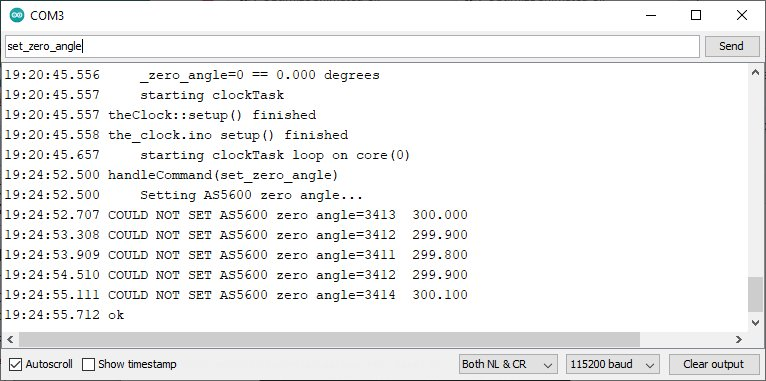
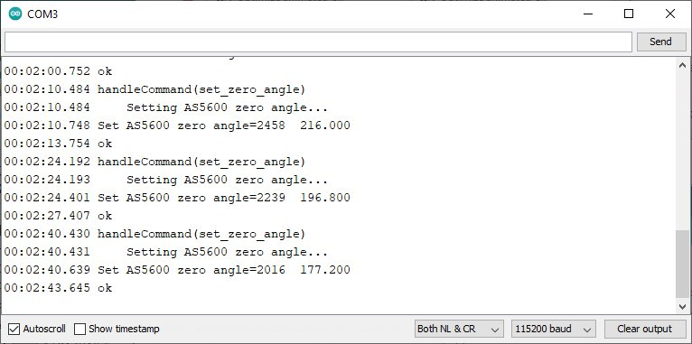
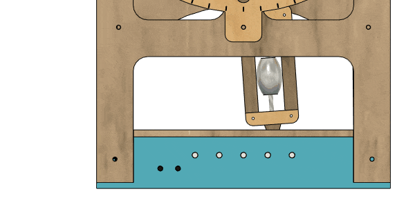
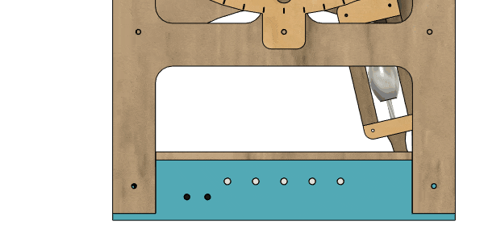
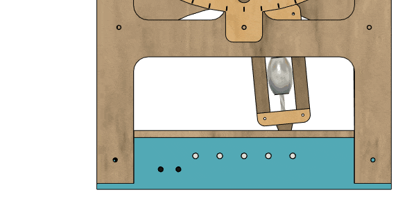
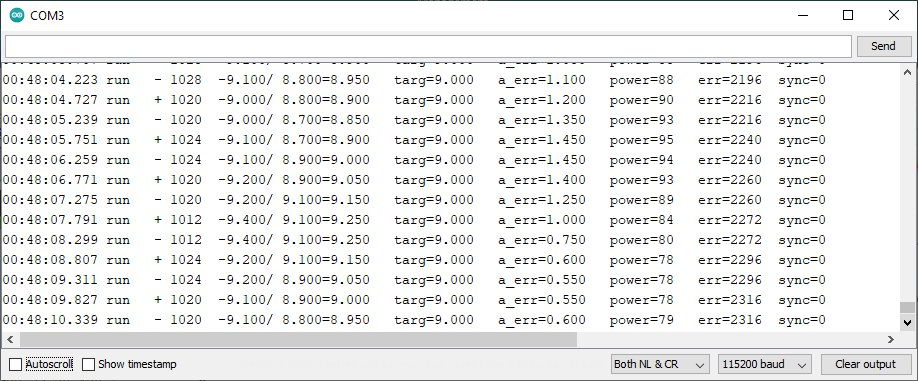
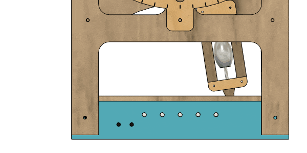
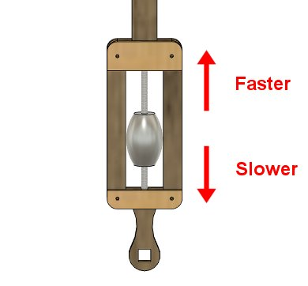
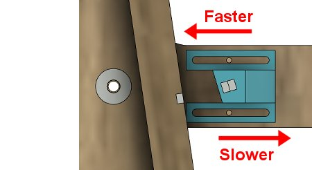
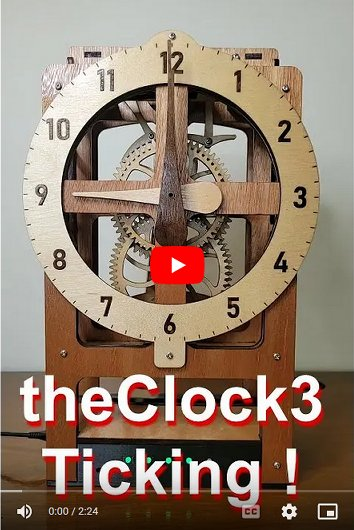

# theClock3 - Tuning the Clock

**[Home](readme.md)** --
**[Design](design.md)** --
**[Plan](plan.md)** --
**[Wood](wood.md)** --
**[Coils](coils.md)** --
**[Electronics](electronics.md)** --
**[Software](software.md)** --
**[Assemble](assemble.md)** --
**[Build](build.md)** --
**Tuning** --
**[UI](ui.md)** --
**[Troubles](troubles.md)** --
**[Notes](notes.md)**

On this page we will describe the process of **tuning** the clock.  We assume
that you have completed the [Build Process](build.md) and that the clock
is in *good mechanical shape* and **ticks and tocks** reliably when you
move the *Pendulum* by hand.

We will use the **Arduino Serial Monitor** to perform the tuning actions.
and ensure the clock is in a *known state* by issuing a **Factory Reset**
command.


## 1. Factory Reset and AS5600 connection

With the clock *completely still* and the *Pendulum* hanging **straight
down** type the command **factory_reset** into the serial monitor.

The ESP32 will reboot and a series of LEDs will light up.

If you see five <font color='red'><b>flashing red LEDs</b></font>
there is a **problem with the AS5600 cable and/or module**. We already
described this during the *Submodule Test* on the [Software](software.md)
page.


If you see five flashing red LEDs, please **verify and correct** the
problem with the cable and connection to the AS5600 module before
proceeding.


## 2. Zero Angle Setting

Once we are certain that the *AS5600 connection* is good, we can see
if we need to *adjust* the **Magnetic Cap** on the *Top Tube*.
If you see **four white LEDs** and one <font color='red'><b>center red LED</b></font>,
while booting, as shown in the image below ...


and *after booting* the <font color='orange'><b>2nd LED is flashing orange</b></font>
as in the image below ...


... then we need to **adjust** the **Magnetic Sensor Cap** on the *Top Tube*.
If you do **NOT** see the above patterns of LEDs, and after booting there is only
a single <font color='purple'><b>leftmost purple</b></font> LED, then the **Zero
Angle** has been properly set, and you do not need to do this step, and may
proceed to the next step, *3. Minimum Power Coil and Pendulum Test*, below.



In the above Serial Monitor listing we see that message that the clock
**COULD NOT SET AS5600 zero angle=3413  300.00**.  This is telling us
that the AS5600 sensor returned a **raw value** of **3413** (on a scale
of 0 to 4095) which equates to an **angle** of **300.00** degrees.

The clock **requires** that the zero angle be in the range of **90
to 270 degrees** to function correctly.   Ideally, the zero angle
will be set around *180 degrees*.

**TO ADJUST THE MAGNETIC CAP TO GET A GOOD ZERO ANGLE, REPEAT THE FOLLOWING STEPS**
until the <font color='orange'><b>orange LED</b></font> **STOPS FLASHING**

- Adjust (turn) the **Magnetic Cap** on the Top Tube and
- re-issue the **set_zero_angle** command in the Serial Monitor

In our example, we need to turn the *Magnetic Cap* about *120 degrees*
counter clockwise to achieve the optimal 180 degree angle.  After
doing that and re-issuing the **set_zero_angle** command, the orange
led should stop flashing, and we should *briefly* see the following LED
pattern of **five white** and <font color='green'><b>one green</b></font>
LEDs indicating that we succesfully set the AS5600 zero angle:


And, also, the Serial Monitor should tell us that we succeeded:



In this example we *moved the Cap* and *set the Zero Angle* **multiple times**
until we got it *close* to 180 degrees at **177.20 degrees**.
Once the Zero Angle has been succesfully set, we can proceed
to the next step *3. Minimum Power Coil and Pendulum Test*.


## 3. Minimum Power Coil and Pendulum Test

We will now verify that the orientation of the the **magnet**
in the Pendulum, the **coils** and their **plugs** are correct.
This section assumes that you have **correctly wired the coils**
so that they both have the **same color** wires going to the
center, and outer lead of the coils, respectively, and that
you have plugged them into the PCB into the correct sockets
with the **same color** on each side, as shown in the
**submodule test** portion of the [Software](software.md) page.

Issue the following *two* commands into the serial monitor:

```
clock_mode=power_min
running=1
```

These command tell the clock to *start moving the Pendulum*
at the **minimum power**. The Pendulum should start **moving
back and forth**.  It is **ok** if it does **not** *tick and tock*
reliably. We just want to make sure that the orientation of the
**magnet** in the Pendulum versus the **fields** generated
by the coils **repulse** the magnet correctly.



**IF THE PENDULUM DOES NOT START MOVING** one of the following
problems may be present and *needs to be corrected*.

- if the coils seem to be *attracting* (rather than *repulsing*)
  the magnet in the pendulum, then the **plugs** in the PCB
  need to be **reversed**.
- if the *pendulum* is **not swinging** but the coils seem to
  move it a bit, then the **mechanism may be binding**. You
  may need to **back the *Top Tube*** out **1/2mm** or so to allow
  a little **play** in the mechanism.
- if **nothing** appears to happen, then there may be a problem
  with the **PCB**, **coils**, **connectors** or **plugs**, and
  unfortunately, you may need to take the PCB out of the box,
  and **verify again** that there are **no short circuits** and
  **test each coil** with a multi-metter for conductivity.

**Note** that any time you mess with the *Top Tube* you *probably*
need to **Set the Zero Angle** again!

When you are finished with this step, type **running=0**
into the Serial monitor sto stop the Pendulum.


## 4. Maximum Power Pendulum Test

In this step we will verify that the Pendulum can swing at
the **maximum target angle**.  *Note* that this test
(and the functionality of the clock in general) *may* be
affected by the power supply of your computer to the ESP32.

Issue the following *two* commands into the serial monitor:

```
clock_mode=power_max
running=1
```

The Pendulum should start swinging **strongly**.  Ideally
it will start **banging** up against the frame within a few
seconds and you can issue the **running=0** command before
it does any damage!



In any case, it is **necessary** that it swings *at least* as far as the
parameterized **ANGLE_MAX** which is **11.5 degrees** by default.

When you issue the above commands, you should see
lines like the following in the Serial Monitor:

```
00:23:10.361 run   - 964  -17.100/16.100=16.600  targ=10.000  a_err=0.000   power=255  err=-64   sync=0
```

On *each swing* of the clock, it outputs a **line** to the Serial Monitor.
We will be going into more detail about what these lines mean, but for now
the part to pay attention to are the **angles** that the pendulum is swinging,
in our example that the part of the line that looks like: **-17.100/16.100=16.600**

This tells us that the Pendulum is swinging (negative) **17.1 degrees to the
left** and **16.1 degrees to the right** for an **average** angle of **16.6
degrees**, so **all is good** as the Pendulum is swinging **more** than 11.5 degrees.

If the Pendulum does **not swing at least *(well over)* 11.5 degrees on average**
the **PID** controller will not work.  As mentioned before, this *may* be
because the power supply of your computer is insufficient to power the
ESP32 and the coils at the same time.   If that is the case, one possible
solution is to use the **2nd USB connector** option, as described in the
[Notes](notes.md), to provide a stronger, separate power supply for the clock.

```
running=0
```

In any case, once we have verified that the clock can run at least at the *maximum
target angle* at **maximum power**, issue the **running=0** command to stop the clock,
and you can proceed to the next step.


## 5. ANGLE_MIN test

We will now test the **1st PID controller**, which is used to cause the
Pendulum to swing at a *given angle*.   We will issue the following
commands to run this test:

```
clock_mode=angle_min
running=1

 ... and after the test

running=0

 ... to stop the clock
```



You will see **timing lines** appear in the Serial Monitor as the
clock attempts to **stabilize** the Pendulum at the **ANGLE_MIN**
target angle, which defaults to **9 degrees**.



Eventually the clock should start ticking withing **a few tenths
of a degree** of 9 degrees.  The *PID Controller* is attempting
minimize the *instantaneous angular error* which is the *difference*
between the *target* angle and the *average* angle, at the same
time as it attepts to minimize the *accumulated angular error*, as
shown by the fields **a_err=0.550** in the above listing. It does
this, as you can see, by modifying the **power** sent to the coils
on each swing.

By watching the Serial Monitor as it does this process, you can understand
a lot about how the clock is (or is **not**) working correctly !!
The **timing lines** consist of the following **fields**

- **time** with *milliseconds*
- **clock state** (start, **run**, or sync)
- **swing time** in *milliseconds* (i.e. 1020, 1024, 1012, etc)
- **left, right, and average angles** of *this swing* (i.e. -9.100/8.900=9.000)
- **target angle** - targ=9.000 in this example
- cumulative **angular error** in degrees (i.e. 1.400, 0.550, etc)
- **power** delivered to the pendulum on *this swing* (from 0 to 255)
- culumative **milliseconds error** - the clock running is slow by *2000+ ms* in this example as we have not *tuned* the clock yet!
- **sync** is the *milliseconds* to correct while we are *syncing* to the RCT (Real Time Clock) on the ESP32

You may be tempted to start messing witht the clock's **parameters** at this point.
**WE GENERALLY DO NOT RECOMMEND MODIFYING THE PARAMETERS OF THE CLOCK**,
like the *POWER_MIN*, *ANGLE_MIN*, *ANGLE_MAX* or *PID* parameters.
If you find you need to modify the parameters then likely there
is **binding** in the *mechanism* or **insufficient power** to
the *PCB*, and those problems should be addressed, as much as possible,
before **resorting** to modifying the parameters to get the clock
working.
*However* the **Parameters may be modified** (by using **parameter=value**
commands from the Serial Monitor or via the **WebUI**) if you find it
**necessary** or just want to *experiment* with the clock.
In any case, you can always issue a **Factory Reset**
command to restore the initial parameters.

Once we have verified that the clock can run reliably at the **ANGLE_MIN**
target angle, we repeat the process to make sure it can run at the
maximum **ANGLE_MAX** in the next step.


## 6. ANGLE_MAX test

This step assumes that the **Magnetic Spring** is adjusted **as
far away** from the Pendulum as possible.  We don't want the
spring to limit the swing of the pendulum yet!

Let's make sure that the clock can reliably achieve the **maximum target
angle** ANGLE_MAX, which defaults to **11.5 degrees**, by typing the
following commands into the Serial Monitor:

```
clock_mode=angle_max
running=1

 ... and after the test

running=0

 ... to stop the clock
```



As in the previous step, after a while you should find that
the Pendulum has narrowed down to swinging within a **few tenths of
a degree** of the **target angle** which is **11.5 degrees** in this case.

Once we have verified that the pendulum can reliably swing at
the ANGLE_MAX target angle, we can move to the next step,
*7. Adjust the Pendulum Weight*.


## 7. Adjust the Pendulum Weight

Here we will **adjust** the weight on the Pendulum so that the
Pendulum swings slightly *slower* than 1 second (more than 1000 millieconds) per swing.
Moving the weight **up** on the rod will cause the Pendulum to swing *faster*, and
moving the weight **down** on the rod will cause the Pendulum to swing *slower*.

- **Start** the clock in **Minimum Angle Mode** (*clock_mode=angle_min, running=1*) as described above.
- Watch the *Serial Monitor* and Note the **milliseconds for each swing**, which is
the *first* number in the *timing line* after the *time*.
- **Stop** the clock by typing *running=0*
- Adjust the *weight* **up or down** by turning it on the *rod*
- **Repeat** the process until the Pendulum is swinging **about** 1010 ms per swing.



The goal is to get the **milliseconds per swing** to be slightly *slower* than
(1 second), averaging about **1010 ms**.  You will find that the time *varies*,
even when the Pendulum is swinging at a constant angle.  That's ok!  When
properly adjusted you should *rarely* see swings that are *less than 1000 ms*,
*generally* see swings that are *from 1005 to 1015 ms*, and *rarely* see
swings that are much over *1020 ms*.

*Design Note:  as currently designed in **v3.3** the weight typically needs to
be adjusted far **up** on the rod to achieve the correct swing.*

## 8. Adjust the Magnetic Spring

In this (final) adjustment step, we will *fix the position* of the **Magnetic Spring**.
During assembly, and up to this point, the Magnetic Spring *should have* been adjusted
to be **as far as possible away** from the Pendulum.

We will now **adjust** the Magnetic Spring so that, in *Maximum Angle Mode* the
Pendulum will swing **slightly quicker** than 1000 ms per swing.

Get ready for this step by *loosening* the screws on the Magnetic Spring until they are *snug* but
you can still **move** the Spring Assembly **by hand**.  Then:

- **Start** the clock in **Maximum Angle Mode** (*clock_mode=angle_max, running=1*) as described above.
- Watch the *Serial Monitor* and Note the **milliseconds for each swing**
- *While* the clock is *Running* **move** the Magnetic Spring Assembly
  **closer** or **farther away** from the Pendulum



The goal here is to get the **ms per swing** to be *faster* than 1000, around **990 ms** on average.
Once again, the time will *vary* and so you are shooting for the **average** time.
When properly aligned you should see swings in the **985-995 ms range** and not see
many swings *over 1000 ms* or *under 980 ms*.  Once you are satisfied that the
clock is beating slightly quicker than 1000 ms:

- **Tighten** the screws holding the Magnetic Spring

**DONT OVER TIGHTEN THE SCREWS!!**.  They are just M2 screws into wooden holes
and can easily be stripped!  If they become stripped, simply put a *small dab* of
**super glue** in the holes, let it **dry**, and *rethread* the screws.
As you *gain experience* and **test the clock** over *longer durations* you will likely
find that you want to adjust the **Pendulum Weight and Magnetic Spring** again a *few
times* to achieve **optimal performance**.

We are actually **now done** with Tuning the clock !!!  The rest of this
page just does additional *testing* to see that the clock is running
correctly.


## 9. MIN_MAX test

This step is *optional* but I wanted you to know that the possibility exists.
Before I implemented the *2nd PID controller*, I implemented a bare-bones way
to make the clock keep *accurate time*.  This is called **MIN_MAX mode**.

In *MIN_MAX mode* the clock beats at the **minimum target angle** (slower
than 1 second per beat) until the **accumulated ms error** exceeds some value.
Then it **switches** to run at the **maximum target angle** until it has
sped up enough so that the *accumulated error* is under some value.
The **amount** that the clock can vary from the correc time is given
by the **MIN_MAX_MS** *parameter*, which is set to **50ms** by default.
So the clock will run slowly until it is more than 50ms slow, and
then it will run quicker until it is more than 50ms fast, overall,
switching back and forth to oscillate around the *correct time*.

You can test MIN_MAX mode by typing the following into the Serial Monitor:

```
clock_mode=min_max
running=1
```

By watching the Serial Monitor, you *should* see the start running at the
*minimum* **target angle** (9.5 degrees) until it stabilizes, and when the *acculumated ms error*
(the **a_err** field in the *timing line*) gets to *50 or more*, then you should
see the *target angle* change to the *maxiumum* target angle (11 degrees), the
clock should start speeding up, and the *accumulated error* should start dropping
until, at **-50 (negative 50 ms) or less**, it should **swtich** back to the minimum
target angle, repeating the process over and over again.


## 10. PID Mode (Tuning Finished!)

The clock normally runs in **PID mode**.  Start the clock for **normal operation**
by typing the following:

```
clock_mode=pid
running=1
```

**CONGRATULATIONS!!!**  You now have a completely working **accurate magnetically
driven wooden geared clock** !!!

[](https://youtu.be/lsMbbkOouPc)


**Next:** [**User Interface**](ui.md) - describes the buttons, LEDS, Parameters, etc
