# theClock3 - User Interface(s)

**[Home](readme.md)** --
**[Design](design.md)** --
**[Plan](plan.md)** --
**[Wood](wood.md)** --
**[Coils](coils.md)** --
**[Electronics](electronics.md)** --
**[Firmware](firmware.md)** --
**[Assemble](assemble.md)** --
**[Build](build.md)** --
**[Tuning](tuning.md)** --
**UI** --
**[Software](software.md)** --
**[Troubles](troubles.md)** --
**[Notes](notes.md)**

On the [Firmware](firmware.md) page we already described how to use the
[Serial Monitor](firmware.md#b-serial-monitor).  On this page
we will decribe the rest of the **User Interface** of the clock
in more detail, including:

- the two [Buttons](#a-buttons) on the clock,
- the five [LEDS](#b-leds) on the clock,
- how to [connect to your Wifi Network](#c-connect-to-wifi), and access the
- browser based [WebUI](#d-webui) for the clock,
  including how to do [OTA](#3-ota) Firmware Upgrades
- connecting to the clock using [Telnet](#e-telnet-serial-monitor) Serial Monitor


## A. Buttons

There are **two holes** front of the *plastic* **Box** into which an item like a toothpick
or small screw driver can be *inserted* to **press a button**..

A button press can be **short** (instant - less than 3 seconds), **medium** (more than 3 seconds, but less than 8 seconds), or **long** (more than 8 seconds).
When you press a button, the rightmost LED will turn **white**.   If you hold the button for more than 3 seconds, the LED will turn
<font color='cyan'><b>cyan</b></font>, and if you hold it for more than 8 seconds, the rightmost LED will turn
<font color='magenta'><b>magenta</b></font>.


The **left button** is used to *start and stop the clock*, turn the *WiFi on and off*, or in extreme cases, to
do a *Factory Reset*.  The **right button** is used to *change the brightness* of the LEDs or
to calibrate the angular sensor on the pendulum (*set zero angle*).

### Left Button

- a **short press** will  **start synchronized**, or **stop** the clock if it is running
- a **double press** will **start** the clock *immediately* (if it is not running and pressed twice within 2 seconds)
- a **medium press** will turn the **WiFi** off and on
- a **long press** will issue a **Factory Reset** and should only be done if all else fails!

### Right Button

- a **short press** will **change the LED brightness** - Pressing the button multiple times will
  increase the brightness of the LEDs until it cycles around and they go 'off'.
- a **medium press** will **set the zero angle** - Occasionally it may be necessary to re-calibrate the angular sensor.
  This is because the magnet on the end of the pendulum tube is not glued on, but merely compression fitted,
  (so that the clock can be disassembled if necessary), and may have slipped during transport or by rough
  handling. Be sure to *hold the clock still* with the *seconds hand straight down* when you issue this command.
- in ***optional* low power** mode, a *short press* will *exit low power mode* and *brighten the LEDs* and
  *turn the WiFi back on*, depending on the configuration

In order to **calibrate the angular sensor** (*set zero angle*) the clock must NOT be running and
the **the Pendulum should hanging, still, straight down**.  When that is the case
long-press the right button for 8+ seconds (until the rightmost LED turns to magenta) while being
*careful **NOT** to move the clock*.  The clock will read the sensor when you let up on the button,
which will determines the "zero position" of the Pendulum which is crucial for the clock to run correctly.

The *zero position* of the pendulum is used to determine when the pendulum has "crossed zero"
so that we can send an impulse to the pendulum on each swing to keep it moving and adjust it's
speed, as well as used in measuring the angle that the pendulum has traversed on each swing,
both of which are needed for the clock to keep good time.

Of course, all of these functions can also be accessed via the Serial Monitor or WebUI (below),
but the buttons allow you to use the clock without another computer.


## B. LEDS

If you see four <font color='green'><b>green</b></font> (or close to green) LEDs,
**all is well** and the clock is running within a few milliseconds of the correct time.


It is normal for the 5th LED to sometimes come on as
<font color='red'><b>red</b></font> or <font color='blue'><b>blue</b></font>
as the clock does a **synchronization cycle**. The LED should
*transition* slowly to <font color='green'><b>green</b></font> as
the cycle proceeds, and then, when the cycle is *complete*, the
LED should turn **off**.

### Special Startup Patterns

When you first start the clock, it flashes all 5 LEDs **cyan**
from left to right to ensure that the LEDs are working.


There are several special patterns of LEDs that show having to do
with the **Angle Sensor** and the **set_zero_angle** command.

<table border='0'>
<tr><td width='200px'></td><td>
	if all of the LEDS are <font color='red'><b>flashing red</b></font>
	it means that there was a failure to initialize the <i>AS5600 Angle Sensor</i>
	and the clock <b>cannot run correctly</b>.
	This means there is either <i>bad cable or connection</i>, or that there is a
	problem with the <i>PCB, ESP32,</i> or the <i>Angle Sensor</i> module itself</td></tr>
<tr><td width='200px'></td><td>
	this pattern, where four of the LEDS are white and one is
	<font color='green'><b>green</b></font> means that
	the <b>set_zero_angle</b> command has <b>succeeded</b>, and the clock has gotten
	a new, good <i>zero angle</i> from the sensor.</td></tr>
<tr><td width='200px'></td><td>
	this pattern, where four of the LEDS are white and one is
	<font color='red'><b>red</b></font> means that
	the <b>set_zero_angle</b> command has <b>failed</b> to get
	a good <i>zero angle</i> from the sensor
	and the clock <b>cannot run correctly</b>.</td></tr>
</table>


### 1. LED1 **WiFi status**

The 1st (leftmost) LED shows the **WiFi status**

<table border='0'>
<tr><td width='200px'></td><td><font color='cyan'><b>cyan</b></font>
	means that the system is <i>initializing</i> (booting)</td></tr>
<tr><td width='200px'></td><td><font color='green'><b>green</b></font>
	means that it is correctly <b>connected</b> to your WiFi network</td></tr>
<tr><td width='200px'></td><td><font color='purple'><b>purple</b></font>
	means that it is not connected to your WiFi network, and is in <b>Access Point Mode</b>
	  so that you can connect directly to it from your phone, laptop, or computer.</td></tr>
<tr><td width='200px'></td><td><font color='orange'><b>orange</b></font>
	is a temporary state after the clock has connected to your WiFi network.
	The clock is waiting for you to disconnect from the Access Point before turning the AP mode off.</td></tr>
<tr><td width='200px'></td><td><font color='red'><b>red</b></font>
	means that the WiFi is <b>not working</b> correctly.</td></tr>
<tr><td width='200px'></td><td><font color='blue'><b>blue</b></font>
	means that the <b>WiFi is off</b>.  In versions of the clock that include
	a battery backup system, the clock will automatically turn the WiFi off during a
	power outage to preserve the battery as long as possible and will turn the WiFi
	back on once the power has been restored.</td></tr>
</table>

### 2. LED2 **Clock status**

The 2nd LED from the left shows the **Clock status**, whether it is starting, running, and so on:

<table border='0'>
<tr><td width='200px'></td><td><b>off</b>
	means the clock is not running and needs to be started</td></tr>
<tr><td width='200px'></td><td><b>white</b>
	means the clock is waiting to <i>Start Synchronized</i>
	when the time crosses the next minute.</td></tr>
<tr><td width='200px'></td><td><font color='gold'><b>yellow</b></font>
	is very transient, lasting less than 1/2 second, and means that the
	clock is delivering the initial impulse to start the pendulum moving.</td></tr>
<tr><td width='200px'></td><td><font color='cyan'><b>cyan</b></font>
	means that the clock is </i>starting</i>.  It takes approximately 30 seconds for the
	pendulum to stabilize before the clock starts *running* normally.</td></tr>
<tr><td width='200px'></td><td><font color='green'><b>green</b></font>
	means that the clock is <b>running normally</b></td></tr>
<tr><td width='200px'></td><td><font color='orange'><b>orange</b></font>
	indicates the clock is in <i>SENSOR_TEST mode</i></td></tr>
<tr><td width='200px'></td><td><font color='orange'><b>flashing orange</b></font>
	indicates that the <b>Zero Angle has not been set</b> or is out of range
	and the <i>clock cannot work</i> correctly</td></tr>
<tr><td width='200px'></td><td><font color='red'><b>flashing red</b></font>
	indicates that the <b>Angle Sensor did not initialize</b> correctly
	and the <i>clock cannot work</i> correctly</td></tr>
</table>


### 3. LED3 **Overall Accuracy**

The 3rd (middle) LED shows the **overall accuracy** of the clock within 150 milliseconds.
<font color='green'><b>Green</b></font> means the clock is running to within a few
milliseconds of the correct time. The LED will *transition* to <font color='blue'><b>blue</b></font>
if the clock is running 150 ms slow, or *transition* to <font color='red'><b>red</b></font> is
if the clock is running 150 ms fast. You may need to pay attention to even see this
LED change because, as a rule, a well running clock will typically run within 10-20
ms of the correct time.

<table border='0'>
<tr><td width='200px'></td><td><font color='green'><b>green</b></font>
	indicates that the clock is running well, within a <b>few milliseconds</b> of the correct time</td></tr>
<tr><td width='200px'></td><td>
	the 3rd LED turns from <font color='green'><b>green</b></font> to <font color='blue'><b>blue</b></font>
	as the clock <b>slows down</b></td></tr>
<tr><td width='200px'></td><td>
	the 3rd LED turns from <font color='green'><b>green</b></font> to <font color='red'><b>red</b></font>
	as the clock <b>speeds up</b></td></tr>
</table>

Note that the <i>range</i> of this change (150 ms) is determined by the ERROR_RANGE paremeter
as described below.


### 4. LED4 **Cycle Accuracy**

The 4th LED shows the *instantaneous accuracy* for each **swing** (cycle) of the Pendulum
to within 50 ms (1/20 of a second) of 1000 milliseconds,
where <font color='green'><b>green</b></font> the cycle is within a few milliseconds,
and *transitioning* to <font color='blue'><b>blue</b></font> as the cycle slows to 1050ms per swing,
or transitioning to <font color='red'><b>red</b></font> cycle speeds up to 950 ms
per swing. Once again, you may need to pay attention to even see this
LED change because the LED changes *subtly* as the Pendulum speeds up
or slows down.

<table border='0'>
<tr><td width='200px'></td><td><font color='green'><b>green</b></font>
	indicates that the Pendulum is swinging well, within a <b>few milliseconds</b> of 1000ms per cycle</td></tr>
<tr><td width='200px'></td><td>
	the 4th LED turns from <font color='green'><b>green</b></font> to <font color='blue'><b>blue</b></font>
	as the cycle gets <b>slower</b> than 1000 ms per cycle</td></tr>
<tr><td width='200px'></td><td>
	the 4th LED turns from <font color='green'><b>green</b></font> to <font color='red'><b>red</b></font>
	as the cycle gets <b>quicker</b> than 1000 ms per cycle</td></tr>
</table>

Note that the <i>range</i> of this change (1000 plus or minus 50 ms) is determined by the
CYCLE_RANGE paremeter as described below.

### 5. LED5 the **Sync** LED

The 5th (right) LED shows if the clock is undergoing a **synchronization** cycle,
where <font color='blue'><b>blue</b></font> means it is slow and the clock is trying to speed up,
and <font color='red'><b>red</b></font> means it is fast and the clock is trying to slow down.

<table border='0'>
<tr><td width='200px'></td><td>
	if this LED is <b>off</b>, it indicates that clock is <b>not currently</b> doing a
	synchronization cycle
<tr><td width='200px'></td><td>
	the 5th LED turns from <font color='blue'><b>blue</b></font> to
	<font color='green'><b>green</b></font> as it performs a synchronization
	and the clock speeds up to the correct time.
<tr><td width='200px'></td><td>
	the 5th LED turns from <font color='red'><b>red</b></font> to
	<font color='green'><b>green</b></font> as it performs a synchronization
	and the clock down slows down to the correct time.
<tr><td width='200px'></td><td>
	if the 5th LED turns is <font color='blue'><b>flashing blue</b></font> it
	indicates that the clock is running more than 5 seconds slow.
<tr><td width='200px'></td><td>
	if the 5th LED turns is <font color='red'><b>flashing red</b></font> it
	indicates that the clock is running more than 5 seconds fast.
</table>

After the LED turns to <font color='green'><b>green</b></font> during the
synchroniztion cycle, it will then turn **off**, indicating the cycle
is complete. As with the *Cycle Accuracy* LED, the range of this change
(150 ms) is determined by the CYCLE_RANGE paremeter as described below.

- It is normal for this LED to be
	<font color='red'><b>red</b></font> or <font color='blue'><b>blue</b></font>
	for a few minutes at a time.
- If this LED remains
   <font color='red'><b>red</b></font> or <font color='blue'><b>blue</b></font>
   for more than a few minutes it means that the clock probably needs maintenance!

**If this LED is flashing**
   <font color='red'><b>red</b></font> or <font color='blue'><b>blue</b></font>
   it means the clock is running **5 seconds or more** fast or slow,
   and that it probably needs maintenance!

By default, the clock will try to synchronize to the RTC on the embedded computer once per hour (every 3600 seconds).
This interval is determined by the SYNC_INTERVAL parameter. If connected to your WiFi network, the clock
will syncrhonizes the RTC to NTP (Network Time Protocol) every two hours (7200 seconds)
as determined by the NTP_INTERVAL parameter.


## C. Connect to WiFi

If the leftmost LED is <font color='green'><b>green</b></font>
then theClock is **connected** to a WiFi network in
STA (Station) mode.

Any time, when **WiFi is ON**, that the clock becomes *disconnected*,
or *fails* to connect to your WiFi network,
the leftmost LED in the strip will change to
<font color='purple'><b>purple</b></font>
indicating it is in AP (Access Point) mode.
It will revert **Access Point** mode in the following cases:

- a **brand new** ESP32
- after a **Factory Reset** is performed.
- the STA_SSID or STA_PASS *parameters* are **blank** or **incorrect**
- the **WiFi** network is **down** for some reason

When in **AP** (Access Point) *mode*, the Clock will present itself as
a **WiFi Network** that you can *attach to* from your computer, laptop
or phone. Thus, for example, if you *change the password* to your WiFi network,
the clock will be unable to connect to it, and it will go into AP mode
to allow you to provide the correct password.

- Connect to the **theClock3** *WiFi Network*.  The default password is **11111111** (eight ones).
- A browser *should* pop up asking you to change the **Access Point** password.
- After you change the AP password, you will be presented with a window letting you specify the *SSID and password* to **your** *WiFi network*
- After you enter the SSID and Password, theClock will connect to your WiFi Network

Once theClock has connected to your WiFi network, you can
access the **WebUI** at the **IP Address** of theClock on your network.
You can get the IP address of the clock in a variety of ways:

- it *may* have shown up in the browser when you connected theClock to your Wifi network
- it **will** show in the *Serial Monitor*
- it *may* be found by going to the **Windows Explorer Network Tab** and *right-clicking* on **refresh**
- it **can** be found by going to your **router's WebUI** and seeing what **IP Address** the router assigned to theClock

Note that the following example is a *Microsoft Windows* machine on **my** home Wifi network,
in which the router assigned theClock an IP address of **10.237.50.13**.  Yours will be different,
most likely something like **192.168.X.YYY** where X is 0 or 1, and YYY is some number between
100 and 200 (i.e. **192.168.0.123**).


### 1. Connect to theClock Access Point

Select the **theClock3.3** Wifi Network from the list of available networks.

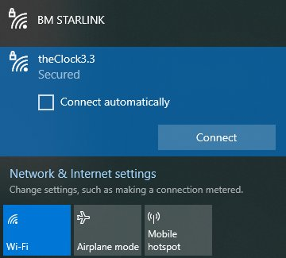
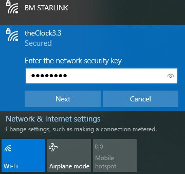

Enter the default password  **11111111** (eight ones)

### 2. Change the AP Password

After a few seconds your system browser should *automatically* **pop up** with a (redirect page and then)
a **page** which requires you to set a new password.  On some newer Android phones this page does not pop
up automatically.  **IF YOU DON’T SEE THE BELOW WINDOW**, please open a browser on your machine and enter
**192.168.1.254/captive** into the location bar to bring up the clock’s AP Mode UI (user interface).

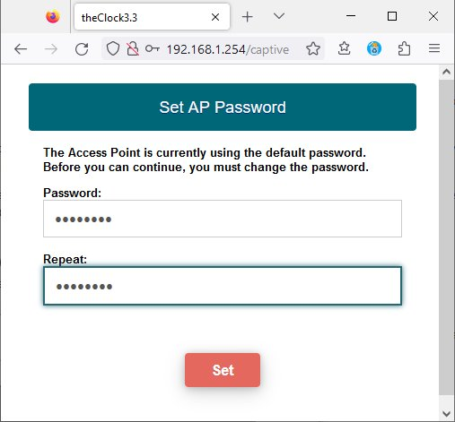

Enter (and re-enter) and write down!! a new password for your clock's AP Mode.
You will need this password (or a Factory Reset) in the future if you change your home
network SSID or credentials.

### 3. Specify the SSID and Password of your WiFi network

After you set the new password, you will be presented with a page that allows you to tell the clock
the **SSID and password** of your home Wi-Fi network.
These credentials are stored in an encrypted form on the clock's c
omputer and will never be shown to anyone.

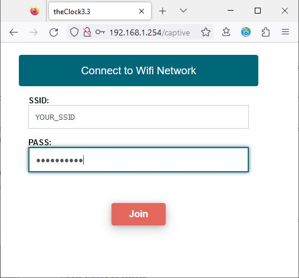

Enter the SSID and password of your home Wi-Fi network and press the **Join** Button.
<b>The last LED should turn <font color='orange'>Orange</font></b> as theClock
connects to your WiFi network at this point.

The clock tries to report when it has successfully connected to your home Wi-Fi network,
but, because it *cannot be connected in both AP and STA mode at the same time*
(unless your home Wi-Fi network happens to be on the same "channel" as the clock's AP mode),
typically it is not able to report to the browser that it connected successfully.
However, you *may get* lucky and see a message of the form "theClock3 successfully
connected to YOUR_SSID at IP Address XXX.XXX.XXX.XXX", as in the window below:

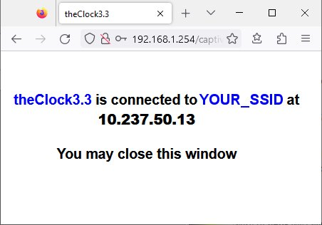

In any case, if you **DONT** see an error message at this point after
10-15 seconds then the clock has successfully connected to your home Wi-Fi network

### 4. Determine the IP address of theClock

- **Disconnect** from theClock and **reconnect** to your *home Wifi network*.
- **Reboot** the clock.
- The last LED should turn <font color='green'><b>green</b></font> indicating
that the Clock has sucessfully connected to your Wifi network

We need to determine the **IP Address** of the Clock, so that we can open the
*WebUI* in a browser or use *Telnet*.
You *may* have already gotten the IP address of theClock in the previous step.  Here are
three other ways to get the IP Address.

#### a. Get the IP Address from the Serial Monitor

You should be able to see the IP Address of the clock in the **Serial
Monitor** when you connected:

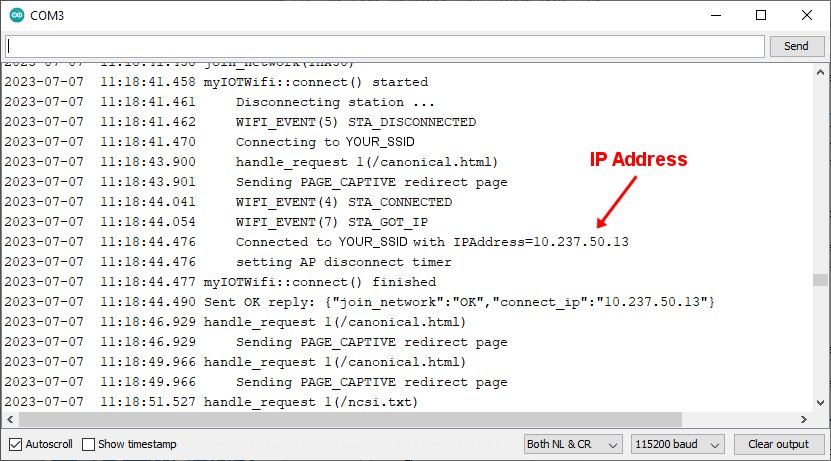

#### b. Get the IP Address from Router DHCP table

If you bring the WebUI of your Wifi network **router** up in a browser, you
should be able to find the **DHCP Client Table** of IP addresses
the router has assigned. Here is an example of the DHCP client
table from my Wifi Router, showing the IP address of **theClock3**.

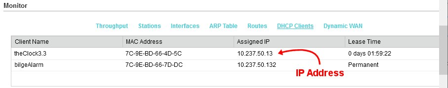

#### c. Get the IP Address from Windows Explorer

The clock supports **SSDP** (Service Search and Discovery Protocol), so it will automatically
show up in the *Windows Explorer* **Network tab** as a network device.

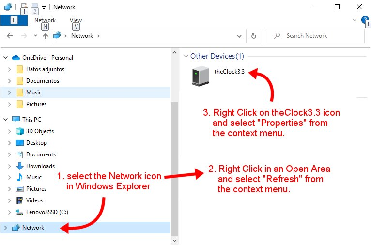

Once you have found the **theClock3 icon**, you can open up the **Properties**
for theClock3, and see it's IP address (and/or click on a link to go to the WebUI):

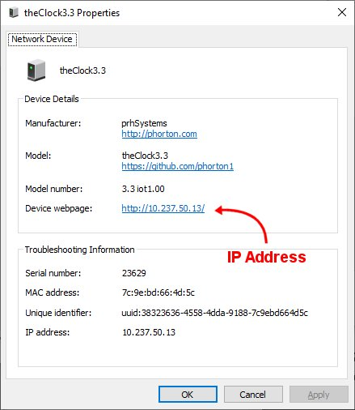


Please also see **Sections 4** and **Section 10** in the
[**Quick Start Guide**](https://github.com/phorton1/Arduino-theClock3/blob/master/docs/QuickStartGuide.pdf)
for details on how to connect the clock to WiFi.


## D. WebUI

You *access* the **WebUI** by opening a **browser** on a computer, laptop, or phone
and entering the **IP Address** of the clock.

It is not *necessary* to use the WebUI to test, control, and configure the clock,
but it can make it **much easier** than typing commands, long-hand, into the
serial monitor, especially when [Tuning](tuning.md) or [Trouble Shooting](troubles.md)
the clock..

The WebUI makes use of **WebSockets** to communicate with the ESP32.  At the top
of the WebUI page there is some cryptic text that describes how the WebUI is
connecting, or connected, to the ESP32 via the Websockts (**WS**).
Because of its usage of WS, the WebUI **knows** when the ESP32 has been *rebooted*,
and will *automatically reconnect* to the ESP32 any time communications
are interrupted.

### 1. Panes

There are four **panes** in the WebUI

#### a. Dashboard Pane

The **Dashboard** pane shows the most *frequently used* Clock
commands and parameters, and is the page that will show up by default

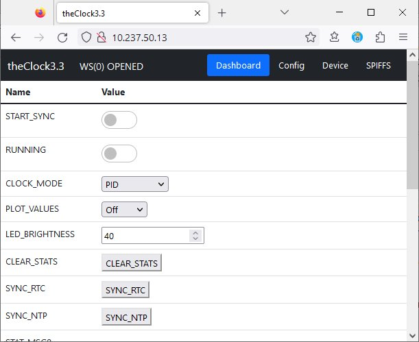

#### b. Config Pane

The **Config** pane shows the Clock **configuration** commands and parameters

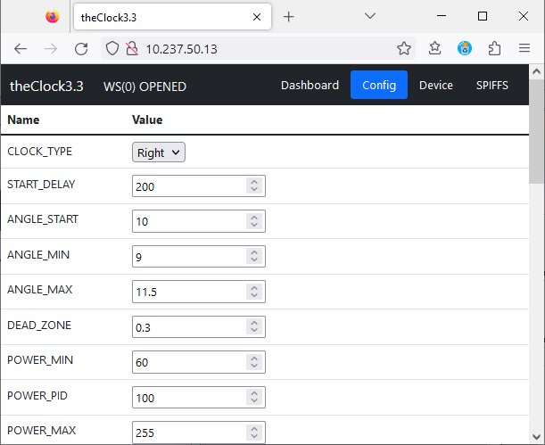

#### c. Device Pane

The **Device** pane shows the parameters and commands common to all
[**MyIOT**](https://github.com/phorton1/Arduino-libraries-myIOT) devices.

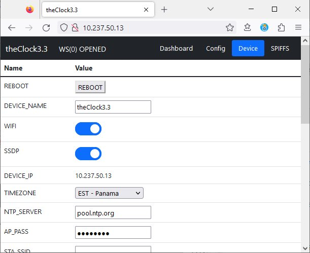

#### d. SPIFFS pane

The **SPIFFS** pane shows a listing of the SPIFFS **FileSystem** and
has the **Upload** and **OTA** buttons.

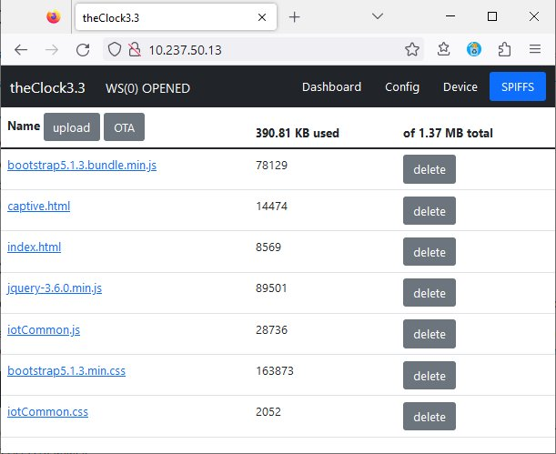

The **Upload button** allows you to upload single files to the SPIFFS.
This can be necessary when *remotely updating* the files used to
present the WebUI.


### 2. Clock Status Messages

There are seven strings of **status messages** on the *Dashboard* pane of theClock.
These status messages are sent from the ESP32 to the Webui,
every 30 seconds (as given by the STAT_INTERVAL parameter).
*while the clock is running*.

Note that you can **Turn Statistics Off** by setting **STAT_INTERVAL=0**,
modify the rate at which they are sent, by assinging a different value
and **clear them** (reset and start accumulating new statistics without
stoppping the clock) by using the **CLEAR_STATS** command.


The seven strings of text are explained here

#### STAT_MSG0 - num_bad and low_power stuff

```text
num_bad(5) restarts(0) NORMAL volts(5.20) vbus(5.69) num_low_powers(8)
LAST_DOWN(2023-07-05 05:52:55.000)
LAST_UP(2023-07-05 05:54:44.000)
```

The first thing in this line,  **num_bad(5)**, indicates that, since the clock
was started, there were five *bad reads* of the Angle Sensor. It is *normal*
for the Clock to occasionally fail to properly read the Angle Sensor.  If the Clock
gets a reading that is more than *25 degrees* from the *Zero Angle* it will ignore
that reading.  That number, in this example, is five bad reads out of the **billions**
of reads that have taken place, 250 times per second, over the **211 hours** the clock
has been running!

The **rest** of this line is only shown if the VOLT_INTERVAL parameter is non-zero,
and relate to the optional **low power mode** of the clock.  These lines are telling
us that the clock is currently in **NORMAL** power mode (as opposed to **LOW** power
mode), that the current **voltage** of the ESP32 is 5.20V, and that the cicruit is
detecting 5.69V on the **VBUS** pin it monitors for sensing low power.

We have had a lot of power outages here recently, and with **num_low_power(8)** the
Clock is telling us that we have had eight power outages since the clock started!
It then gives the dates and times of the **LAST_DOWN**, the last time the vbus voltage
went below the VOLT_CUTOFF parameter, and the **LAST_UP**, the last time the vbus
voltage rose back above the VOLT_RESTORE parameter.

#### STAT_MSG1 - times

```text
TIME_START(2023-06-28 12:43:00.517)
TIME_INIT(2023-06-28 12:43:02.104)
CUR_TIME(2023-07-07 08:33:32.464)
```

This line gives three **date-times**.

- TIME_START is the date and time of the **initial starting pulse** delivered to te coils
- TIME_INIT is the date and time of the **first full cycle** of the clock
- CUR_TIME is the current time from the ESP32 **RTC** (Real Time Clock)

#### STAT_MSG2 - running seconds and beats

```text
RUNNING 211:50:30 == 762630 SECS 762630 BEATS
```

This line says that the clock has been **running** for 211 hours, 50 minutes, and 30
seconds, which is equal to 762630 **seconds**, as well as telling us that the Pendulum
has swung the same number of **beats**.

#### STAT_MSG3 - accumulated overall statistics

This line gives us a number of statistics that have been accumulated since
the clock was started.  These are the *extremes* the clock has experienced.
Note that you can **clear** (reset) the statistics *without stopping the clock*
by issuing the CLEAR_STATS command (button) at any time.

```text
ALL cycle(964,1080) error(-93,123) power(60,255) ang_error(-2.123,3.456)
ANGLE target(10.000,10.500) left(-13.600,-12.500) right(11.600,13.000)
```

- cycle(964,1080) - indicates that the pendulum has swung as quickly
  as 964ms, and as slowely as 1080ms, in the time the clock has been running
- error(-93,123) - says that the clock has been as much as 93ms fast,
  and 123ms slow over the the time the clock has been running
- power(60,255) - says that the clock has variously sent out the full range
  of power pulses from POWER_MIN to POWER_MAX
- ang_err(-2.123,3.456) - is the accumulated angular error,
  which has been as low as -2.123 degrees and as high as 3.456 degrees
- ANGLE target(10.000,10.500) - says the clock has used target
  angles over the range from 10.00 to 10.500 to keep the clock running
- left(-13.6,-12.5) and right(11.6, 14.0) - saying the clock has swung
  between -13.6 and-12.5 degrees to the left, and
  between 11.6 and 14 degrees over to the right.


#### STAT_MSG4 - statistics for the last 30 seconds

This line gives us a number of statistics about how the clock has run in this most recent
STAT_INTERVAL number of seconds.

```text
RECENT cycle(989,1008) error(-15,3) power(68,111) ang_error(-0.024,2.524)
ANGLE target(10.289,10.478) left(-11.600,-10.800) right(9.200,10.000)
```

- cycle(989,1008) - indicates that the pendulum has between 989ms and 1008ms,
  so no swing has been off by more than 1/100 of second or so, for the last 30 seconds
- error(-15,3) - says that overall error has been between -15 and 3 milliseconds,
  so, overall the clock has been accurate to within 15/1000, or about 1/60th of second over the last 30 seconds
- power(68,111) - says that the clock has sent out pulses of between 68 and 111
  (on a scale of 0..255) power.  This is a nice range, and not taxing the coils.
- ang_err(-0.024,2.524) - the accumulated angular error has been between zero,
  essentially, and 2.5 degrees, which is totally reasonable.
- ANGLE target(10.289,10.478) - the clock has narrowed into a target angle between 10.289
  and 10.478 degrees, or less than 1/4 degree difference, to get it to run at the correct time.
- left(-11.6,-10.8) and right(9.2,10.0) - saying the clock has swung between -11.6
  and -10.8 degrees to the left, and between 9.2 and 10.0 degrees to the right,
  changes to the angle of the Pendulum's swing that would be hardly noticable to a human.

This messsage indicates that the clock is running really well.


#### STAT_MSG5 - SyncRTC stats

```text
SYNC(212/212) last(-56) total(-13342) abs(30560)
```

This message says that the clock has undergone 212 sucessfuly
**synchornization cycles**, in total, slowing the clock
down by just over 13 seconds (-13342 ms) over the last 211 hours
to keep it accurate to the RTC.  The last correction
was -56 milliseconds.  The abs(30560) (sum of the absolute values
of all corrections) indicates that it has both corrected
the clock forward, and backwards, in some cases.

#### STAT_MSG6 - SyncNTP stats

```text
NTP(50/52) fails(2) last(-62) total (-4440) abs(5844)
```

This message says tha the clock has syncronized to **NTP** 50 out of 52 times it tried.
It is normal for the NTP synchronization (which uses UDP internet packet) to fail occasionally
on a Wifi network, as the ESP32 does not reliably maintain connectivity 100.000% of the time.

In the 211 hours it has been running, the ESP RTC clock has been off (running fast)
by about 4.4 seconds (-4440 ms).  That accounts for a large part of the corrections
made above in the synchronizations.  The fact that the abs(5844) is much closer
to the total than in STAT_MSG5 indicates that *most* of the NTP corrections have
been in the same (negative) direction.

### 3. OTA

All [**MyIOT**](https://github.com/phorton1/Arduino-libraries-myIOT) devices
include the ability to do **OTA** (Over the Air) firmware updates.

After pressing the **OTA button** in the browser, you will be presented with
a *file dialog* allowing you to select a file to upload.

**IT IS CRUCIAL** that you select only a **valid clock binary file image**
when updating the ESP32.  Anything else may irretrievably crash the the ESP32
requiring you to reload the firmware over a **Serial** connection.

After selecting a valid new clock **binary image**, it will be uploaded
to the ESP32 and the ESP32 will reboot.


## E. Telnet Serial Monitor

Finally, plese note that, once the Clock has been connected
to Wifi, you can access it via **Telnet** by using a free telnet client program
like [**Putty**](https://www.putty.org/).

Here is a screen shot of a *Putty Telnet Session* with the Clock, with
the LOG_COLORS paremeter turned on:

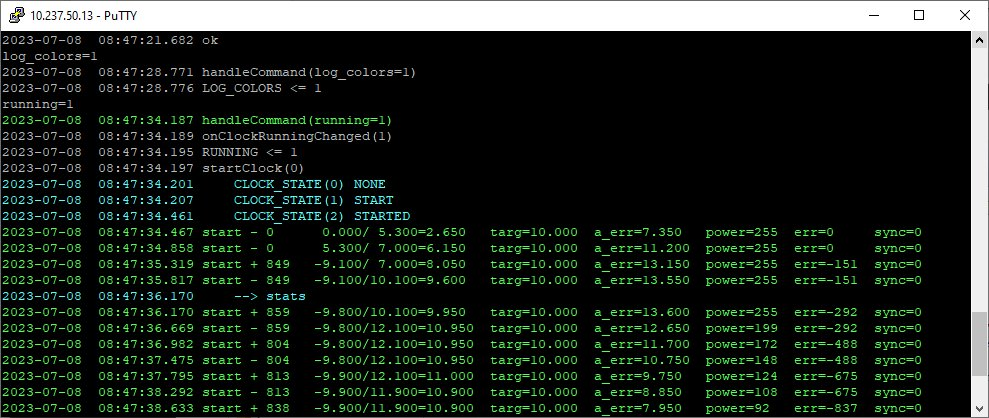

**Telnet** access to the clock is *useful* during [Tuning](tuning.md)
and over the *lifetime* of the clock.  By using Telnet (instead of
the *Serial Monitor*) you can plug the clock into a more robust
**2 to 3 Amp power supply** instead of the one on your laptop/computer which
is typically limited to *500 milliamps*.
Telnet is also *handy*, to see the **timing lines**,
if you want to *adjust*, or [Tune](tuning.md) the clock, without *moving it*
from a shelf or other location to your desk or work area.


**Next:** Understanding the [**Software**](software.md) running the clock ...
