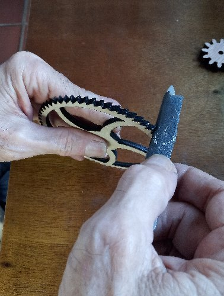

# theClock3 - Laser Cut Wood and sub-assemble (Build Continued)

**[Home](readme.md)** --
**[Design](design.md)** --
**[Build](build.md)** --
**Wood** --
**[Coils](coils.md)** --
**[Electronics](electronics.md)** --
**[Software](software.md)** --
**[Box](box.md)** --
**[Assembly](assembly.md)** --
**[Tuning](tuning.md)** --
**[User Manual](user_manual.md)** --
**[Trouble Shooting](trouble.md)** --
**[Notes](notes.md)**

Note that there are no *wood stains* used in this project.  All I use is a
lacquer based **clear coat** on the parts and let the natural colors of the
different types of wood show through.

## 1. Cutting the Wood

Here is a screen grab of the Lightburn [AllParts.lbrn2](lightburn/all_parts.lbrn2)
project showing and naming all of the wooden parts that are laser cut.

- <b>black</b> parts are cut from **cheap 3/16" plywood**
- <b>blue</b> parts are cut from better quality **3/16" birch plywood**
- <b>red</b> parts are cut from **1/8" birch plywood**
- <b>cyan</b> parts are cut from **1/8" maple** hardwood
- <b>orange</b> parts are cut from **1/8" walnut** hardwood

I specifically cut the **pendulum** out of better **3/16 walnut plywood** that
I happen to have.  It is more rigid and a bit thicker than the birch or cheap plywood.

I usually sand both sides of the frame *plywood* pieces with an electric
**palm sander** before cutting the parts out.  I sand the smaller pieces
individually after they are cut.

On my **10 Watt Diode Laser** I typically cut the 3/16" wood with two passes at
**95% power** and **140 mm per minute**.  I cut the 1/8 wood a bit quicker
at **90% power** and **150 mm per minute**.  Test cuts and adjustments
are required to get the best cut quality.

*There is **nothing worse** than cutting a sheet full of parts and finding that
the cuts did not go all the way through!!  It is usually impossible to fix it,
and so the wood gets wasted.  Therefore I prefer to **over-do** it a little bit,
even at the expense of **charring** the wood to ensure that all parts are
completely cut out.*

For the **smaller parts** (small gears, cam, arms, pawls, spacers, etc),
since I can usually fit them in the blank spaces of other parts, I typically print
twice as many as I need and select the better looking ones for the assembly.

There are separate **Lightburn Projects** in this repository for each of the different
pieces of wood that I cut.

Where possible, for all the big parts, immediately after cutting
I rub down the laser cuts with a **paper towel** to remove as much
of the charcoal as is easily done before moving them to my work table.
The process of cleaning and sanding the laser cut parts is surprisingly
*messy* and I find that I need to wash my hands often to prevent the
oil from my hands combining with the charcoal dust and leaving marks
in the wood.

## 2. Assemble, sand, and clear-coat the Frame

It is important to dry fit the frame together and know ahead
of time how you will assemble and clamp it.  It is also
is important to understand that there are four tabs
that *extend out of the frame front* onto which the **bridge** (which
is NOT glued, but which is attached with screws) are aligned.

I usually use a small piece of 1x2 wood as a mallet to tap the
pieces together as I align them.  As is typical with these kinds
of **box joints**, some tapping, force, and/or slight bending of the pieces
may be necessary to get the tabs to go into the slots.

Glue the frame together, in *one fell swoop*, with **wood glue** before
clamping it together!! The order of assembly of the frame is important,
is shown in the below **animated GIF**, and it is necessary that **all
pieces are in place, and square** before any **glue sets up** !!!

Starting the with the **middle** frame piece, glue the
**house top**, **house bottom**, and **frame top** to it. Then,
while holding those pieces roughly in place, turn it on it's side
and glue **one of the frame sides to that**, then flip it over and
glue the **other frame side to that**. Then glue
the **frame back**, and, finally, **the frame front**.

**Clamp** the frame together and let it dry thoroughly ...

When it is thoroughly dry, lightly finish sand **the assembled frame**,
and the separate **bridge piece** before applying 2-3 clear-coats to the interior
of the frame and back of the bridge, and 3-4 coats to the
exterior and front.

## 3. Assemble, sand, and clear-coat the Face

**IT IS IMPORTANT TO KEEP THE LITTLE PIECES INSIDE OF THE NUMBERS
WHEN CUTTING THE FACE**.  As I result I **do not** print these
pieces on my honeycomb laser printing surface or else they will
fall into the honeycomb, be harder than heck to find, and will likely
be damaged by the laser.  Instead I cut these pieces **directly
on the laser table** and carefully keep track of where they come
from, and go so that I can *match the grain* when I re-insert
them during the face assembly.

I place the **face** downwards on a sheet of wax paper and glue
the numbers in with **white glue**, inserting them from the back
so that they are *flush with the front of the face*.  Then
after the glue is thoroughly dry, I rough sand the back as needed
and sand the face with 220 and 320 grit sand paper until it
looks clean.

I try to clear coat things as soon after I finish-sand them as
possible.  I clear coat the important (front) surface first so
that it is sealed as cleanly as possible before I flip them over
and paint the backs.  I apply as many as 5-6 clear-coats on the
face of the clock to get a nice sheen.

## 4. **Sand** and clear-coat the **Gears** and **other parts**

My *least favorite* part of the entire build process is **sanding the gears**
and the rest of the small parts.

(A) **Inspect each gear carefully**.  If there are any *defective* or *delaminated*
teeth they need to be **repaired** (or another instance of the particular gear
needs to be re-cut with the laser).  I have used wood glue, epoxy glue, and
even the **baking soda and super glue** trick to repair individual teeth on
gears before and during the sanding process.

(B) **Make sure the ends of your brass tubes are sanded and smooth** before
inserting them into parts so that they don't damage the holes!
Test fit all the pieces onto their appropriate brass tubes.
Make sure the **pendulum, gears, cam,** and **hands** fit onto
the correct sized brass tubes so that they **fit snugly**.
You *may* need to lightly sand the holes so that the tubes go in, but,
**DONT OVERDO IT!!**

It is better if the *cam and pendulum* are a little easier to move
when later adjusting the clock but it is particularly important that
the **hands are snug** when compression fit on their particular brass tubes.

(C) For **each gear** and **every tooth** sand them *lightly* with 220 or 300
grit sand paper. You have to be very careful when sanding the gears to **NOT**
delaminate the plywood and chip the gears!!

For the **big gears**, after sanding the teeth, sand the **interior openings**
then clean everything with a paper towel before sanding the **back** and **face**
of each gear until they are clean enough to clear-coat.  This is an *art* more
than it is a *science*.  **Do your best!!** ... you won't regret taking the
time needed to make the gears as functionally and aesthetically as
nice as possible.

(D) The **faces of the pawls** and the **contact points** on the cam will also need
to be smooth.  The process varies with my feelings.  Sometimes I clear-coat them
first and then only sand these pieces once afterwards to minimize the
amount of material removed.

(E) In any case, it is important to **apply several clear-coats** to the gears,
particularly *saturating the **teeth** and **contact points***.
The clear coat adds significant strength and **wear resistance** to these
parts.

(F) After clear coating and allowing to dry thoroughly, **re-sand each tooth**
and all **contact points** to minimize friction.  I like to do the second
sanding of the small (pinon) gears by aligning each pair of pinon gears
on a **brass tube** and then doing the second pass at sanding their teeth
*before* doing any gluing.

##  5. Align and glue to the **sets of gears** together

Each **gear assembly** consists of one large gear with two smaller *pinon gears*
(or one *spacer*) glued together in a *stack*.  I use *5 minute epoxy* to glue the gears together.

The following picture shows the big gears and each pair of smaller gears
(or the single spacer) to be glued to the big gears, in their **proper orientation**.

- the **seconds wheel** is glued to the two (smallest) **min1a** gears
- the (largest) **min1b** gear is glued to the two (2nd smallest) **min2a** gears
- the (2nd largest) **min2b** gear is glued to the two **hour1a** gears
- the **hour1b** gear is glued to the two **hours2a** gears, and
- the final (smallest big) **hours2b** gear is glued to the (single) **hour spacer**

(A) Jury rig an apparatus so that you can **spin the gears** and **align them**
as the glue is setting up.  For instance the **4 mm tubes** turn nicely
on **3mm threaded rods**, so for those gears that go on 4mm tubes I rig
up a contraption with a 3mm threaded rod on which I can spin the 4mm tube
and it's gears.  Likewise the 5mm tubes spin nicely on 4mm tubes, so I
then rig it up with a protruding (fixed) 4mm tube so that I can spin the
5mm tubes and it's gears during the alignment process.

*note: this photo is an assembly from a previous clock.  Be sure
to glue the **correct gears** together (as shown in the previous image) in their
**proper orientation!!***

(B) **BE CAREFUL NOT TO GLUE THE GEARS TO THE TUBES!!**.  We will
**cut the tubes later** and we don't want to damage the tubes
during this process.

(C) Apply a small amount of glue as needed, press the three gears together on
the tube, **spin** them, and **adjust** them get them as **square as possible**
before the epoxy sets up.

Any *wobbles* introduced at this point will be permanent (as I learned
the hard way a few times) so **take your time** and glue and **align**
each gear sub-assembly on the (raw) brass tubes. If you end up with
a **wobbly gear** it is probably better to just re-cut, re-sand,
and create a new assembly than to try to use a mis-aligned gear
asembly in your finished clock!

(D) After the glue has **set up** (about 5 minutes), slide the sub-assembled
gears off the tubes and set them aside.  **CLEAN THE TUBES WITH ALCOHOL**
after each subassembly.

**Next:** Winding the [**Coils**](coils.md) ...
